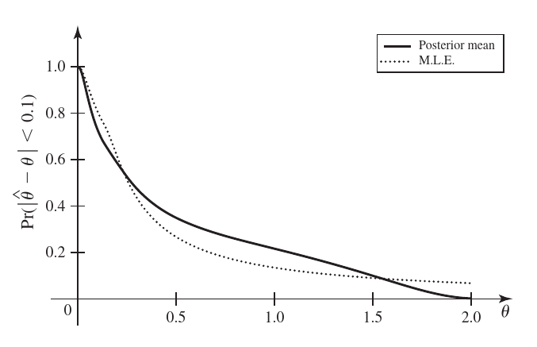

--- 
title: "Notas Curso de Estadística (Parte I)"
author: "Maikol Solís"
date: "Actualizado el 24 October, 2020"
site: bookdown::bookdown_site
documentclass: book
fontsize: 12pt
monofont: "Source Code Pro"
colorlinks: true
bibliography: [bibliografia.bib]
biblio-style: authoryear
biblatexoptions: [url=false, doi=false, eprint=false, isbn=false]
link-citations: yes
description: ""
---


# Introducción


<!--chapter:end:index.Rmd-->


# Inferencia estadística

**Definición:** Hacer afirmaciones probabilísticas respecto a (acerca de)
cantidades desconocidas.

## Ejemplo

***Pregunta**: ¿Será posible modelar cuánto dura un componente electrónico en
fallar?

**Solución**: Podemos responder esta pregunta dividiéndola en dos partes:

1. **Modelo probabilístico:** Asuma que los tiempos de vida del componente son
   exponenciales (en años).
2. **Parámetro:** Sea $\theta > 0$ la tasa de fallo (unidades: 1/Tiempo(años)). 
    
Es decir, tenemos un modelo (exponencial) y estamos decretando que su información estará concentrada en el parámetro \(\theta\).


**Nota**: El parámetro \(\theta\) contiene la información del modelo,
pero ¿Cómo obtenemos esa información

**Muestra**: Secuencia (sucesión) de variables aleatorias independientes $X_1,X_2,\dots, X_n,\dots$. Tomemos una muestra $X_1,X_2,\dots, X_n,\dots \stackrel{i.i.d}{\sim} \text{Exp}(\theta)$.

**Objetivos**

* Estimar $X_m, X_{m+1}, \dots$ si se observa $X_1, X_{m-1}, \dots$ (Predicción).

* Estimar $\theta$ usando información.

**Datos**: Realizaciones de variables aleatorias $X_1,\dots,X_m$ pertenecientes a la muestra.


**Estimación de $\theta$**

Dado que $\mathbb{E}(X) = \dfrac{1}{\theta}$ con $X \sim \text{Exp}(\theta)$, por la ley de grandes números se tiene que

\begin{equation*}
\underbrace{\dfrac{1}{n} \sum_{i=1}{X_i}}_{\bar{X}_n} \xrightarrow[n\to \infty]{\mathbb{P}}\mathbb{E}(X) = \dfrac{1}{\theta}
\end{equation*}

por propiedad de convergencia en probabilidad.

Un posible candidato para estimar $\theta$ es $\dfrac{1}{\bar X_n}$, bajo el supuesto por Ley de Grandes Números que $\theta$ es una constante (frecuentista). 

**Realidad**: $\theta$ no necesariamente es determinístico (factores externos, por la naturaleza del fenómeno).

Asumimos un modelo probabilístico para $\theta$ (tasa siempre positiva):

\begin{equation*}
\theta \sim \Gamma(\alpha_0,\beta_0)
\end{equation*}
Luego, según estudios previos la tasa esperada es 0.5/año
\begin{equation*}
\mathbb{E}(\theta) = \dfrac{1}{2} = \dfrac{\alpha_0}{\beta_0}.
\end{equation*}

Un primer indicio de que se podría establecer que  $\alpha_0 = 1$ y de $\beta_0 = 2$.

## Modelo estadístico

Vamos a definir como típicamente se define un modelo estadístico. 

1. Variables aleatorias observables / hipotéticamente observables:

     \begin{equation*}
     \underbrace{X_t}_{\text{Observable}} = \underbrace{Y_t}_{\text{Hip. observable}} + \underbrace{\epsilon}_{\text{Ruido}}
     \end{equation*}

    En otras palabras \(Y_t\) sería la el dato _"verdadero"_ que pasó
      exactamente en el fenómeno analizado. Esta observación es afectada por
      muchos factores no observables (por ejemplo: errores de medición, cambio
      de las condiciones de la economía, etc.). La variable \(\epsilon\) captura
      toda esa aleatoriedad que no es parte del fénomeno.

    Claramente ni \(Y_t\) ni \(\epsilon\) se pueden medir y la mejor
      representación del nuestro es fenómeno es a partir de \(X_t\).


2. Distribución conjunta de una muestra de variables observables.

    Es decir cuál es el supuesto general que estoy usando para describir mis
    observaciones. 

3. Parámetros que son hipotéticamente observables (desconocidos).

   ¿Cuál sería la mejor calibración de los componentes del modelo anterior de
   modo que mi modelo se ajuste a los datos?

4. (Opcional) Distribución conjunta de los parámetros.

   En el caso de Bayes, los parámetro dejan de ser simple valores puntuales y se
   convierten en distribuciones completas. 

* **Inferencia estadística**: procedimiento que genera afirmaciones probabilísticas de un modelo estadístico.

**Ejemplo de inferencias**:

1. Estimar $\theta$ a través de $\dfrac{1}{\bar X_n}$.

2. ¿Qué tan probable es que el promedio de las siguientes observaciones es al menos 2?
\begin{equation*}
\dfrac{1}{10}\sum_{i= m+1}^{m+10} X_i > 2
\end{equation*}

3. ¿Qué tan cierto es que $\theta\leq0.4$ después de observar la muestra?

* **Parámetro**: característica (s) que determinan la distribución conjunta de las variables aleatorias de interés.

* **Espacio paramétrico** $\Omega$ (espacio de parámetros, puede ser de probabilidad)

**Ejemplos**:

  * $\theta$ > 0 (ejemplo anterior); $\Omega = (0,+\infty)$.
  * $X_1,\dots,X_n \sim N(\mu, \sigma^2)$, $(\mu,\sigma^2)$ parámetros; $\Omega$ = $\mathbb{R}\times[0,+\infty)$.
  
**Ejemplo:** Clientes de un banco

¿Qué tan probable es que un cliente no pague su crédito hoy?

* **Datos**: $X_i = \begin{cases}1& \text{el cliente } \#i  \text{ no pagó}\\0 & \text{el cliente } \#i  \text{ pagó}\end{cases}$.

* **Muestra**: $X_1,\dots,X_{10000}$ (realización al día de hoy).

* **Modelos**: $X_1,\dots, X_{10000} \stackrel{i.i.d}{\sim} \text{Ber}(p)$ con $p\in[0,1]$.

* **Parámetro**: $p$, $\Omega = [0,1]$.

 
* **Inferencias:** 
  - Estimar \(p\) (probabilidad de impago). 
  - Suponga que $L(X_i)$ es el saldo en la cuenta del cliente $\#i$.
 
\begin{equation*}
\mathbb{P}\left(\sum_{i=1}^{10000}L(X_i)>u\right)=\text{Probabilidad de ruina}
\end{equation*}

## Estadístico

**Definición**. Si $X_1,\dots,X_n$ es una muestra observable. Sea $r$ una función real de $n$ variables:
\begin{equation*}
T = r(X_1,\dots,X_n)
\end{equation*}
es un estadístico.

**Nota**: $T$ también es aleatorio.

**Ejemplos**: 

- $\hat p = \dfrac{1}{10000}\displaystyle\sum_{i=1}^{10000}X_i = \dfrac{\#\text{ no pagan}}{\text{Total}} = r(X_1,\dots,X_{10000})$

- $L_m = \max L(X_i)$ (saldo del cliente más riesgoso).

- $R_m = \max L(X_i) - \min L(X_i), 1\leq i\leq 10000$

    

<!--chapter:end:01-inferencia-estadistica.Rmd-->


# Densidades previas conjugadas y estimadores de Bayes
    
## Distribución previa (distribución a priori)

Suponga que tenemos un modelo estadístico con parámetro $\theta$. Su $\theta$ es aleatorio entonces su densidad (antes de observar cualquier muestra) se llama **densidad previa**: $\pi$.

**Ejemplo**: $X_1,\dots, X_n \sim \text{Exp}(\theta)$ y $\theta$ es aleatorio tal que \(\theta \sim \Gamma(\stackrel{\alpha}{1},\stackrel{\beta}{2})\) entonces

$$ \pi(\theta) = \dfrac{1}{\Gamma(\alpha)}\beta^\alpha\theta^{\alpha-1}e^{\beta\theta} = 2e^{-2\theta}, \quad \theta > 0$$

**Ejemplo**: Sea $\theta$ la probabilidad de obtener cara al tirar una moneda.

En este caso antes de modelar exactamente el \(\theta\), lo importante es
modelar el tipo de moneda. Es decir, supongamos que tenemos dos opciones

- *Moneda justa:* $\theta = \dfrac{1}{2}$ con probabilidad previa $0.8$ ($\pi(\frac{1}{2}) = 0.8$).

- *Moneda con solo una cara:* $\theta = 1$  con probabilidad previa $0.2$ ($\pi(1) = 0.2$).

En este ejemplo si tuviéramos 100 monedas con probabilidad previa \(\pi\)
entonces 20 tendrían solo una cara y 80 serían monedas normales. 

**Notas**:

- $\pi$ está definida en $\Omega$ (espacio paramétrico).

- $\pi$ es definida antes de obtener la muestra.

**Ejemplo** (Componentes eléctricos) Supoga que se quiere conocer el tiempo de
vida de cierto componente eléctrico. Sabemos que este tiempo se puede modelar
con una distribución exponencial con parámetro \(\theta\) desconocido.
Este parámetro asumimos que tiene una distribución previa Gamma.

Un experto en componentes eléctricos conoce mucho de su área y sabe
que el parámetro \(\theta\) tiene las siguientes características: 

\begin{equation*}
\mathbb{E}[\theta] = 0.0002, \quad \sqrt{\text{Var}(\theta)} = 0.0001.
\end{equation*}

Como sabemos que la previa  $\pi$ es Gamma, podemos deducir lo siguiente:

\begin{equation*}
 \mathbb{E}[\theta] = \dfrac{\alpha}{\beta}, \text{Var}(\theta) = \dfrac{\alpha}{\beta^2}
\end{equation*}

$$\implies \begin{cases}\dfrac{\alpha}{\beta} = 2\times 10^{-4}\\\sqrt{\dfrac{\alpha}{\beta^2}} = 1 \times 10^{-4}\end{cases} \implies \beta = 20000, \alpha = 4$$

**Notación**:

- $X = (X_1,\dots, X_n)$: vector que contiene la muestra aleatoria.

- Densidad conjunta de $X$: $f_\theta(x)$.

- Densidad de $X$ condicional en $\theta$: $f_n(x|\theta)$.

**Supuesto**: $X$ viene de una muestra aleatoria  si y solo si $X$ es condicionalmente independiente dado $\theta$.

**Consecuencia**: $$f_n(X|\theta) = f(X_1|\theta)\cdot f(X_2|\theta)\cdots f(X_n|\theta)$$

**Ejemplo**

Si $X = (X_1,\dots, X_n)$ es una muestra tal que $X_i\sim \text{Exp}(\theta)$,

\begin{align*}
f_n(X|\theta) &= \begin{cases}\prod_{i=1}^n \theta e^{-\theta X_i} & \text{si } X_i>0\\
0 & \text{si no}
\end{cases}  \\
&= \begin{cases}\theta^n e^{-\theta\sum_{i=1}^n X_i} & X_i > 0  \\ 0 & \text{si no}\end{cases}
\end{align*}
 
## Densidad posterior


**Definición**. Considere un modelo estadístico con parámetro $\theta$ y muestra
aleatoria $X_1,\dots, X_n$. La densidad condicional de $\theta$ dado
$X_1,\dots,X_n$ se llama *densidad posterior*: $\pi(\theta|X)$


**Teorema**. Bajo las condiciones anteriores: 

\begin{equation*}
\pi(\theta|X) =
\dfrac{f(X_1|\theta)\cdots f(X_n|\theta)\pi(\theta)}{g_n(X)} 
\end{equation*} 

para $\theta \in \Omega$, donde $g_n$ es una constante de
normalización.

*Prueba*:
\begin{align*}
\pi(\theta|X) & = \dfrac{\pi(\theta,X)}{\text{marginal de X}} = \dfrac{\pi(\theta,X)}{\int \pi(\theta,X)\;d\theta}= \dfrac{P(X|\theta)\cdot \pi(\theta)}{\int \pi(\theta,X)\;d\theta}\\
& \dfrac{f_n(X|\theta)\cdot \pi(\theta)}{g_n(X)} = \dfrac{f(X_1|\theta)\cdots f(X_n|\theta)\pi(\theta)}{g_n(X)}
\end{align*}

Del ejemplo anterior, 

$$f_n(X|\theta) = \theta^n e^{-\theta y}, y = \sum{X_i} \text{ (estadístico})$$
Numerador: 

$$f_n(X|\theta)\pi(\theta) = \underbrace{\theta^n e^{-\theta y}}_{f_n(X|\theta)} \cdot \underbrace{\dfrac{200000^4}{3!}\theta^3e^{-20000\cdot\theta}}_{\pi(\theta)} = \dfrac{20000^4}{3!}\theta^{n+3}e^{(20000+y)\theta}$$

Denominador:

$$g_n(x) = \int_{0}^{+\infty}\theta^{n+3}e^{-(20000+y)\theta}\;d\theta = \dfrac{\Gamma(n+4)}{(20000+y)^{n+4}}$$

Entonces la posterior corresponde a
$$\pi(\theta|X) = \dfrac{\theta^{n+3}e^{-(20000+y)\theta}}{\Gamma(n+4)} (20000+y)^{n+4}$$
que es una $\Gamma(n+4,20000+y)$.

Con 5 observaciones (horas): 2911, 3403, 3237, 3509, 3118.
$$y = \sum_{i=1}^{5}X_i = 16478, \quad n= 5$$
por lo que $\theta|X \sim \Gamma(9,36178)$


\begin{center}\includegraphics[width=1\linewidth]{Notas-Curso-Estadistica_files/figure-latex/02-distribuciones-previas-posteriores-1-1} \end{center}

Es sensible al tamaño de la muestra (una muestra grande implica un efecto de la previa menor).

**Hiperparámetros**: parámetros de la previa o posterior.


## Proceso de modelación de parámetros. 

De ahora en adelante vamos a entender un modelo como el conjunto de los datos
\(X_1, \ldots, X_n\), la función de densidad \(f\) y el parámetro de la densidad
\(\theta\). Estos dos últimos resumen el comportamiento de los datos.

Ahora para identificar este modelo se hace por partes,

1. La información previa \(\pi(\theta)\) es la información extra o basado en la
   experiencia que tengo del mdoelo. 
2. Los datos es la información observada. La función de densidad \(f\) filtra y
   mejora la información de la previa. 
3. La densidad posterior es la "mezcla" entre la información y los datos
   observados. Es una versión más informada de la distribución del parámetro. 
 

## Función de verosimilitud

Bajo el modelo estadístico anterior a $f_n(X|\theta)$ se le llama **verosimilitud** o **función de verosimilitud**.

**Observación**. En el caso de una función de verosimilitud, el argumento es $\theta$.

**Ejemplo**.

Sea $\theta$ la proporción de aparatos defectuosos, con $\theta \in [0,1]$
$$ X_i = \begin{cases}
 0 & \text{falló} \\
 1 & \text{no falló}
 \end{cases}$$

$\{X_i\}_{i=1}^n$ es una muestra aleatoria y $X_i \sim Ber(\theta)$.

* **Verosimilitud**

$$ f_n(X|\theta) = \prod_{i=1}^n f(X_i|\theta) = \begin{cases}\theta^{\sum X_i}(1-\theta)^{n-\sum X_i} & X_i = 0,1\; \forall i\\ 0 & \text{si no}\end{cases}$$

* **Previa**:
$$\pi(\theta) = 1_{\{0\leq\theta\leq 1\}}$$

* **Posterior**:

Por el teorema de Bayes,
\begin{align*}
\pi(\theta|X) \propto \theta^y (1-\theta)^{n-y}\cdot 1  \\
&= \theta^{\overbrace{y+1}^{\alpha}-1}(1-\theta)^{\overbrace{n-y+1}^{\beta}-1}
&\implies \theta|X \sim \text{Beta}(y+1,n-y+1)
\end{align*}

* **Predicción**. 

*Supuesto*: los datos son secuenciales. Calculamos la distribución posterior
secuencialmente:

\begin{align*}
\pi(\theta|X_1) & \propto \pi(\theta) f(X_1|\theta)\\
\pi(\theta|X_1,X_2) &\propto \pi(\theta) f(X_1,X_2|\theta) \\
&= \pi(\theta) f(X_1|\theta) f(X_2|\theta) \text{ (por independencia condicional)}
\\ & = \pi(\theta|X_1)f(X_2|\theta)\\
\vdots &  \\
\pi(\theta|X_1,\dots,X_n) & \propto f(X_n|\theta)\pi(\theta|X_1,\dots, X_{n-1})
\end{align*}

Bajo independencia condicional no hay diferencia en la posterior si los datos
son secuenciales.

Luego,

\begin{align*} 
g_n(X) & = \int_{\Omega} f(X_n|\theta) \pi(\theta|X_1,\dots, X_{n-1})\;d\theta\\
& = P(X_n|X_1,\dots,X_{n-1}) \text{ (Predicción para }X_n)
\end{align*}

Continuando con el ejemplo de los artefactos, $P(X_6>3000|X_1,X_2,X_3,X_4,X_5)$.
Se necesita calcular $f(X_6|X)$. Dado que $$ \pi(\theta|X) = 2.6\times
10^{36}\theta^8 e^{-36178\theta}$$

se tiene 

$$ f(X_6|X) = 2.6\times 10^{36} \int_{0}^1 \underbrace{\theta e^{-\theta
X_6}}_{\text{Densidad de } X_6}\theta^8 e^{-36178\theta}\;d\theta = \dfrac{9.55
\times 10^{41}}{(X_6+36178)^{10}}$$ 

Entonces, 

$$ P(X_6>3000) =
\int_{3000}^{\infty} \dfrac{9.55\times10^{41}}{(X_6+36178)^{10}}\; dX_6 =
0.4882$$

La vida media se calcula como $\dfrac{1}{2} = P(X_6>u|X)$.

## Familias conjugadas

**Definición**. Sea $X_1,\dots, X_n$ i.i.d. condicional dado $\theta$ con
densidad $f(X|\theta)$. Sea $\psi$ la familia de posibles densidades previas
sobre $\Omega$. Si, sin importar los datos, la posterior pertenece a $\psi$,
entonces decimos que $\psi$ es una familia conjugada de previas.

**Ejemplos**:

* La familia Beta es familia conjugada para muestras según una Bernoulli.
 
*  La familia Gama es familia conjugada para muestras exponenciales.

* Para el caso Poisson, si $X_1,\dots,X_n\sim Poi(\lambda)$,entonces la familia
  Gamma es familia conjugada.

La función de densidad de una Poisson es \(P(X_i = k) = e^{-\lambda}\dfrac{\lambda^k}{k!}\). La verosimilitud corresponde a 
$$ f_n(X|\lambda) = \prod_{i=1}^{n}e^{-\lambda}\dfrac{\lambda^X_i}{X_i!} = \dfrac{e^{-n\lambda^y}}{\prod_{i=1}^n X_i}.$$
La previa de $\lambda$ está definida por $\pi(\lambda)\propto\lambda^{\alpha-1}e^{-\beta\lambda}$. Por lo tanto, la posterior es
$$ \pi(\lambda|X) \propto \lambda^{y+\alpha-1}e^{-(\beta+n)\lambda} \implies
 \lambda|X \sim \Gamma(y+\alpha,\beta+n)$$ 

* En el caso normal, si $X_1,\dots,X_n\sim N(\theta,\sigma^2)$,entonces la familia normal es conjugada si $\sigma^2$ es conocido.

Si $\theta \sim N(\mu_0,V_0^2) \implies \theta|X \sim N(\mu_1, V_1^2)$ donde,
$$\mu_1 = \dfrac{\sigma^2\mu_0 + nV_0^2 \bar X_n}{\sigma^2 + nV_0^2}  = \dfrac{\sigma^2}{\sigma^2 + nV_0^2}\mu_0 + \dfrac{nV_0^2}{\sigma^2 + nV_0^2}\bar X_n$$

Combina de manera ponderada la previa y la de los datos.

**Ejemplo**

Considere una verosimilitud Poisson($\lambda$) y una previa
$$ \pi(\lambda) = \begin{cases}2e^{-2\lambda} & \lambda> 0 \\ 0 & \lambda \geq 0\end{cases} \quad \lambda \sim \Gamma(1,2)$$

Supongamos que es una muestra aleatoria de tamaño $n$. ¿Cuál es el número de observciones para reducir la varianza, a lo sumo, a 0.01?

Por teorema de Bayes, la posterior $\lambda|x \sim \Gamma(y+1,n+2)$. Luego, la varianza de la Gamma es
$$\dfrac{\alpha}{\beta^2} = \dfrac{\sum x_i + 1}{(n+2)^2} \leq 0.01 \implies \dfrac{1}{(n+2)^2} \leq \dfrac{\sum x_i + 1}{(n+2)^2} \leq 0.01 \implies 100 \leq (n+2)^2 \implies n\geq 8$$
**Teorema**. Si $X_1,\dots,X_n \sim N(\theta, \sigma^2)$ con $\sigma^2$ conocido y la previa es $\theta \sim N(\mu_0,V_0^2)$, entonces $\theta|X\sim N(\mu_1,V_1^2)$ donde
$$ \mu_1 =  \dfrac{\sigma^2\mu_0 + nV_0^2 \bar X_n}{\sigma^2 + nV_0^2}, \quad V_1^2 = \dfrac{\sigma^2V_0^2}{\sigma^2 + nV_0^2}$$

*Prueba*:

* **Verosimilitud**:

$$ f_n(X|\theta) \propto \exp\left[- \dfrac{1}{2\sigma^2} \sum_{i=1}^{n}(X_i\theta)^2\right]$$
Luego, 
\begin{align*}
\sum_{i=1}^n (X_i-\theta)^2 & = \sum_{i=1}^n (X_i-\bar X + \bar X - \theta)^2 \\
& = n(\bar X + \theta)^2 + \sum_{i=1}^n (X_i-\bar X)^2 + \underbrace{2 \sum_{i=1}^n (X_i-\bar X)(\bar X - \theta)}_{= 0 \text{ pues } \sum Xi = n\bar X)}
\end{align*}
Entonces
$$ f_n(X|\theta) \propto \exp\left[-\dfrac{n}{2\sigma ^2}(\bar X - \theta )^2\right].$$

* **Previa**:

$$ \pi(\theta) \propto \exp\left[-\dfrac{1}{2V_0^2}(\theta - \mu_0)^2\right].$$

* **Posterior**:

$$ \pi(\theta|X) \propto \exp\left[-\dfrac{n}{2\sigma ^2}(\bar X - \theta )^2-\dfrac{1}{2V_0^2}(\theta - \mu_0)^2\right].$$

Con $\mu_1$ y $V_1^2$ definidos anteriormente, se puede comprobar la siguiente identidad:

$$-\dfrac{n}{\sigma ^2}(\bar X - \theta )^2-\dfrac{1}{V_0^2}(\theta - \mu_0)^2= \dfrac{1}{V_1^2}(\theta-\mu_1)^2 + \underbrace{\dfrac{n}{\sigma^2 + nV_0^2}(\bar X_n- \mu_0)^2}_{\text{Constante con respecto a }\theta}$$
Por lo tanto, $$\pi(\theta|X) \propto \exp\left[-\dfrac{n}{2V_1^2}(\theta -\mu_1)^2\right]$$

*Media posterior*:

$$\mu_1 = \underbrace{\dfrac{\sigma^2}{\sigma^2 + nV_0^2}}_{W_1}\mu_0 + \underbrace{\dfrac{nV_0^2}{\sigma^2 + nV_0^2}}_{W_2}
\bar X_n $$

**Afirmaciones**:

1) Si $V_0^2$ y $\sigma^2$ son fijos, entonces $W_1 \xrightarrow[n\to \infty]{}0$ (la importancia de la media empírica crece conforme aumenta $n$).

2) Si $V_0^2$ y $n$ son fijos, entonces $W_2 \xrightarrow[\sigma^2\to \infty]{}0$ (la importancia de la media empírica decrece conforme la muestra es menos precisa).

3) Si $\sigma^2$ y $n$ son fijos, entonces $W_2 \xrightarrow[V_0^2\to \infty]{}1$ (la importancia de la media empírica crece conforma la previa es menos precisa).

**Ejemplo (determinación de n)**

Sean $X_1,\dots, X_n \sim N(\theta,1)$ y $\theta\sim N(\mu_0,4)$. Sabemos que $$V_1^2 = \dfrac{\sigma^2V_0^2}{\sigma^2 + nV_0^2}. $$
Buscamos que $V_1\leq 0.01$, entonces
$$ \dfrac{4}{4n+1}\leq 0.01 \implies n\geq 99.75 \text{ (al menos 100 observaciones)}$$

## Densidades previas impropias

**Definición**. Sea $\pi$ una función positiva cuyo dominio está en $\Omega$. Suponga que $\int\pi(\theta)\;d\theta = \infty$. Entonces decimos que $\pi$ es una **densidad impropia**.

**Ejemplo**: $\theta \sim \text{Unif}(\mathbb{R})$, $\lambda \sim \text{Unif}(0,\infty)$.

Una técnica para seleccionar distribuciones impropia es sustituir los hiperparámetros previos por 0.

**Ejemplo**:

Se presenta el número de soldados prusianos muertos por una patada de caballo (280 conteros, unidades de combate en 20 años).

| Unidades | Ocurrencias |  
|----------|-------------|
| 144      | 0           |   
|    91    | 1           |  
|    32    | 2           |   
|       11 | 3           |  
|         2| 4           |  

* Muestra de Poisson: $X_1 = 0, X_2 = 1, X_3 = 1,\dots, X_{280} = 0 \sim \text{Poi}(\lambda)$.

* Previa: $\lambda \sim \Gamma(\alpha, \beta)$.

* Posterior: $\lambda|X \sim \Gamma(y+\alpha, n+\beta) = \Gamma(196 + \alpha, 280 + \beta)$.

Sustituyendo, \(\alpha=\beta = 0\)
\begin{align*}
\pi(\lambda) &= \dfrac{1}{\Gamma(\alpha)}\beta^\alpha\lambda^{\alpha-1}e^{\beta\lambda}  \\
\\ \propto \lambda^{\alpha-1}e^{-\lambda\beta} \\
&=\dfrac{1}{\lambda}
\end{align*}
donde $\displaystyle\int_{0}^{\infty}\dfrac{1}{\lambda} d\lambda = \infty$. 

Por teorema de Bayes, $$\theta|X \sim \Gamma(196,280)$$

## Funciones de pérdida

**Definición**. Sean $X_1,\dots, X_n$ datos observables cuyo modelo está indexado por $\theta\in\Omega$. Un estimador de $\theta$ es cualquier estadístico $\delta(X_1,\dots, X_n)$.

**Notación**:

* Estimador $\to \delta(X_1,\dots,X_n)$.
* Estimación o estimado: $\delta(X_1,\dots,X_n)(\omega) = \delta(\overbrace{x_1,\dots,x_n}^{datos})$

**Definición**. Una **función de pérdida** es una función de dos variables:
$$ L(\theta,a), \quad \theta \in\Omega$$
con $a$ un número real.

**Interpretación**: es lo que pierde un analista cuando el parámetro es $\theta$ y el estimador es $a$.

Asuma que $\theta$ tiene una previa. La pérdida esperada es
$$ \mathbb{E}[L(\theta,a)] = \int_{\Omega}L(\theta, a) \pi(\theta)\;d\theta$$
la cual es una función de $a$, que a su vez es función de $X_1,\dots,X_n$. Asuma que $a$ se selecciona el minimizar esta esperanza. A ese estimador $a = \delta^*(X_1,\dots, X_n)$ se le llama **estimador bayesiano**, si ponderamos los parámetros con respecto a la posterior.

$$\mathbb{E}[L(\theta, \delta^*)|X] = \int_{\Omega}L(\theta, a) \pi(\theta)\;d\theta = \min_a \mathbb{E}[L(\theta|a)X]. $$

### Función de pérdida cuadrática

$$ L(\theta, a) = (\theta-a)^2$$

En el caso en que $\theta$ es real y $\mathbb{E}[\theta|X]$ es finita, entonces
$$ \delta^*(X_1,\dots, X_n) = \mathbb{E}[\theta|X] \text{ cuando } L(\theta,a) = (\theta-a)^2. $$

**Ejemplo**: $X_1,\dots, X_n \sim \text{Ber}(\theta)$, $\theta \sim \text{Beta}(\alpha,\beta) \implies \theta|X \sim \text{Beta}(\alpha+y,\beta+n-y)$.

El estimador de $\theta$ es
$$ \delta^*(X_1,\dots, X_n) = \dfrac{\alpha+y}{\alpha + \beta + n} = \overbrace{\dfrac{\alpha}{\alpha + \beta} }^{\text{Esperanza previa}}\cdot \dfrac{\alpha +\beta}{\alpha +\beta + n} + \overbrace{\dfrac{y}{n}}^{\bar X}\cdot \dfrac{n}{\alpha +\beta + n}.  $$

### Función de pérdida absoluta

$$ L(\theta,a) = |\theta-a|$$

La pérdida esperada es
$$ f(a) = \mathbb{E}[L(\theta,a)|X] = \int_{-\infty}^{+\infty}|\theta-a|\pi(\theta|X)\;d\theta = \int_{a}^{+\infty}(\theta-a)\pi(\theta|X)\;d\theta + \int_{-\infty}^{a}(a-\theta)\pi(\theta|X)\;d\theta $$

Usando el teorema fundamental del cálculo,
$$F_{\pi}(a|X) = \int_{-\infty}^{\hat a}\pi(\theta|X)\;d\theta = \dfrac12 \Leftrightarrow \hat a= \operatorname*{argmin}_a f(a)$$

La **mediana** es el punto de $X_{0.5}$ tal que $F(X_{0.5}) = \dfrac{1}{2}$.

**Corolario**. Bajo la función de pérdida absoluta, el estimador bayesiano es la mediana posterior.

**Ejemplo**: Bernoulli.
$$ \dfrac{1}{\text{Beta}(\alpha+y, \beta+n-y)}\int_{-\infty}^{X_{0.5}}\theta^{\alpha+y-1} (1-\theta)^{\beta+n-y-1}\;d\theta = \dfrac12$$
Resuelva para $X_{0.5}$.

### Otras funciones de pérdida

* $L(\theta,a) = |\theta-a|^k$, $k\ne 1,2$, $0<k<1$.

* $L(\theta,a) = \lambda(\theta)|\theta-a|^2$ ($\lambda(\theta)$ penaliza la magnitud del parámetro).

* $L(\theta,a)=\begin{cases}3(\theta-a)^2 & \theta\leq a \text{ (sobreestima)}\\ (\theta-a)^2&\theta\geq a \text{ (subestima)} \end{cases}$

## Efecto de muestras grandes

**Ejemplo**: ítemes malos (proporción: $\theta$), $\theta \in [0,1]$. Función de pérdida cuadrática. El tamaño de muestra son $n=100$ ítemes, de los cuales $y=10$ están malos.

$$ X_1,\dots,X_n\sim \text{Ber}(\theta)$$

* Primer previa. $\alpha = \beta = 1$ (Beta). El estimador bayesiano corresponde a

$$ \mathbb{E}[\theta|X] = \dfrac{\alpha+y}{\alpha+\beta+n} = \dfrac{1+10}{2+100} = 0.108$$

* Segunda previa. $\alpha =1, \beta=2 \implies \pi(\theta) = 2e^{-2\theta}, \theta >0$.

$$ \mathbb{E}[\theta|X] = \dfrac{1+10}{1+2+100} = \dfrac{11}{103}=0.107$$

La media es $\bar X_n = \dfrac{10}{100} = 0.1$.

## Consistencia

**Definición**. Un estimador de $\theta$ $\delta(X_1,\dots, X_n)$ es consistente si  $$\delta(X_1,\dots, X_n)\xrightarrow[n\to \infty]{\mathbb{P}}\theta.$$

Bajo pérdida cuadrática, $\mathbb{E}[\theta|X] = W_1\mathbb{E}[\theta] + X_2\bar X_n = \delta^*$. Sabemos, por ley de grandes números, que $\bar X_n \xrightarrow[n\to \infty]{\mathbb{P}}\theta$. Además, $W_1\xrightarrow[n\to \infty]{}0$ y  $W_2\xrightarrow[n\to \infty]{}1$. 

En los ejemplos que hemos analizado 
$$\delta^* \xrightarrow[n\to \infty]{\mathbb{P}}\theta $$
**Teorema**. Bajo condiciones generales, los estimadores bayesianos son consistentes.

**Estimador**. Si $X_1,\dots, X_n$ es una muestra en un modelo indexado por $\theta$, $\theta \in \Omega$ ($k$-dimensiones), sea

$$h:\Omega \to H \subset \mathbb{R}^d.$$
Sea $\psi = h(\theta)$. Un **estimador** de $\psi$ es un estadístico $\delta^*(X_1,\dots, X_n) \in H$. A $\delta^*(X_1,\dots, X_n)$ estimador de $\psi$ se puede evaluar y construir estimadores nuevos.

**Ejemplo**. $X_1,\dots, X_n \sim \text{Exp}(\theta)$, $\theta|X \sim \Gamma(\alpha,\beta) = \Gamma (4,8.6)$. La característica de interés es $\psi = \dfrac{1}\theta$, el valor esperado del tiempo de fallo.

Es estimador se calcula de la siguiente manera:

\begin{align*}
\delta^*(x) = \mathbb{E}[\psi|x] & = \int_{0}^\infty \dfrac{1}\theta\pi(\theta|x)\;d\theta\\
& = \int_{0}^\infty \dfrac{1}\theta \dfrac{8.6^4}{\Gamma(4)} \theta^3e^{-8.6\theta}\;d\theta\\
&=\dfrac{8.6^4}{6} \underbrace{\int_{0}^\infty \theta^2 e^{-8.6\theta}\;d\theta}_{\frac{\Gamma(3)}{8.6^3}}\\
& = \dfrac{8.6^4}{6}\dfrac{2}{8.6^3} = 2.867 \text{ unidades de tiempo.}
\end{align*}

Por otro lado, vea que $\mathbb{E}(\theta|X) = \dfrac{4}{8.6}$. El estimador *plug-in* correspondería a
$$\dfrac{1}{\mathbb{E}(\theta|X)} = \dfrac{8.6}{4} = 2.15.$$

## Laboratorio

Lo primero es cargar los paquetes necesarios que usaremos en todo el curso


```r
library(tidyverse)
```

### Distribución previa 


En nuestro ejemplo se tenía que \(\mathbb E [\theta] = 0.0002\) y \(\mathrm{Var}(\theta) = 0.001\). Suponiendo que \(\theta\) es gamma se puede resolver el sistema de ecuaciones obtenemos que \(\beta=20000\) y \(\alpha=4\). 


```r
alpha_previa <- 4
beta_previa <- 20000

ggplot(data = data.frame(x = c(0, 1e6)), aes(x)) +
  stat_function(fun = dgamma, args = list(shape = alpha_previa, scale = beta_previa)) +
  ylab("") +
  scale_y_continuous(breaks = NULL) +
  theme_minimal()
```


\begin{center}\includegraphics[width=1\linewidth]{Notas-Curso-Estadistica_files/figure-latex/02-distribuciones-previas-posteriores-3-1} \end{center}

### Distribución conjunta 

Asumiendo que tenemos algunos datos \(X_1, ..., X_n\), asumimos que estos son exponencial recordando que \(\mathbb E [X] = 1/\theta\), entonces una aproximación de esta densidad es 


```r
x  <- c(2911, 3403, 3237, 3509, 3118)

theta <- 1 / mean(x)

ggplot(data = data.frame(x = c(0, 1e5)), aes(x)) +
  stat_function(fun = dexp, args = list(rate = theta)) +
  ylab("") +
  scale_y_continuous(breaks = NULL) +
  theme_minimal()
```


\begin{center}\includegraphics[width=1\linewidth]{Notas-Curso-Estadistica_files/figure-latex/02-distribuciones-previas-posteriores-4-1} \end{center}


### Distribución posterior 

Según los contenidos del curso, se puede estimar los parámetros de la densidad posterior de la forma 


```r
(y  <- sum(x))
```

```
## [1] 16178
```

```r
(n <- length(x))
```

```
## [1] 5
```

```r
(alpha_posterior <- n + alpha_previa)
```

```
## [1] 9
```

```r
(beta_posterior <- beta_previa + y)
```

```
## [1] 36178
```


```r
ggplot(data = data.frame(x = c(0, 7.5e5)), aes(x)) +
  stat_function(fun = dgamma, args = list(shape = alpha_previa, scale = beta_previa), aes(color = "Previa")) +
  stat_function(fun = dgamma, args = list(shape = alpha_posterior, scale = beta_posterior), aes(color = "Posterior")) +
  stat_function(fun = dexp, args = list(rate = theta), aes(color = "Verosimilitud")) +
  ylim(0, 1.5e-5) +
  theme_minimal()
```


\begin{center}\includegraphics[width=1\linewidth]{Notas-Curso-Estadistica_files/figure-latex/02-distribuciones-previas-posteriores-6-1} \end{center}

### Agregando nuevos datos 

Si tenemos un 6to dato, y queremos ver cual es su distribución posterior. Lo primero es estimar la densidad posterior de este 6to dato, pero asumiendo que la previa es la densidad que obtuvimos en el caso anterior. 

Suponga que \(X_6 = 3000\)


```r
(alpha_previa <- alpha_posterior)
```

```
## [1] 9
```

```r
(beta_previa <- beta_posterior)
```

```
## [1] 36178
```

```r
(alpha_posterior <- alpha_previa + 1)
```

```
## [1] 10
```

```r
(beta_posterior <- beta_previa + 3000)
```

```
## [1] 39178
```

```r
ggplot(data = data.frame(x = c(0, 1e6)), aes(x)) +
  stat_function(fun = dgamma, args = list(shape = 4, scale = 20000), aes(color = "Previa #1")) +
  stat_function(fun = dgamma, args = list(shape = alpha_previa, scale = beta_previa), aes(color = "Previa #2")) +
  stat_function(fun = dgamma, args = list(shape = alpha_posterior, scale = beta_posterior), aes(color = "Posterior")) +
  ylim(0, 1.5e-5) +
  theme_minimal()
```


\begin{center}\includegraphics[width=1\linewidth]{Notas-Curso-Estadistica_files/figure-latex/02-distribuciones-previas-posteriores-7-1} \end{center}


### Familias conjugadas normales


Si tenemos pocos datos, la información previa es la que "prevalece". 


```r
x <- rnorm(n = 3, mean = 10, sd = 1)

(mu <- mean(x))
```

```
## [1] 9.54454
```

```r
(sigma <- sd(x))
```

```
## [1] 0.1919427
```

```r
(n <- length(x))
```

```
## [1] 3
```

```r
(mu_previa <- 0)
```

```
## [1] 0
```

```r
(sigma_previa <- 1)
```

```
## [1] 1
```

```r
(mu_posterior <- ((sigma^2) / (sigma^2 + n * sigma_previa^2)) * mu_previa + ((n * sigma_previa^2) / (sigma^2 + n * sigma_previa^2)) * mu)
```

```
## [1] 9.428748
```

```r
(sigma2_posterior <- (sigma^2 * sigma_previa^2) / (sigma^2 + n * sigma_previa^2))
```

```
## [1] 0.01213168
```

```r
ggplot(data = data.frame(x = c(-5, 15)), aes(x)) +
  stat_function(fun = dnorm, args = list(mean = mu_previa, sd = sigma_previa), aes(color = "Previa")) +
  stat_function(fun = dnorm, args = list(mean = mu_posterior, sd = sqrt(sigma2_posterior)), aes(color = "Posterior")) +
  stat_function(fun = dnorm, args = list(mean = mu, sd = sigma), aes(color = "Verosimilitud")) +
  theme_minimal()
```


\begin{center}\includegraphics[width=1\linewidth]{Notas-Curso-Estadistica_files/figure-latex/02-distribuciones-previas-posteriores-8-1} \end{center}

Con más datos, la distribución se ajusta a esto y le quita importancia a la información previa. 


```r
x <- rnorm(n = 100, mean = 10, sd = 1)

(mu <- mean(x))
```

```
## [1] 10.05814
```

```r
(sigma <- sd(x))
```

```
## [1] 0.9727496
```

```r
(n <- length(x))
```

```
## [1] 100
```

```r
(mu_previa <- 0)
```

```
## [1] 0
```

```r
(sigma_previa <- 1)
```

```
## [1] 1
```

```r
(mu_posterior <- ((sigma^2) / (sigma^2 + n * sigma_previa^2)) * mu_previa + ((n * sigma_previa^2) / (sigma^2 + n * sigma_previa^2)) * mu)
```

```
## [1] 9.963861
```

```r
(sigma2_posterior <- (sigma^2 * sigma_previa^2) / (sigma^2 + n * sigma_previa^2))
```

```
## [1] 0.009373719
```

```r
ggplot(data = data.frame(x = c(-5, 15)), aes(x)) +
  stat_function(fun = dnorm, args = list(mean = mu_previa, sd = sigma_previa), aes(color = "Previa")) +
  stat_function(fun = dnorm, args = list(mean = mu_posterior, sd = sqrt(sigma2_posterior)), aes(color = "Posterior")) +
  stat_function(fun = dnorm, args = list(mean = mu, sd = sigma), aes(color = "Verosimilitud")) +
  theme_minimal()
```


\begin{center}\includegraphics[width=1\linewidth]{Notas-Curso-Estadistica_files/figure-latex/02-distribuciones-previas-posteriores-9-1} \end{center}


Si los datos por si solo son muy variable, la posterior tiende a parecerse a la
distribución previa en lugar que a la verosimilitud.


```r
x <- rnorm(n = 10, mean = 10, sd = 5)

(mu <- mean(x))
```

```
## [1] 10.58903
```

```r
(sigma <- sd(x))
```

```
## [1] 4.098052
```

```r
(n <- length(x))
```

```
## [1] 10
```

```r
(mu_previa <- 0)
```

```
## [1] 0
```

```r
(sigma_previa <- 1)
```

```
## [1] 1
```

```r
(mu_posterior <- ((sigma^2) / (sigma^2 + n * sigma_previa^2)) * mu_previa + ((n * sigma_previa^2) / (sigma^2 + n * sigma_previa^2)) * mu)
```

```
## [1] 3.952011
```

```r
(sigma2_posterior <- (sigma^2 * sigma_previa^2) / (sigma^2 + n * sigma_previa^2))
```

```
## [1] 0.6267826
```

```r
ggplot(data = data.frame(x = c(-5, 15)), aes(x)) +
  stat_function(fun = dnorm, args = list(mean = mu_previa, sd = sigma_previa), aes(color = "Previa")) +
  stat_function(fun = dnorm, args = list(mean = mu_posterior, sd = sqrt(sigma2_posterior)), aes(color = "Posterior")) +
  stat_function(fun = dnorm, args = list(mean = mu, sd = sigma), aes(color = "Verosimilitud")) +
  theme_minimal()
```


\begin{center}\includegraphics[width=1\linewidth]{Notas-Curso-Estadistica_files/figure-latex/02-distribuciones-previas-posteriores-10-1} \end{center}

### Funciones de pérdida

Lo más importante acá es que dependiendo de la función de pérdida podemos construir una estimador para \(\theta\). En el caso de los componentes electrónicos recordemos que la posterior nos daba


```r
alpha <- 9
beta <- 36178
```

- **Pérdida cuadrática:** Recoremos que la media de una gamma es \(\alpha/\beta\) entonces 


```r
(theta <- alpha / beta)
```

```
## [1] 0.00024877
```

Y por lo tanto el tiempo promedio del componente electrónico es \(1/\theta\)=4019.7777778.

- **Pérdidad absoluta:** La distribución Gamma no tiene una forma cerrada para la mediana, por que se puede aproximar así, 


```r
m <- rgamma(n = 1000, scale = beta, shape = alpha)
(theta <- median (m))
```

```
## [1] 313355.4
```


Y por lo tanto el tiempo promedio del componente electrónico es \(1/\theta\)=\ensuremath{3.1912648\times 10^{-6}}.

**OJO: En este caso la pérdida cuadrática ajusta mejor ya que la distribución que la pérdida absoluta ya que la distribución NO es simétrica. En el caso simétrico los resultados serían muy similares.** 


### Caso concreto

Suponga que se que quiere averiguar si los estudiantes de cierto colegio duermen más de 8 horas o menos de 8 horas. 

Para esto primero cargaremos el siguiente paquete, 


```r
library(LearnBayes)
```
Suponga que se hace una encuesta a 27 estudiantes y se encuentra que 11 dicen que duermen más de 8 horas diarias y el resto no. Nuestro objetivo es encontrar inferencias sobre la proporción $p$ de estudiantes que duermen al menos 8 horas diarias. El modelo más adecuado es  

\[
f(x \vert p) \propto p^s (1-p)^f
\]

donde $s$ es la cantidad de estudiantes que duermen más de 8 horas y $f$ los que duermen menos de 8 horas. 

Una primera aproximación para la previa es usar una distribución discreta. En este caso, el investigador asigna una probabilidad a cierta cantidad de horas de sueño, según su experiencia. Así, por ejemplo:


```r
p <- seq(0.05, 0.95, by = 0.1)
prior <- c(1, 5.2, 8, 7.2, 4.6, 2.1, 0.7, 0.1, 0, 0)
prior <- prior / sum(prior)
plot(p, prior, type = "h", ylab = "Probabilidad Previa")
```


\begin{center}\includegraphics[width=1\linewidth]{Notas-Curso-Estadistica_files/figure-latex/02-distribuciones-previas-posteriores-15-1} \end{center}

El paquete `LearnBayes` tiene la función `pdisc` que estima la distribución posterior para una previa discreta binomial. Recuerde que el valor 11 representa la cantidad de estudiantes con más de 8 horas de sueño y 16 lo que no duermen esa cantidad. 


```r
data <- c(11, 16)
post <- pdisc(p, prior, data)
round(cbind(p, prior, post), 2)
```

```
##          p prior post
##  [1,] 0.05  0.03 0.00
##  [2,] 0.15  0.18 0.00
##  [3,] 0.25  0.28 0.13
##  [4,] 0.35  0.25 0.48
##  [5,] 0.45  0.16 0.33
##  [6,] 0.55  0.07 0.06
##  [7,] 0.65  0.02 0.00
##  [8,] 0.75  0.00 0.00
##  [9,] 0.85  0.00 0.00
## [10,] 0.95  0.00 0.00
```

Y podemos ver la diferencia entre la previa (negro) y la posterior (roja), 


```r
plot(p, post, type = "h", col = "red")
lines(p + 0.01, prior, type = "h")
```


\begin{center}\includegraphics[width=1\linewidth]{Notas-Curso-Estadistica_files/figure-latex/02-distribuciones-previas-posteriores-17-1} \end{center}

¿Qué se puede deducir de estos resultados?

**Ejercicio:** Suponga que se tiene la base de datos `studentdata`. Realice los cálculos anteriores con esos datos, 


```r
data("studentdata")
horas_sueno <- studentdata$WakeUp - studentdata$ToSleep
horas_sueno <- na.omit(horas_sueno)
summary(horas_sueno)
```

```
##    Min. 1st Qu.  Median    Mean 3rd Qu.    Max. 
##   2.500   6.500   7.500   7.385   8.500  12.500
```

```r
hist(horas_sueno, main = "")
```


\begin{center}\includegraphics[width=1\linewidth]{Notas-Curso-Estadistica_files/figure-latex/02-distribuciones-previas-posteriores-18-1} \end{center}


Ahora supongamos que se tiene quiere ajustar una previa continua a este modelo. Para esto usaremos una distribución Beta con parámetros $\alpha$ y $\beta$, de la forma 

\[
pi(p\vert \alpha, \beta) \propto p^{1-\alpha} (1-p)^{1-\beta}.
\]

El ajuste de los paramétros de la Beta depende mucho de la información previa que se tenga del modelo. Una forma fácil de estimarlo es a través de cuantiles con los cuales se puede reescribir estos parámetros. Para una explicación detallada revisar https://stats.stackexchange.com/a/237849


En particular, suponga que se cree que el $50\%$ de las observaciones la proporción será menor que 0.3 y que el $90\%$ será menor que 0.5. 

Para esto ajustaremos los siguientes parámetros 


```r
quantile2 <- list(p = .9, x = .5)
quantile1 <- list(p = .5, x = .3)
(ab <- beta.select(quantile1, quantile2))
```

```
## [1] 3.26 7.19
```

```r
a <- ab[1]
b <- ab[2]
s <- 11
f <- 16
```

En este caso se obtendra la distribución posterior Beta con paramétros $\alpha + s$ y $\beta + f$, 


```r
curve(dbeta(x, a + s, b + f), from = 0, to = 1,
  xlab = "p", ylab = "Densidad", lty = 1, lwd = 4)
curve(dbeta(x, s + 1, f + 1), add = TRUE, lty = 2, lwd = 4)
curve(dbeta(x, a, b), add = TRUE, lty = 3, lwd = 4)
legend(.7, 4, c("Previa", "Verosimilitud", "Posterior"),
  lty = c(3, 2, 1), lwd = c(3, 3, 3))
```


\begin{center}\includegraphics[width=1\linewidth]{Notas-Curso-Estadistica_files/figure-latex/02-distribuciones-previas-posteriores-20-1} \end{center}

<!--chapter:end:02-distribuciones-previas-posteriores.Rmd-->


# Estimación por máxima verosimilitud

¿Será posible estimar sin una densidad previa? Se debería ajustar la noción de
muestra a independencia dado el valor de un parámetro.

Recuerde que, para $X_1,\dots, X_n \stackrel{i.i.d}{\sim} f(X|\theta)$ con $\theta$
fijo, la **función de verosimilitud** se define como $$ f_n(X|\theta) =
\pi(X_i|\theta) = G(\theta|X).$$

Si $\theta_1,\theta_2\in \Omega$, $\theta$ es el valor real del parámetro. Si la muestra es
fija, evaluamos, para $\theta_1$, $f_n(X|\theta_1) = L(\theta_1|X)$ y, de igual forma para
$\theta_2$, $f_n(X|\theta_2) = L(\theta_2|X)$. Supongamos que

\begin{equation*}
f_n(X|\theta_1) >f_n(X|\theta_2) \implies L(\theta_1|X)>L(\theta_2|X) \text{
(principio de verosimilitud)} 
\end{equation*}

**Interpretación**. Es más verosímil (realista) que el verdadero parámetro sea
$\theta_1$ que $\theta_2$ dada la muestra.

**Definición**. Para cada $x\in \mathcal{X}$ (espacio muestral), sea
$\delta(x) \in \delta$ estimador de $\theta$ tal que $f_n(x|\theta)$ es máximo. A
$\delta(x)$ se le llama **MLE (estimador de máxima verosimilitud)**.

**Ejemplo**. Si $X_1,\dots, X_n \sim \text{Exp}(\theta)$, estime $\theta$. 

Determinamos la función de verosimilitud,

\begin{equation*} 
f_n(X|\theta) =
\prod_{i=1}^n \dfrac{1}\theta e^{-X_i/\theta} = \dfrac1{\theta^n}
\exp\left(\dfrac{1}\theta \sum_{i=1}^nX_i\right) = \theta^{-n}e^{-y/\theta}.
\end{equation*}

Considere la **log-verosimilitud**
\begin{equation*}
\ell(\theta|X) = \ln f_n(X|\theta) = -n\ln \theta - \dfrac{y}{\theta}
\end{equation*}

Como es una transformación monótona creciente, la función de verosimilitud se
maximiza si la log-verosimilitud es máxima. Entonces,


\begin{align*}
\dfrac{\partial}{\partial\theta} \ell(\theta|X) & = \dfrac{-n}{\theta}+\dfrac{y}{\theta^2} = 0 \\
\implies \dfrac{1}{\theta}\left(-n+\dfrac{y}\theta\right) & =0  \\
\implies \hat\theta = \dfrac{y}{n} & = \bar X_n.
\end{align*}

Para verificar que es un máximo:

$$\dfrac{\partial^2    \ell}{\partial\theta^2} = \left. \dfrac{n}{\theta^2} -\dfrac{2y}{\theta^3}\right\vert_{\theta = \frac{y}{n}} = \dfrac{1}{\hat\theta^2} \bigg[n-\dfrac{2y}{\frac yn}\bigg] = \dfrac{-n}{\hat\theta^2} < 0.$$

Entonces $\hat\theta = \bar X_n$ es el MLE de $\theta$.


**Laboratorio:** 

Suponga que se tiene 100 valores con distribución exponencial con parámetro
\(\theta=1\). 


```r
x  <- rexp(n = 100, rate = 1)
n <- length(x)
y <- sum(x)
theta <- seq(0.5, 1.5, length.out = 1000)
```


```r
L <- theta^(-n) * exp(-y / theta)
plot(theta, L)
```


\begin{center}\includegraphics[width=1\linewidth]{Notas-Curso-Estadistica_files/figure-latex/03-maxima-verosimilitud-2-1} \end{center}


```r
l <- -n * log(theta) - y / theta
plot(theta, l)
```


\begin{center}\includegraphics[width=1\linewidth]{Notas-Curso-Estadistica_files/figure-latex/03-maxima-verosimilitud-3-1} \end{center}

**Ejemplo**. En una prueba sobre alguna enfermedad, en un $90\%$ da la verdadera condición (enfermo) y en un $10\%$ la prueba se equivoca (que diga que la persona esté enferma cuando está sana). Considere una variable aleatoria $\text{Bernoulli}(\theta)$,$\theta \in \{0.9,0.1\}$
Una muestra sería
$$x = \begin{cases}1 & \text{si la prueba es positiva}\\0& \text{si no}\end{cases}$$
Si $x=0$, entonces $f(0|\theta) = \begin{cases}0.9 & \text{si }\theta = 0.1\\0.1& \text{si }\theta = 0.9\end{cases}$.

Si $x=1$, entonces $f(1|\theta) = \begin{cases}0.1 & \text{si }\theta = 0.1\\0.9& \text{si }\theta = 0.9\end{cases}$.

El MLE corresponde a
$$\hat\theta = \begin{cases}0.1 & \text{si }x= 0\\0.9& \text{si }x= 1\end{cases}$$


**Ejemplo**. Para el caso normal, $X_1,\dots, X_n \sim N(\mu,\sigma^2)$, $\sigma^2$ conocida, estime $\mu$.

$$f_n(x|\mu) = \prod_{i=1}^n \dfrac{1}{\sqrt{2\pi\sigma^2}}\exp\left(-\dfrac{(x_i-\mu)^2}{2\sigma^2}\right) = (2\pi\sigma^2)^{-n/2}\exp\left(-\dfrac1{2\sigma^2}\sum_{i=1}^n(x_i-\mu)^2\right).$$

La log-verosimilitud es de la forma
$$ \ell(\mu|x) = \dfrac{-n}{2}\ln(2\pi\sigma^2)-\dfrac1{2\sigma^2}\sum_{i=1}^n(x_i-\mu)^2.$$

Basta con minimizar $Q(\mu) = \sum_{i=1}^n(x_i-\mu)^2$.

$$ \dfrac{\partial Q}{\partial\mu} = -2\sum_{i=1}^n(x_i-\mu) \implies n\mu = \sum_{i=1}^nx_i \implies \hat\mu = \bar x_n.$$

No hace falta verificar la condición de segundo orden, pues $Q$ es una función
cuadrática de $\mu$ y tiene un único máximo.

$$ \hat\mu_{MLE} = \bar x_n \quad (*)$$

Ahora, si $X_1,\dots, X_n \sim N(\mu,\sigma^2)$, $\theta = (\mu,\sigma^2)$ desconocido, por $(*)$,


$$
\ell(\sigma^2|X_1,\dots, X_n) = \dfrac n2 \ln(2\pi\sigma^2)--\dfrac1{2\sigma^2}\sum_{i=1}^n(x_i-\bar
x_n)^2
$$


$$ \dfrac{\partial L}{\partial\sigma^2} = -\dfrac n2 \dfrac1{2\pi\sigma^2} + \dfrac1{2(\sigma^2)^2} \sum_{i=1}^n(x_i-\bar x_n)^2= 0 $$
Entonces
$$ \sigma^2 = \dfrac 1n \sum_{i=1}^n(x_i-\mu)^2 \text{ (varianza muestral)}$$

Las condiciones de segundo orden quedan como ejercicio.

**Nota**. Si $\theta_{MLE}$ de $\theta$, entonces $h(\theta_{MLE})$ es el MLE de $h(\theta)$.

Sea $h(x,y) = \sqrt{y}$ (es inyectiva). $h(\bar x_n, \hat\sigma^2) = \sqrt{\hat\sigma^2} = \hat\sigma$.

El MLE de $\dfrac{\sigma}{\mu} = \dfrac{\hat \sigma}{\bar x_n}$.

**Laboratorio:**


```r
library(scatterplot3d)

x <- rnorm(100)
n <- length(x)

mu <- seq(-0.5, 0.5, length.out = 50)
sigma <- seq(0.5, 1.5, length.out = 50)

ms <- expand.grid(sigma, mu)

l <- -(n / 2) * log(2 * pi / ms[, 1]^2) - (1 / (2 * ms[, 1]^2) * sum((x - ms[, 2])^2))

scatterplot3d(ms[, 1], ms[, 2], l, angle = 45)
```


\begin{center}\includegraphics[width=1\linewidth]{Notas-Curso-Estadistica_files/figure-latex/03-maxima-verosimilitud-4-1} \end{center}

**Ejemplo**. $X_1,\dots, X_n \stackrel{i.i.d}{\sim} \text{Unif}(0, \theta)$. Estime $\theta$ $(\theta > 0)$. Suponga que $x_i>0 \forall i$.

$$f(X|\theta) = \dfrac 1\theta \cdot 1_{[0,\theta]}(x)$$ 

La verosimilitud es
$$f_n(x|\theta) = \prod_{i=1}^{n} f(x_i|\theta) = \dfrac 1{\theta^n} \prod_{i=1}^n 1_{\{0\leq X_i\leq \theta\}} \quad 0\leq X_i \leq \theta \;\forall i$$

Vea que $f_n(x|\theta)$ es válido si y solo si $0\leq X_{(n)}\leq \theta$.

El valor de la muestra $\{X_1,\dots, X_n\}$ en la $i$-ésima posición cuando los
datos se ordenan de menor a mayor se denota $X_{(i)}$ (estadístico de orden). En
este caso, $X_{(n)} = \max\{X_1,\dots, X_n\}$. Entonces $\hat\theta_{MLE} = x_{(n)}$.

**Laboratorio:** 


```r
x <- runif(100, 0, 2)
n <- length(x)

theta <- seq(1.5, 2.5, length.out = 1000)

L <- numeric(1000)
for (k in 1:1000) {
  L[k] <- 1 / theta[k]^n * prod(x < theta[k])
}

plot(theta, L)
```


\begin{center}\includegraphics[width=1\linewidth]{Notas-Curso-Estadistica_files/figure-latex/03-maxima-verosimilitud-5-1} \end{center}

## Propiedades del MLE

### Propiedad de invarianza

**Teorema**. Si $\hat\theta$ es el MLE de $\hat\theta$ y si $g$ es biyectiva,
entonces $g(\theta)$ es el MLE de $g(\theta)$.

*Prueba*:

Sea $\Gamma$ el espacio paramétrico $g(\Omega)$. Como $g$ es biyectiva entonces
defina $h$ la inversa de $g\colon \theta = h(\psi), \psi \in \Gamma$.

Reparametrizando la verosimilitud,
$$f_n(x|\theta) = f_n(x|h(\psi)). $$

El MLE de $\psi:\hat\psi$ satisface que $f_n(x|h(\hat\psi))$ es máximo.

Como $f_n(x|\theta)$ se maximiza cuando $\theta = \hat \theta$, entonces $f_n(x|h(\psi))$ se
maximiza cuando $\hat \theta = h(\psi)$ para algún $\psi$.

Se concluye que $\hat\theta = h(\hat\psi) \implies \hat\psi = g(\hat \theta)$.

**Ejemplo**: $g(\theta) = \dfrac 1\theta$ es biyectiva si $\theta > 0$. Así,


\begin{equation*} 
\frac{1}{\hat{\theta}} = \frac{1}{\frac{1}{\bar{X}_n}} =
\bar{X}_n \text{ es parámetro de la tasa.} 
\end{equation*}


¿Qué pasa si $h$ no es biyectiva?

**Definicion (Generalización del MLE)**. Si $g$ es una función de $\theta$ y $G$
la imagen de $\Omega$ bajo $g$. Para cada $t\in G$
defina $$ G_t = \{\theta: g(\theta) = t\}$$ Defina
$L^*(t) = \displaystyle\max_{\theta\in G_t} \ln f_n(x|\theta)$. El MLE de $g(\theta) (=\hat t)$
satisface $L^*(\hat t) = \displaystyle\max_{t \in G} L^*(t)$.

**Teorema**. Si $\hat \theta$ es el MLE de $\theta$ entonces $g(\hat\theta)$ es el
MLE de $g(\theta)$ ($g$ es arbitraria).


 *Prueba*. Basta probar $L^*(\hat t) = \ln f_n(x|\hat \theta)$. Se cumple que
$\hat\theta\in G_{\hat t}$. Como $\hat \theta$ maximiza $f_n(x|\theta)$ $\forall \theta$, también
lo hace si $\theta \in G_{\hat t}$. Entonces $\hat t = g(\hat \theta)$ (no pueden existir 2
máximos en un conjunto con la misma imagen).


**Ejemplos**.$X_1,\dots, X_n \sim N(\mu, \sigma^2)$. 

* Si $h(\mu, \sigma^2) = \sigma$ (no es biyectiva) $\implies h(\hat X_n,\hat\sigma^2) = \sqrt{\hat\sigma^2}$ es el MLE de $\sigma$.

* $h(\mu,\sigma^2) = \dfrac{\sigma^*}{\mu}$ (coeficiente de variación). $\dfrac{\hat{\sigma}}{\bar X_n}$ es el MLE de CV.

* $h(\mu, \sigma^2) = \mu^2 + \sigma^2$. $\mathbb{E}[X^2] - \mu^2 = \sigma^2 \implies \mathbb{E}[X^2] = \mu^2 + \sigma^2$. El MLE de $\mathbb{E}[X^2]$ es $\bar X_n^2 + \hat \sigma ^2$.

### Consistencia

Los estimadores bayesianos son de la forma
$$EB = W_1\mathbb{E}[\text{Previa}] + W_2\hat X_n.$$
El estimador bayesiano "combina" la esperanza de la previa y el $\hat\theta_{MLE}$. El $\hat\theta_{MLE}$ "hereda la consistencia del estimador bayesiano". 

$$EB = W_1\mathbb{E}[\text{Previa}] + W_2 \hat\theta_{MLE}.$$
**Afirmación**. Bajo "condiciones usuales",
$$\hat\theta_{MLE} \xrightarrow[n\to \infty]{\mathbb P}\theta.$$

## Cálculo numérico
 


### Método de los momentos

**Ejemplo**. $X_1,\dots, X_n \sim \Gamma(\alpha,1)$. Estime $\alpha$.
$$f_n(x|\alpha) = \dfrac{1}{\Gamma(\alpha)}x^{\alpha-1}e^{-x}.$$

Verosimilitud: $f_n(x|\alpha) = \dfrac 1 {\Gamma(\alpha)^n}(\prod x_i)e^{\sum x_i}$.

\begin{align*}
\dfrac{\partial}{\partial \alpha} L(\alpha|x) & = \dfrac{\partial}{\partial \alpha} \bigg[ -n\ln \Gamma(\alpha) + (\alpha-1)\ln(\pi x_i) - \sum x_i\bigg]\\
& = -n\dfrac{1}{\Gamma(\alpha)} \dfrac d{d\alpha}\Gamma(\alpha) + \ln (\prod x_i) = 0
\end{align*}

**Definición**. Asumimos que $X_1,\dots, X_n \sim F$ indexada con un parámetro $\theta \in \mathbb{R}^k$ y que al menos tiene $k$ momentos finitos. Para $j = 1,\dots, k$ sea $\mu_j(\theta) = \mathbb{E}[X_1^j|\theta]$. Suponga que $\mu(\theta) = (\mu_1(\theta),\dots,\mu_2(\theta))$ es biyectiva. Sea $M$ la inversa de $\mu$,
$$ M(\mu(\theta)) = \theta =M(\mu_1(\theta),\dots,\mu_2(\theta)) $$
y defina los momentos empíricos
$$ m_j = \dfrac 1n \sum_{i=1}^n X_i^j, \quad j=1,\dots, k.$$
El estimador según el método de los momentos es
$$\hat\theta = M(m_1,\dots,m_k).$$ 
Del ejemplo anterior, $\mu_1(\alpha) = \mathbb{E}[x_1|\alpha] = \alpha$.Dado que $m_1 = \hat x_n$, el sistema por resolver es
$$ \mu_1(\alpha) = m_1 \Longleftrightarrow \alpha = \bar x_n$$
El estimador por método de momentos es $\hat \alpha = \bar X_n$.

**Ejemplo**. $X_1,\dots, X_n \stackrel{i.i.d}{\sim} \Gamma(\alpha, \beta)$. La varianza de $X$ es
$$ \dfrac{\alpha}{\beta^2} = \text{Var}X = \mathbb{E}[X^2]-\mathbb{E}[X]^2 = \mathbb{E}[X^2] - \dfrac{\alpha^2}{\beta^2}.$$
Se debe resolver el sistema
$$ \begin{cases}\mu_1(\theta) = \dfrac{\alpha}\beta = \bar X_n = m_1& (1)\\\mu_2(\theta) = \dfrac{\alpha(\alpha+1)}{\beta^2}=m_2 & (2)\end{cases}$$

De $(1)$, $\alpha = m_1\beta$. Sustituyendo en $(2)$,

$$m_2 = \dfrac{m_1\beta(m_1\beta+1)}{\beta^2} = m_1^2+\dfrac{m_1}\beta = m_2\implies m_2-m_1^2 = \dfrac{m_1}{\beta}.$$
De esta manera, 
$$ \hat\beta = \dfrac{m_1}{m_2-m_1^2},\quad  \hat\alpha = \dfrac{m_1^2}{m_2-m_1^2}$$
**Teorema**. Si $X_1,X_2,\dots$ i.i.d con distribución indexada por $\theta \in \mathbb{R}^k$. Suponga que los $k$ momoentos teóricos son finitos $\forall \theta$ y suponga que $M$ es continua. Entonces el estimador por el método de momentos es consistente.

¿Cuál es el comportamiento en la distribución de $\hat\theta$ cuando la muestra es grande?

Del teorema del límite central, 
$$ \dfrac{\bar X_n-\theta}{\dfrac{\sigma}{\sqrt{n}}} = \dfrac{\sqrt{n}(\bar X_n-\theta)}{\sigma} \xrightarrow{d} N(0,1)$$
$$\text{Var}(\bar X_n) = \dfrac 1{n^2}\sum \text{Var}(X_1) = \dfrac{\sigma^2}n$$

Implica que se debe multiplicar la media muestral por una constante para hacer la desviación visibile y, con ello, hacer inferencia del parámetro.

**Caso general**. Si $f(X|\theta)$ es "suficientemente suave" como función de $\theta$, es puede comprobar que la verosimilitud tiende a una normal conforme $n \to \infty$. Es decir,
$$ f(X|\theta)\propto \exp\Bigg[\dfrac{-1}{2\frac{V_n(\theta)}{n}}(\theta-\hat\theta)\Bigg], \quad n \to \infty\quad(*) $$
donde $\hat\theta$ es el MLE de $\theta$.

$$V_n(\theta)\xrightarrow[n\to \infty]{}V_{\infty}(\theta)<\infty$$

**Notas**:

1) Si $n \to \infty$ la normal en $(*)$ tiene muchísima precisión y es concentrada alrededor de $\hat\theta$.

2) En el caso bayesiano, ninguna previa en $\theta$ puede anular el efecto en la verosimilitud cuando $n\to \infty$. 

3) Por $(*)$ el MLE se distribute asintóticamente como $$N\left(\theta, \dfrac{V_\infty(\theta)}{n}\right),$$ $Var(X_n)\xrightarrow[n\to \infty]{} 0$ y $\mathbb{E}[X_n] = X \implies X_n \xrightarrow[n\to \infty]{\mathbb P} X$ (confirma que el MLE es consistente).

### Método Delta

Si $Y_1,Y_2,\dots$ es una sucesión de variables aleatorias y sea $F^*$ su c.d.f. continua. Sea $\theta\in \mathbb R$ y $\{a_n\}$ sucesión de números positivos tal que $a_n \nearrow\infty$. Suponga que $a_n(Y_n-\theta) \xrightarrow{d} F^*$. Si $\alpha$ es una función tal que $\alpha'(\theta)\ne 0$, entonces
$$\dfrac{a_n}{\alpha'(\theta)}[\alpha(Y_n)-\alpha(\theta)] \xrightarrow{d} F^*$$

**Ejemplo**. $X_1,X_2,\dots$ i.i.d. de variables con media $\mu$ y varianza $\sigma^2$. Sea $\alpha$ una función tal que $\alpha'(\mu)\neq 0$. Por el T.L.C, 
$$ \dfrac{\sqrt{n}}{\sigma}(X_n-\mu)\xrightarrow{d}N(0,1)$$

Entonces por el método Delta

$$ \dfrac{\sqrt{n}}{\sigma\alpha'(\mu)}[\alpha(\bar X_n)-\alpha(\mu)]\xrightarrow{d}N(0,1) $$

Si $\alpha(\mu) = \dfrac 1\mu$ $(\mu\neq 0) \implies -\dfrac{1}{\mu^2} = \alpha'(\mu)$. Entonces por el método Delta

$$ \dfrac{\sqrt{n}}{\sigma}\mu^2\bigg[\dfrac 1{\bar X_n}-\dfrac 1\mu\bigg]\xrightarrow{d}N(0,1) $$

**Ejemplo**

Si $X_1,X_2\dots \stackrel{i.i.d}{\sim} \text{Exp}(\theta)$. Sea $T_n = \sum X_i \implies \hat\theta = \dfrac 1{\bar X_n} = \dfrac n{T_n}$.

Note que $\dfrac{1}{\hat{\theta}} = \bar X_n$ y 
$$ \dfrac{\sqrt{n}}{\sigma}\bigg[\bar X_n-\dfrac 1\theta\bigg]\xrightarrow[n\to\infty]{d}N(0,1) .$$

La varianza de una exponencial es $\sigma^2 = \text{Var}(X_1) = \dfrac1{\theta^2}$, entonces
$$ \theta\sqrt{n}\bigg[\bar X_n-\dfrac 1\theta\bigg]\xrightarrow[n\to\infty]{d}N(0,1) .$$
El método Delta nos dice, con $\alpha(\mu) = \dfrac 1\mu$, $\alpha'(\mu) = -\dfrac 1{\mu^2}$, el comportamiento asintótico de MLE:

\begin{align*}
\dfrac{\theta\sqrt{n}}{\alpha'(1/\theta)}\bigg[\bar \alpha(X_n)-\alpha\left(\dfrac 1\theta\right)\bigg] 
& = \dfrac{\theta\sqrt{n}}{\dfrac{1}{1/\theta}}\bigg[ \dfrac 1{\bar X_n} -\theta\bigg]\xrightarrow[n\to\infty]{d}N(0,1) \\
& = \dfrac{\sqrt{n}}{\theta}\bigg[\dfrac 1{\bar X_n} -\theta\bigg]\xrightarrow[n\to\infty]{d}N(0,1) 
\end{align*}

El MLE $\hat\theta = \dfrac 1{\bar X_n}$ es asintóticamente normal con media $\theta$ y varianza $\dfrac{V_n(\theta)}{n} = \dfrac{\theta^2}n$.

**Caso bayesiano**. Tome una previa conjugada $\theta \sim \Gamma(\alpha,\beta)$, posterior $\theta \sim \Gamma(\alpha+n,\beta+y)$, $y = \sum X_i$. Supongamos que es entero positivo. 
$$\Gamma(\alpha+n,\beta+y) \sim \sum_{i=1}^{\alpha+n}e^{\beta+y}$$
Por el T.L.C., la distribución posterior $\theta|X$ se distribuye como una normal con media $\dfrac{\alpha+n}{\beta+y}$ y varianza $\dfrac{\alpha+n}{(\beta+y)^2}$. Tomando una previa poco informativa, ($\alpha, \beta$ son pequeños), la media es 
$$\dfrac ny = \dfrac 1{\bar X_1} = \hat\theta_{MLE}$$ y la varianza 
$$\dfrac 1{y^2/n} = \dfrac{\theta^2}n = \dfrac{V_n(\hat\theta)}{n}.$$ 


## Laboratorio

Suponga que tenemos una tabla con los siguientes datos, los cuales representan la cantidad de giros hacia la derecha en cierta intersección.


```r
(X <- c(rep(0, 14), rep(1, 30), rep(2, 36), rep(3, 68), rep(4, 43), rep(5, 43),
  rep(6, 30), rep(7, 14), rep(8, 10), rep(9, 6), rep(10, 4), rep(11, 1), rep(12, 1)))
```

```
##   [1]  0  0  0  0  0  0  0  0  0  0  0  0  0  0  1  1  1  1  1  1  1  1  1  1  1
##  [26]  1  1  1  1  1  1  1  1  1  1  1  1  1  1  1  1  1  1  1  2  2  2  2  2  2
##  [51]  2  2  2  2  2  2  2  2  2  2  2  2  2  2  2  2  2  2  2  2  2  2  2  2  2
##  [76]  2  2  2  2  2  3  3  3  3  3  3  3  3  3  3  3  3  3  3  3  3  3  3  3  3
## [101]  3  3  3  3  3  3  3  3  3  3  3  3  3  3  3  3  3  3  3  3  3  3  3  3  3
## [126]  3  3  3  3  3  3  3  3  3  3  3  3  3  3  3  3  3  3  3  3  3  3  3  4  4
## [151]  4  4  4  4  4  4  4  4  4  4  4  4  4  4  4  4  4  4  4  4  4  4  4  4  4
## [176]  4  4  4  4  4  4  4  4  4  4  4  4  4  4  4  4  5  5  5  5  5  5  5  5  5
## [201]  5  5  5  5  5  5  5  5  5  5  5  5  5  5  5  5  5  5  5  5  5  5  5  5  5
## [226]  5  5  5  5  5  5  5  5  5  6  6  6  6  6  6  6  6  6  6  6  6  6  6  6  6
## [251]  6  6  6  6  6  6  6  6  6  6  6  6  6  6  7  7  7  7  7  7  7  7  7  7  7
## [276]  7  7  7  8  8  8  8  8  8  8  8  8  8  9  9  9  9  9  9 10 10 10 10 11 12
```
Queremos ajustar esta tabla a una distribución Poisson con función de densidad 

\[
\mathbb{P}(X=x) = \frac{\lambda^x e^{-\lambda}}{x!} 
\]

 Se puede probar que teórico de máxima verosimilitud para $\lambda$ es $\overline{X}$ (Tarea). Queremos estimar este parámetro alternativamente maximizando la función de verosimilitud. 

Primero veamos la forma de los datos, 

```r
hist(X, main = "histograma del número de giros a la derecha", right = FALSE, prob = TRUE)
```


\begin{center}\includegraphics[width=1\linewidth]{Notas-Curso-Estadistica_files/figure-latex/03-maxima-verosimilitud-7-1} \end{center}

Definamos la función correspondiente a $-\log(\mathbb{P}(X=x))$


```r
n <- length(X)
negloglike <- function(lambda) {
  n * lambda - sum(X) * log(lambda) + sum(log(factorial(X)))
}
```

Para encontrar el parámetro deseado, basta minimizar la función `negloglike` usando el la instrucción de optimización no lineal `nlm`. 

```r
lambda.hat <- nlm(negloglike, p = c(0.5), hessian = TRUE)
```
Aquí el valor `p = c(0.5)` representa un valor inicial de búsqueda y `hessian = TRUE` determina el cálculo explícito de la segunda derivada. 

Compare el resultado de `lambda.hat$estimate` con `mean(X)`. 


```r
lambda.hat$estimate
```

```
## [1] 3.893331
```

```r
mean(X)
```

```
## [1] 3.893333
```


<!--chapter:end:03-maxima-verosimilitud.Rmd-->


# Estadísticos Suficientes y Criterio de Factorización


## Estadísticos suficientes

Una función de verosimilitud se va a describir a través de un número. El
objetivo es buscar un estadístico $T=r(X_1,\dots,X_n)$ que resuma de manera
óptima la información de $X_1,\dots,X_n$

**Definición**. Sea $X_1,\dots,X_n$ una muestra indexada por $\theta$. Sea $T$
un estadístico, suponga que para cada $\theta \in \Omega$ y para cada $t$ en la imagen
de $T$, $X_1\cdots X_n|T=t$ depende solamente de $t$ y no de $\theta$. Entonces $T$
es suficiente.


## Teorema de Factorización de Fisher

**Teorema**. Si $X_1,\dots,X_n$ es una muestra aleatoria de $f(X|\theta)$, el
parámetro $\theta$ es desconocido. Un estadístico $T=r(X_1,\dots,X_n)$ es
suficiente si y solo si $$f_n(x|\theta) = u(x)v(r(x),\theta)\;\forall x\in
\mathbb R, \; \forall \theta \in \mathbb R.$$

*Prueba* (Discreta). $f_n(x|\theta) = \mathbb P(X=x|\theta)$

"$\Leftarrow$" Sea \(A(t) = \{x\in \mathbb R| r(x) =t\}\). Para \(\theta \in \mathbb R \), \(x\in A(t)\),

\begin{align*}
\mathbb P(X=x|T=t) 
& = \dfrac{\mathbb P(X=x \cap T=t)}{\mathbb P (T=t)} \\ 
&= \dfrac{f_n(x|\theta, T=t)}{\displaystyle\sum_{y \in A(t)}f_n(y|\theta)} \\
& = \dfrac{u(x)v(r(x),\theta)}{\displaystyle\sum_{y \in A(t)} u(y)v(r(y),\theta)} \\ 
& = \dfrac{u(x)v(t,\theta)}{\displaystyle v(t,\theta)\sum_{y \in A(t)} u(y)} \text{(Como \(y\in A(t)\) entonces \(r(y) = t\) que es constante.)}\\ 
&= \dfrac{u(x)}{\displaystyle\sum_{y \in A(t)}u(y)}
\end{align*}

no depende de $\theta$. 

Si $x\notin A(t) \implies \mathbb P(X=x|T=t) = 0$ no depende de $\theta$.

"$\Rightarrow$" Si $T$ es un estadístico suficiente, $u(x) = \mathbb P(X=x|T=t)$ no depende de $\theta$. Sea $v(t,\theta) = \mathbb P_{\theta}(T=t)$. Entonces

\[ f_n(x|\theta) = \mathbb P (X=x|\theta) = \dfrac{\mathbb P(X=x|\theta)}{\mathbb P(T=t)}\mathbb P(T=t) = u(x)v(t,\theta).\]

**Consecuencia**: $f_n(x|\theta) \propto v(r(x),\theta)$ ($u(x)$ es una constante con respecto a $\theta$). Aplicando el teorema de Bayes,
\[ \pi(\theta|x) \propto \pi(\theta)v(r(x),\theta).\]

**Corolario**. Un estadístico $r(x)$ es suficiente si y solo si no importa cuál previa de $\theta$ se use, la posterior depende solamente de $r(x)$ a través de los datos.

**Ejemplo**. $X_1,\dots, X_n \sim \text{Poi}(\lambda)$, 

\[f_n(x|\theta) = \prod_{i=1}^n \dfrac{e^{-\lambda}}{x_i!} = \dfrac{e^{-\lambda n} \lambda ^{\sum x_i (\;= r(x))}}{\prod x_i!} = \underbrace{\dfrac{1}{\prod_{i=1}^n x_i!}}_{u(x)} \underbrace{e^{-\lambda n}\lambda^{r(x)}}_{v(r(x),\lambda)}\]

Si $x_i < 0$ para al menos un $i$, entonces $f_n(x|\theta) = 0$. Tome $u(x) = 0$. Por el teorema de factorización, $r(x) = \sum x_i$ es un estadístico suficiente para $\lambda$.

**Ejemplo**. $X_1,\dots, X_n \sim f(x|\theta)$
\[ f(x|\theta) = \begin{cases}\theta x^{\theta-1} & 0<x< 1\\ 0 & \text{otro caso}\end{cases}\]


Verosimilitud: ($0<x_i<1$ $\forall i$)

\[ f_n(x|\theta) = \theta^n\bigg[\underbrace{\prod(x_i)}_{r(x)}\bigg]^{\theta-1}  = \underbrace{\theta^n(r(x))^{\theta-1}}_{v(r(x),\theta)}\cdot \underbrace{1}_{u(x)}\]

Por el teorema de factorización $r(x) = \prod x_i$ es un estadístico suficiente., 

**Ejemplo**. $X_1,\dots, X_n \sim N(\mu, \sigma^2)$ ($\sigma^2$ conocido).

\begin{align*} 
f_n(x|\theta) & = (2\pi\sigma^2)^{-n/2} \exp\bigg[-\dfrac{1}{2\sigma^2}\sum_{i=1}^n(X_i-\mu)^2\bigg] \\
& = (2\pi\sigma^2)^{-n/2} \exp\bigg[-\dfrac{1}{2\sigma^2}\underbrace{\sum_{i=1}^n X_i^2}_{r_2(x)}+ \dfrac{\mu}{\sigma^2}\underbrace{\sum_{i=1}^n X_i}_{r_1(x)} - \dfrac{\mu^2 n}{2\sigma^2} \bigg]
\end{align*}

Tome \[u(x) = (2\pi\sigma^2)^{-n/2}\exp\bigg[-\dfrac{1}{2\sigma^2} \displaystyle\sum_{i=1}^n X_i^2\bigg],\]
\[ v(r_{1}(x),\mu) = \exp\bigg[\dfrac{\mu}{\sigma^2}r_{1}(x) - \dfrac{n\mu^2}{2\sigma^2}\bigg]. \]

Por teorema de factorización, $r_{1}(x)=\sum X_i$ es un estadístico suficiente para $\mu$.

Con $\sigma^2$ desconocido, $\theta = (\mu,\sigma^2)$, tome $u(x) = 1$,
\[ v(r_1(x),r_2(x),\theta) = (2\pi\sigma^2)^{-n/2}\exp\bigg[\dfrac{-r_2(x)}{2\sigma^2} + \dfrac{\mu r_1(x)}{\sigma^2}- \dfrac{n\mu^2}{2\sigma^2}\bigg] \]
Entonces 
\[ (r_1(x),r_2(x)) = \left(\sum{x_i},\sum x_i ^2\right) \]
es un estadístico suficiente para $(\mu, \sigma^2)$.

**Ejemplo**. $X_1,\dots, X_n \stackrel{i.i.d}{\sim}\text{Unif}(0,\theta)$, $\theta>0$, $f(x|\theta) = 1_{[0,\theta]}(x)\dfrac 1\theta$.
\[f_n(x|\theta) = \prod_{i=1}^n 1_{[0,\theta]}(x_i)\left(\dfrac 1\theta \right) \]

*Nota:* si al menos uno de los $x_i<0$ o $x_i>\theta$, $u(x) = 0$ $(f(x|\theta) = 0)$ (Trivial).

Si $0<x_i<\theta$ $\forall i \implies f_n(x|\theta) = 1_{[0,\theta]}(\max\{x_i\})\left(\dfrac 1\theta \right)^n.$

Si $T = r(x) = X_{(n)} \implies f_n(x|\theta) = u(x)v(r(x),\theta)$, $u(x) = 1$. Por teorema de factorización, $r(x) = x_{(n)}$ es un estadístico suficiente para $\theta$.

## Estadístico suficiente multivariado.

Si $\theta \in \mathbb R^k$, $k\geq 1$ se necesita al menos $k$ estadísticos
$(T_1,\dots,T_k)$ para cada $i=1,\dots,k$, $T_i = r_i(X_1,\dots, X_n)$.

**Definición**. Suponga que para cada $\theta\in \Omega$ y $(t_1,\dots, t_k) \in \mathbb
R^k$ valor del estadístico $(T_1,\dots,T_k)$, la distribución condicional de
$X_1,\dots, X_n$ dado $(T_1,\dots,T_k) = (t_1,\dots, t_k)$ no depende de
$\theta$, entonces $(T_1,\dots,T_k)$ es un **estadístico suficiente** para
$\theta$.

**Criterio de factorización**:

\[ f_n(x|\theta) = u(x)v(r_1(x),\dots,r_k(x),\theta) \Leftrightarrow T = (r_1(x),\dots,r_k(x)) \text{ es
suficiente}\]

Si $(T_1,\dots,T_k)$ es suficiente para $\theta$ y si $(T_1',\dots,T_k') =
g(T_1,\dots,T_k)$ donde $g$ es biyectiva, entonces $(T_1',\dots,T_k')$ es
suficiente para $\theta$. \[ u(x)v(r(x)|\theta) = u(x)v(g^{-1}(g(r(x))),\theta).\]

**Ejemplo**. Considere los siguiente 

\begin{align*}
T_1 &= \sum_{i=1}^{n} X_i \\
T_2 &= \sum_{i=1}^{n} X_i^2 \\
T_1' & = \frac{1}{n} \sum_{i=1}^{n} X_i \\
T_2' &= \frac{1}{n} \sum_{i=1}^{n} (X_i - \overline{X}_n) ^{2}
\end{align*}


Entonces defina la siguiente función 
\[
(T_1',T_2') = g(T_1,T_2) =
\left(\dfrac{1}{n}T_1,\dfrac{1}{n}T_2 - \dfrac{1}{n^2}T_1^2\right).
\]


De la primera entrada, 
\[ T_1' = \dfrac 1n T_1 \implies T_1 = nT_1'.\]
De la segunda,
\begin{align*}
T_2' = \dfrac 1n T_2 - \dfrac 1{n^2} & = \dfrac 1n \sum X_i^2 - \left(\dfrac 1n \sum X_i\right)^2\\
& = \dfrac 1n \sum X_i^2 - 2X_i\bar X_n^2 + \bar X_n \\
& = \dfrac 1n \sum(X_i-\bar X_n)^2 = \hat\sigma_n^2
\end{align*}
Como $g$ es biyectiva entonces $(\bar X_n, \sigma_n^2)$ es un estadístico suficiente para $(\mu,\sigma^2)$.

**Ejemplo**. $X_1,\dots, X_n \sim \text{Unif}(a,b)$, $a<b$. Encuentre un estadístico suficiente. 

1. Si $x_i \leq a$ o $x_i>b$, tome $u(x) = 0$.

2. Si $a< x_i <b$ $\forall i$,

    a.  $x_i > a$ $\forall i \Leftrightarrow x_{(1)}>a$.
 
    b.  $x_i < b$ $\forall i \Leftrightarrow x_{(n)}<b$.
 
 La verosimilitud es de la forma
 
\[f_n(x|(a,b)) = \prod_{i=1}^n1_{[a,b]}(x_i) = \underbrace{\dfrac 1{(b-a)^n} 1_{\{(z,w): z>a, w<b\}}(X_{(1)},X_{(n)})}_{v(r_1(x),r_2(x),(a,b))}\cdot \underbrace{1}_{u(x)}\]

Por teorema de factorización $(r_{1}(x), r_{2}(x)) = (X_{(1)},X_{(n)})$ es un
estadístico suficiente para $(a,b)$.
    
## Estadísticos minimales

**Idea:** un estadístico suficiente que garantice una partición de $\mathcal X$
(espacio muestral) de la manera más simple posible.

**Definición (Estadístico de orden)**. Sean $X_1,\dots, X_n \stackrel{i.i.d}{\sim}
f$. Al ordenar los datos 

\[(Y_1,\dots,Y_n) = (X_{(1)},\dots,X_{(n)}) \text { tal
que } Y_1<\dots<Y_n\]

**Nota**: $(X_{(1)},\dots,X_{(n)})$ es un estadístico suficiente de $\theta$.

**Ejemplo**.  $X_1,\dots, X_n \sim \text{Cauchy}(\alpha)$.
\[ f(x) = \dfrac1\pi[1+(x-\alpha)^2]^{-1}, x\in\mathbb R\]

Busque un estimador suficiente para $\alpha \in \mathbb R$.

\[ f_n(x|\alpha) = \prod(x|\alpha) = \dfrac 1\pi [1+(x_i-\alpha)^2]^{-1} = \underbrace{\dfrac 1{\pi^n}}_{u(x)}\underbrace{\prod_{i=1}^n[1+(x_i-\alpha)^2]^{-1} }_{v(y,\alpha)} \]
donde $y = (X_{(1)},\dots,X_{(n)})$ es suficiente para $\alpha$.

**Ejercicio**: estime $\alpha$ usando R o usando método de momentos.

**Definición**. Un estadístico $T$ es **suficiente minimal** si $T$ es
suficiente y es función de cualquier otro estadístico suficiente.

**Teorema**. Si $T = r(X_1,\dots, X_n)$ es un estadístico suficiente para
$\theta$, entonces el MLE $\hat\theta$ de $\theta$ depende de $X_1,\dots, X_n$
solamente a través de $T$. Además, si $\hat \theta$ es suficiente entonces $\hat
\theta$ es minimal.

*Prueba*. Por teorema de factorización, $f_n(x|\theta) = u(x)v(r(x),\theta)$ de $T =r(x)$
es suficiente y
\[\hat\theta = \operatorname*{argmax}_\theta f_n(x|\theta) = \operatorname*{argmax}_\theta v(r(x),\theta), \quad (\Delta)\]

Como $\hat\theta = g(T)$ para cualquier $T$ estadístico suficiente, entonces $\hat\theta$ es minimal.

**Teorema**. Si $T = r(X_1,\dots, X_n)$ es un estadístico suficiente para
$\theta$ entonces el estimador bayesiano (bajo una escogencia de $L$) depende de
$X_1,\dots, X_n$ solamente a través de $T$ (el estimador bayesiano es minimal).

*Prueba*. Sustituya $(\Delta)$ por $\pi(\theta|x) \propto v(r(x),\theta)\cdot\pi(\theta)$. Como cualquier
estimador bayesiano depende de $\pi(\theta|x)$, cualquier estimador bayesiano depende
e los datos a través de $r(x)$.

## Mejorando estimadores

**Idea:** ¿Será posible mejorar un estimar que no es suficiente?

¿Existirá otra medida de comparación entre estimadores?

Considere una **función de riesgo o pérdida**
$$ R(\theta,\delta) = \mathbb E[(\delta(x)-\theta) ^2]$$
Si $\delta(x)$ estima una característica de $F$:
\[ R(\theta,\delta) = \mathbb E[(\delta(x)-h(\theta))^2]\quad (\Delta\Delta)\]
donde $h$ es la característica. 

**Nota:** la función de riesgo puede ser calculada con una posterior $\pi(\theta|X)$.

**Definición**.

* Decimos que $\delta$ es **inadmisible** si $\exists \delta_0$ (otro estimador) tal que
  $R(\theta, \delta_{0}) \leq R(\theta,\delta)$ $\forall \theta \in \Omega$.
deltadelta
* Decimos que $\delta_0$ **"domina"** a $\delta$ en el caso anterior.

* Decimos que \(\delta_0\) es admisible si no existe otro estimador que domine a
  \(\delta_0\).

* A $(\Delta \Delta)$ se le llama **MSE** o **error cuadrático medio**.

**Teorema (Rao-Blackwell)**. Sea $\delta(X)$ un estimador y $T$ un estadístico
suficiente para $\theta$ y sea $\delta_0 = \mathbb E[\delta(X)|T]$. Entonces \[ R(\theta,\delta_0) \leq
R(\theta,\delta) \; \forall \theta \in \Omega\]

*Prueba*. Por la desigualdad de Jensen,
\[ \mathbb E_\theta[(\delta(x)-\theta)^2] \geq (E_\theta[(\delta(x)-\theta)])^2. \]
También,
\[\mathbb E[(\delta(x)-\theta)^2|T] \geq (E[(\delta(x)|T)]-\theta)^2 = (\delta_0(T)-\theta)^2.\]

Entonces,
\[ \mathbb E[(\delta(x)-\theta)^2] \leq \mathbb E[\mathbb E[(\delta(x)-\theta)^2|T]] = \mathbb E[(\delta(x)-\theta)^2] = R(\theta,\delta).\]

**Nota**. Si cambiamos a $R(\theta,\delta) = \mathbb E[|\delta(x)-\theta|]$ (error medio absoluto), el resultado anterior es cierto.

**Ejemplo**. Sean $X_1,\dots, X_n \stackrel{i.i.d}{\sim} \text{Poisson}(\theta)$ donde $\theta$ es la tasa de "visitas" de clientes por hora.

Numericamente podemos hacer el ejemplo con \(\theta = 2\) y una muestra de \(n = 10000\), 
 

```r
X <- rpois(n = 10000, lambda = 2)
head(X, 20)
```

```
##  [1] 2 2 2 1 2 3 4 1 2 1 2 3 1 0 1 2 4 2 4 2
```

```r
hist(X)
```


\begin{center}\includegraphics[width=1\linewidth]{Notas-Curso-Estadistica_files/figure-latex/04-estadisticos-suficientes-1-1} \end{center}


A partir de la verosimilitud,
\[f_n(X|\theta) = \dfrac{e^{-\theta n} \theta^{\sum X_i}}{\prod X_i!} \]
se tiene que $T=\sum X_i$ es un estadístico suficiente para $\theta$.

Sea  $Y_i = \begin{cases} 1 & \text{si } X_i = 1\\ 0 & \text{si } X_i \ne 1\end{cases}$.

Esta \(Y\) se calcula de la forma 


```r
Y <- X == 1
head(Y, 10)
```

```
##  [1] FALSE FALSE FALSE  TRUE FALSE FALSE FALSE  TRUE FALSE  TRUE
```


El objetivo es estimar $p$ donde $p$ es la probabilidad de que $X_i =1$ (solo llegue un cliente por hora). Un estimador de $p$ (MLE) es
\[\delta(x) = \dfrac{\sum Y_i}{n}\]


```r
(delta <- mean(Y))
```

```
## [1] 0.2676
```

¿Es el óptimo?

Calculamos
\[\mathbb E[\delta(x)|T] = \dfrac 1n \sum_{i=1}^n \mathbb E (Y_i|T)\]
Vea que
\begin{align*}
\mathbb E[Y_i|T = t] = \mathbb P(X_i = 1 | T = t) & = \dfrac{\mathbb P(X_i = 1, T=t)}{\mathbb P(T=t)}\\
& = \dfrac{\mathbb P(X_i = 1, \sum_{j\ne i} X_j = t-1)}{\mathbb P(T=t)}\\
& = \dfrac{\mathbb P(X_i = 1) \mathbb P(\sum_{j\ne i} X_j = t-1)}{\mathbb P(T=t)} = \Delta
\end{align*}

 * $\mathbb P(X_i = 1) = \theta e^{-\theta}$
 
 * $\mathbb P(\sum_{j\ne i}X_j = t-1) = e^{-(n-1)\theta}\dfrac{((n-1)\theta)^{t-1}}{(t-1)!}$
 
 * $\mathbb P(T=t) = e^{-n\theta}\dfrac{(n\theta)^t}{t!}$
 
 Entonces,
 \begin{align*}
\Delta = \dfrac{\theta e^{-n\theta}\dfrac{((n-1)\theta)^{t-1}}{(t-1)!}}{e^{-n\theta}\dfrac{(n\theta)^t}{t!}} = \dfrac tn \left(1-\dfrac 1n\right)^{t-1} = G\left(\dfrac tn\right)
\end{align*}
 
 es el estadístico con MSE mínimo.


```r
T <- sum(X)
n <- length(X)
(delta_0 <- (T / n) * (1 - 1 / n)^(T - 1))
```

```
## [1] 0.2697231
```

En este caso \(\delta_0\) es mejor que \(\delta\) bajo una pérdida cuadrática. 

<!--chapter:end:04-estadisticos-suficientes.Rmd-->


# Distribución muestral de un estadístico

## Distribución muestral

**Definición**. Suponga que \(X_1,\dots,X_n\) es una muestra con parámetro
$\theta$ con parámetro $\theta$ (desconocido). Sea \(T=r(X_1,\dots,X_n,\theta) \). La
distribución de $T$ dado $\theta$ se llama **distribución muestral**.

**Ejemplo**. Si $X_1,\dots,X_n \sim N(\mu,\sigma^2)$. El MLE de $\mu$ es

\begin{equation*}
\bar X_n =\dfrac 1n \sum_{i=1}^n X_i.
\end{equation*}

La distribución muestral del estadístico $\bar X_n$ es

\[
\bar X_n \sim N\left(\mu, \dfrac{\sigma^2}n \right)
\]

- $\mathbb E[\bar X_n] = \dfrac 1n\displaystyle\sum_{i=1}^n\mathbb E[X_i] = \dfrac
  1n\cdot n \mathbb E[X_1] = \mu$.

- $\text{Var}(\bar X_n) = \text{Var}\left(\dfrac 1n \displaystyle\sum_{i=1}^n
  X_i\right) = \dfrac{1}{n^2}\cdot n\cdot \text{Var}(X_1) = \dfrac{\sigma^2}n$.

**Ejemplo**. $X_i:$ tiempo de vida de un aparato. $X_1,\dots,X_n
\stackrel{i.i.d}{\sim} \text{Exp}(\theta)$. La previa de $\theta$ es $\Gamma(1,2)$. Solamente
observamos $n=3$. La posterior sería 

\[
\theta|X \sim \Gamma(1+3,2+\sum_{i=1}^3 X_i). 
\]

El estimador bayesiano, bajo pérdida cuadrática, es
\[
\mathbb E[\theta|X] = \dfrac 4{2+\sum X_i} = \hat\theta
\]

**Problema:** estimar \(\mathbb P(|\hat\theta-\theta|<0.1)\).

Note que

\begin{align*}
\mathbb P(|\hat\theta-\theta|<0.1)
&= \mathbb E [1_{|\hat\theta-\theta|<0.1|\theta)}] \\
&= \mathbb E[\mathbb E [1_{|\hat\theta-\theta|<0.1|\theta)}\vert \theta]] \\
&= \mathbb E[\mathbb P(|\hat\theta-\theta|<0.1|\theta)]
\end{align*}

Debemos definir primero cuál es la función de distribución de \(\hat{\theta}\).

\begin{align*}
F_{\hat{\theta}}(t|\theta) = \mathbb P(\hat\theta\leq t|\theta)&= \mathbb
P\left( \dfrac 4{2+T}\leq t\bigg|\theta\right) \\ & = \mathbb P\left( 2+T \geq
\dfrac 4t\bigg|\theta\right)\\ & = \mathbb P\left( T \geq \dfrac
4t-2\bigg|\theta\right)
\end{align*}

**Nota: Recuerde que sumas de exponenciales es una gamma. (Ver teorema 5.7.7)**

Entonces $T=\sum_{i=1}^{3}X_{i}\sim \Gamma(3,\theta)$, por lo que $F(t|\theta) =
1-G_{\Gamma(3,0)}\left( \dfrac 4t-2\right)$. Aqui denotamos como \(G\) a la
distribución de \(T\).

De esta manera,

\begin{align*}
\mathbb P[|\hat\theta-\theta|<0.1|\theta]  
& = \mathbb P [-0.1+\theta < \hat\theta < 0.1 +\theta|\theta]\\
& = G_{\Gamma(3,\theta)}\left(\dfrac 4{-0.1+\theta} - 2\right)-G_{\Gamma(3,\theta)}\left(\dfrac 4{0.1+\theta} - 2\right)
\end{align*}

y se toma la esperanza para estimar la esperanza. Este valor no se puede estimar
de forma cerrada, sino que se podría aproximar mediante una simulación



Otra solución es estimar \(\theta\) usando el MLE \(\hat{\theta} = \frac{3}{T}\). Se
podría construir esa probabilidad de forma que no dependa de $\theta$.

\[
\mathbb P \left(\bigg| \underbrace{\dfrac{\hat\theta_{MLE}}\theta-1}_{\text{Cambio
relativo}} \bigg| < 0.1\bigg|\theta \right) = \mathbb P \left( \bigg| \dfrac{3}{\theta
T}-1 \bigg| < 0.1 \bigg| \theta \right) = \Delta \]

Si \(T\sim\Gamma(3,\theta) \implies \theta T \sim \Gamma(3,1)\).

Por lo tanto,
\[
\Delta = \mathbb P \left(0.9<\dfrac 3{\theta T}<1.1\bigg|\theta\right) = \mathbb P \left(\dfrac 3{1.1}<\theta T<\dfrac 3{0.9}\right) = 13,4\%
\]

## Distribución $\chi^2$

**Definición**. Para $m>0$ definimos
\[
\chi^2_m \sim \Gamma\left(\dfrac m2, \dfrac 12 \right)
\]

la distribución **chi-cuadrado** con $m$ grados de libertad.

**Propiedades**:

- $\mathbb E[X] = m$.

- $\text{Var} (X) = 2m$.

- Para $X_i \sim \chi^2_{m_i}$, $i = 1,\dots, k$, independientes, entonces

\[\sum_{i=1}^k X_i \sim \chi^2_{\sum m_i}\]

- Si $X\sim N(0,1) \implies Y = X^2\sim \chi^2_1$.

- Si $X_i \stackrel{i.i.d}{\sim} N(0,1) \implies \sum_{i=1}^m X_i^2 = \chi^2_m$.

**Ejemplo**. Si $X_1,\dots,X_n \sim N(\mu,\sigma^2) \implies Z = \dfrac{X_i-\mu}{\sigma} \sim N(0,1)$ $\forall i$.

Entonces
\[\sum Z_i^2 \sim \chi^2_n \implies \sum \dfrac{(X_i-\mu)^2}{\sigma^2}\sim \chi^2_n \quad (\*) \]

Además, si $\mu$ es conocido y $\sigma^2$ desconocido, entonces el MLE de \(\sigma ^{2}\) es
\[\hat\sigma_0^2=\dfrac{1}n \sum_{i=1}^n(X_i-\mu)^2\]

De esta manera, observe que, de $(*)$,


\[\dfrac{n}{\sigma^2} \dfrac{1}n \sum_{i=1}^n(X_i-\mu)^2 = n\dfrac{\hat \sigma_{0}^2}{\sigma^2} \sim \chi^2_n \]

La principal limitación es que $\mu$ es conocida. Asuma que también es
desconocida. ¿Cuál es la distribución muestral de $(\bar X_n,\hat\sigma^2)$?

**Teorema**. Bajo las condiciones anteriores,

1. $\bar X_n$ y $\hat \sigma_n$ son independientes aunque $\hat \sigma_n$ es función de
   $\bar X_n$.

2. La distribución muestral de $\bar X_n$ es $N\left(\mu,\dfrac{\sigma^2}{n}\right)$.

3. $n\dfrac{\hat \sigma_{0}^2}{\sigma^2} =\sum_{i=1}^n \dfrac{(X_i-\mu)^2}{\sigma^2} \sim \chi^2_{n-1}$.

**Nota:** De álgebra lineal, recuerde que una matriz $A_{n\times n}$ es ortogonal si
cumple que $A^{-1} = A$, $\det(A) = 1$. Si $X, Y\in \mathbb R ^{n}$, $AX =Y$, $A$
ortogonal, entonces \[ \|Y\|_2^2 = \|X\|_2^2 \quad (\Delta\Delta)\]

**Teorema**. Si $X_1,\dots,X_n \sim N(0,1)$, $A$ es ortogonal $n\times n$ y $Y=AX$ donde
$X = (X_1,\dots,X_n)^T$ entonces $Y_1,\dots,Y_n \sim N(0,1)$.

_Prueba_. Ver 8.3.1.

Si $X_1,\dots,X_n \sim N(0,1)$, use Gram-Schmidt con vector inicial

\begin{equation*}
u = \left[ \frac{1}{\sqrt{n}}, \cdots, \frac{1}{\sqrt{n}}\right]
\end{equation*}

Generamos $A = \begin{bmatrix}u\\\vdots\end{bmatrix}$. Defina $Y
=AX$. Entonces \[ Y_1 = uX = \dfrac 1{\sqrt{n}}\sum_{i=1}^n X_i = \sqrt{n} \bar
X_n.\]

Por la propiedad $(\Delta \Delta)$, $\displaystyle\sum_{i=1}^n Y_i^2 = \displaystyle\sum_{i=1}^n X_i^2$. Entonces,
\[ \sum_{i=2}^nY_i^2 = \sum_{i=1}^nY_i^2 - Y_1^2 = \sum_{i=1}^nX_i^2-n\bar X_n^2\sum_{i=1}^n(X_i-\bar X_n)^2. \]

Como $Y_1^2$ y $\sum_{i=2}^nY_i^2$ son independientes, entonces $\bar X_n$ y $\dfrac{1}n \sum_{i=1}^n(X_i-\bar X_n)^2$ son independientes.

Note que \(\sum_{i=2}^n Y_i^2 \sim \chi^2_{n-1}\) ya que $Y_i \stackrel{i.i.d}{\sim} N(0,1)$.

Si $X_1,\dots,X_n \sim N(\mu, \sigma^2)$, tome $Z_i = \dfrac{X_i-\mu}\sigma$ y repita todo lo anterior.

**Ejemplo**. $X_1,\dots,X_n\sim N(\mu,\sigma^2)$ ($\mu,\sigma$ desconocidos). Los MLE son

\[\hat \mu = \bar X_n,\quad \hat\sigma = \bigg[\dfrac{1}{n}\sum_{i=1}^n(X_i-\bar X_n)^2 \bigg]^{\frac 12}.\]

Encuentre $n$ tal que

\begin{equation*}
p = \mathbb P \bigg[|\hat\mu-\mu|<\dfrac {\sigma}{5}, |\hat\sigma-\sigma|<\dfrac \sigma 5\bigg] \geq \dfrac 12.
\end{equation*}

Por independencia de $\bar X_n$ y $\hat\sigma^2_n$,
\[p= \mathbb P \bigg[|\hat\mu-\mu|<\dfrac \sigma5\bigg] \mathbb P \bigg[|\hat\sigma-\sigma|<\dfrac \sigma5\bigg]\]

Por un lado,
\[\mathbb P \bigg[|\hat\mu-\mu|<\dfrac \sigma5\bigg] = \mathbb P \bigg[-\dfrac{\sqrt n}5\leq \underbrace{\dfrac{\sqrt{n}(\hat\mu-\mu)}\sigma}_{N(0,1)} <\dfrac {\sqrt n}{5}\bigg] = \Phi\left(\dfrac{\sqrt n}{5}\right)-\Phi\left(-\dfrac{\sqrt n}{5}\right).\]

Además,

\begin{align*}
\mathbb P \bigg[|\hat\sigma-\sigma|<\dfrac \sigma5\bigg]
=&\mathbb P \bigg[-\dfrac \sigma 5 < \hat\sigma-\sigma<\dfrac \sigma5\bigg] \\
=&\mathbb P \bigg[-\dfrac{\sigma}{5} +\sigma < \hat\sigma<\dfrac \sigma5 +\sigma\bigg] \\
=&\mathbb P \bigg[-\dfrac 45 \sigma < \hat\sigma<\dfrac 65\sigma\bigg] \\
=&\mathbb P \bigg[-\dfrac 45 < \dfrac{\hat\sigma}{\sigma}<\dfrac 65\bigg] \\
=&\mathbb P \bigg[\left(-\dfrac 45\right)^2 < \dfrac{\hat{\sigma}^2}{\sigma^2}<\left(\dfrac 65\right)^2\bigg] \\
=&\mathbb P \bigg[0.64n < \dfrac{\hat{n\sigma}^2}{\sigma^2} <1.44n\bigg] \\
=& F_{\chi^2_{n-1}}(1.44n)-F_{\chi^2_{n-1}}(0.64n).
\end{align*}

Estime $n$ de manera que
\[\bigg[1-2\Phi\left(-\dfrac{\sqrt n}{5}\right)\bigg][F_{\chi^2_{n-1}}(1.44n)-F_{\chi^2_{n-1}}(0.64n)] \geq \dfrac 12.\]

Se resuelve numéricamente, y si $n=21$ se cumple.


```r
ggplot(data = data.frame(x = seq(0, 40, length.out = 1000)), aes(x)) +
  stat_function(fun = dchisq, args = list(df = 5), aes(color = "05 grados de libertad")) +
  stat_function(fun = dchisq, args = list(df = 10), aes(color = "10 grados de libertad")) +
  stat_function(fun = dchisq, args = list(df = 20), aes(color = "20 grados de libertad")) +
  ylab("") +
  scale_y_continuous(breaks = NULL) +
  theme_minimal()
```


\begin{center}\includegraphics[width=1\linewidth]{Notas-Curso-Estadistica_files/figure-latex/05-distribucion-muestral-1-1} \end{center}

## Distribución $t$

**Definición**. Sea $Y$ y $Z$ dos variables independientes tal que $Y\sim \chi^2_m$ y $Z\sim N(0,1)$. Si
\[X := \dfrac Z{\sqrt{\dfrac Ym}},\]
tiene una distribución **$t$ de Student** con $m$ grados de libertad. Tiene como densidad
\[f_X(x) = \dfrac{\Gamma\left(\dfrac{m+1}2\right)}{\sqrt{m\pi}\Gamma\left(\dfrac m2 \right)}\left(1+\dfrac{x^2}m\right)^{-\frac{m+1}2}, \quad x\in \mathbb R.\]

**Propiedades**:

1. $f_X$ es simétrica.

2. La media de $X$ no existe si $m\leq 1$. Si la media existe, es 0.

3. Las colas de una $t$ de Student son más pesadas que una $N(0,1)$.

4. Si $m$ es entero, los primeros $m-1$ momentos de $X$ existen y no hay momentos de orden superior.

5. Si $m>2$, $\text{Var}\left(X \right)=\dfrac m{m-2}$.

6. Si $m=1$, $X\sim \text{Cauchy}$.

7. **Ejercicio**: $f_x(x)\xrightarrow[m\to \infty]{}\Phi(x)$ (sirve como aproximación). La discrepancia de ambas está en la cola y se disipa cuando $m$ es grande.

Recuerde que, por el teorema 8.3.1, $\bar X_n$ y $Y=\dfrac{n\hat\sigma^2}{\sigma}$ son independientes, con $\bar X_n \sim N\left(\mu, \dfrac{\sigma^2}{n}\right)$ y $Y\sim \chi^2_{n-1}$. Además,
\[Z = \sqrt n\dfrac{\bar X_n-\mu}{\sigma} \sim N(0,1).\]

Sea

\[T = \dfrac Z{\sqrt{\dfrac Y{n-1}}} = \dfrac{\sqrt n \dfrac{\bar X_n-\mu}{\sigma}} {\sqrt{\dfrac{\dfrac{n\hat\sigma^2}{\sigma^2}}{n-1}}} = \dfrac{\bar X_n-\mu}{\sqrt{\dfrac{\hat\sigma}{n-1}}}\]
el cual no depende de $\sigma$.

**Teorema**. Si $X_1,\dots, X_n \stackrel{i.i.d}{\sim} N(\mu,\sigma^2)$, defina
\[\sigma' = \bigg[\dfrac 1{n-1}\sum_{i=1}^n(X_i-\bar X_n)^2\bigg]^\frac 12.\]
Entonces
\[\dfrac{\sqrt{n}(\bar X_n-\mu)}{\sigma'} \sim t_{n-1}\]

**Nota**. $\sigma' = \left(\dfrac n{n-1}\right)^\frac 12 \hat\sigma$ (si $n$ es grande, $\sigma' = \hat\sigma$).

_Prueba_. Sean
\[S_n^2=\sum_{i=1}^n(X_i-\bar X_n)^2, \quad Z = \sqrt n \dfrac{\bar X_n-\mu}{\sigma}. \]
Dado que $Y = \dfrac{S_n^2}{\sigma^2}\sim \chi^2_{n-1}$, entonces

\begin{align*}
U = \dfrac{Z}{\sqrt{\dfrac Y{n-1}}} & = \dfrac{\dfrac{\sqrt n}\sigma (\bar X_n-\mu)}{\sqrt{\dfrac{S_n^2}{\sigma^2(n-1)}}} \\ & = \dfrac{\sqrt n (\bar X_n-\mu)}{\sqrt{\dfrac{S_n^2}{n-1}}}\\& = \dfrac{\sqrt n (\bar X_n-\mu)}{\sigma'} \sim t_{n-1}.
\end{align*}


```r
ggplot(data = data.frame(x = seq(-5, 5, length.out = 1000)), aes(x)) +
  stat_function(fun = dnorm, args = list(mean = 0, sd = 1), aes(color = "Normal(0,1)")) +
  stat_function(fun = dt, args = list(df = 1), aes(color = " t con 01 grados de libertad")) +
  stat_function(fun = dt, args = list(df = 5), aes(color = " t con 05 grados de libertad")) +
  stat_function(fun = dt, args = list(df = 10), aes(color = " t con 10 grados de libertad")) +
  ylab("") +
  scale_y_continuous(breaks = NULL) +
  theme_minimal()
```


\begin{center}\includegraphics[width=1\linewidth]{Notas-Curso-Estadistica_files/figure-latex/05-distribucion-muestral-2-1} \end{center}

<!--chapter:end:05-distribucion-muestral.Rmd-->


# Intervalos de confianza

## Intervalos de confianza para la media de una distribución normal

Dado $\theta$ un parámetro en $\mathbb{R}$ hemos estudiado procedimientos para
encontrar estadísticos \(T\in \mathbb R\) para estimarlo. La limitación que
tenemos acá es que no sabemos que tan aleatorio es \(T\). Entonces podemos
sustituir este estadístico \(T\) con otros dos estadísticos \(T_1\) y \(T_2\)
de modo que sepamos que
\begin{equation*}
T_1 \leq \theta \leq T_2
\end{equation*}
  
En caso que \(\theta \in \mathbb{R} ^{k}\) se puede construir un conjunto de
estadísticos \(T_1, \ldots, T_{k^\prime}\) con \(k^\prime = 2k\) tal que
 
\begin{equation*}
\theta \in [T_1, T_2] \times \cdots \times [T_{k^\prime-1}, T_{k^\prime}]
\end{equation*}

## Caso normal.

En el caso normal, $\bar X_n$ es un estimador puntual de $\mu$. ¿Será posible
encontrar un estimador por intervalos?

Para efectos didácticos, vamos a empezar al revés de lo que usualmente se
acostumbra.

Defina $U = \dfrac{\sqrt{n}(\bar X_n-\mu)}{\sigma'} \sim t_{n-1}$. Si $c>0$,

\begin{align*} 
\mathbb P[-c<U<c] & = \mathbb P \bigg[ -c<\dfrac{\sqrt{n}(\bar
X_n-\mu)}{\sigma'} <c\bigg]\\ & = \mathbb P \bigg[-\dfrac{c\sigma'}{\sqrt n} <
\bar X_n - \mu <\dfrac{c\sigma'}{\sqrt n}\bigg] \\ & = \mathbb P \bigg[ \bar X_n
-\dfrac{c\sigma'}{\sqrt n} < \mu < \bar X_n + \dfrac{c\sigma'}{\sqrt n}\bigg]
\end{align*}

El intervalo

\begin{equation*}
T = \bigg[\bar X_n - \dfrac{c\sigma'}{\sqrt n},\bar X_n + \dfrac{c\sigma'}{\sqrt
n}\bigg]
\end{equation*}

es un intervalo aleatorio que "contiene" a $\mu$. Si queremos restringir la
probabilidad anterior, tome $\gamma \in (0,1)$: \[ \mathbb P(\mu\in T) = \gamma. \]

Para que se cumpla lo anterior, seleccione $c$ tal que

\begin{align*} \gamma = \mathbb P( \mu \in T) & = F_{t_{n-1}}(c)-F_{t_{n-1}}(-c)
\\ & = F_{t_{n-1}}(c) - [1-F_{t_{n-1}}(c)]\\ & = 2F_{t_{n-1}} - 1 \end{align*}

Entonces

\[ \dfrac{\gamma+1}2 = F_{t_{n-1}}(c) \implies c = F_{t_{n-1}}^{-1}\left(\dfrac{\gamma+1}2
\right). \]

**Definición**. Si $X$ es una variable aleatoria continua con distribución $F$
(monótona creciente), entonces $x=F^{-1}(p)$ es el **cuantil** de orden $p$ de
$F$ ($p$-cuantil).

El intervalo aleatorio

\begin{equation*}
\bigg[\bar X_n -
F_{t_{n-1}}^{-1}\left(\dfrac{\gamma+1}2 \right)\dfrac{\sigma'}{\sqrt n},\bar X_n
+ F_{t_{n-1}}^{-1}\left(\dfrac{\gamma+1}2 \right)\dfrac{\sigma'}{\sqrt
  n}\bigg]
\end{equation*}

  contiene a $\mu$ con probabilidad $\gamma$.

***Definición**. Sea $X = (X_1,\dots,X_n)$ una muestra con parámetro $\theta$.
 Sea $g(\theta)$ una característica de la distribución que genera la muestra. Sea $A <
B$ dos estadísticos que cumplen ($\forall \theta$):
\[
\mathbb P [A<g(\theta)<B]\geq \gamma.\quad
(*)
\]

Al intervalo $(A,B)$ le llamamos **intervalo de confianza con coeficiente
$\gamma$ para $g(\theta)$** (intervalo de confianza al $100\gamma$ para $g(\theta)$). En
el caso que $(*)$ tenga una igualdad, el intervalo es exacto.

**Nota**. Si observamos $X$, calculamos $A=a$, $B=b$. Entonces $(a,b)$ es el
valor observado de un intervalo de confianza.

**Ejemplo**. Se mide la lluvia con nubes inyectadas con "sulfato de plata" con
$n=26$ observaciones. Se desea hacer inferencia sobre $\mu$, la cantidad de
lluvia media (escala logarítmica). Para $\gamma = 0.95$, se calcula

\[
c=F^{-1}_{t_{25}}\left(\dfrac{1+\gamma}2\right) =F^{-1}_{t_{25}}(0.975) = 2.060
\]

Note que \(\frac{1+\gamma}{2}=\) $0.975$ y el segundo valor se obtiene de
una tabla de valor de la \(t\)-student o de la expresión `qt(p = 0.975, df =
26-1)` = $2.06$


\begin{center}\includegraphics[width=1\linewidth]{Notas-Curso-Estadistica_files/figure-latex/06-intervalos-confianza-1-1} \end{center}

El intervalo de confianza para $\mu$ al $95\%$ es \[\bar X_n \pm
\underbrace{0.404}_{\frac{2.060}{\sqrt{26}}}\sigma'\]

Si $\bar X_n = 5.134$ y $\sigma' = 1.6$ el valor observado del intervalo de confianza
al $95\%$ para $\mu$ corresponde a

\[[5.134-0.404\cdot1.6, 5.134+0.404\cdot1.6]= [4.47,5.78]\]

**Interpretación**. El intervalo observado $[4.48,5.78]$ contiene a $\mu$ con un
nivel de confianza del $95%$. Usualmente a $\dfrac{c\sigma'}{\sqrt{n}}$ se le llama
**margen de error** (MOE).

**Interpretación gráfica**. El proceso de construir un intervalo de confianza,
quiere decir que si usted repitiera ese experimento muchas veces, el
\(100\gamma\%\) (e.g, 95\% o 99\%) de la veces, el intervalo escogido tendría el
parámetro real de la población \(\theta\).

![Ejemplo interactivo sobre intervalos de confianza. Tomado de (R Psycologist)[https://rpsychologist.com/d3/ci/] ](./images/interpreting_confidence_intervals.png)

## Intervalos de confianza abiertos

Si $\gamma$ es el nivel de confianza dado, sea $\gamma_1<\gamma_2$ tal que $\gamma_2 -\gamma_1 =
\gamma$. Sea $U = \dfrac{\sqrt n}{\sigma'}(\bar X_n-\mu)$.

Si
\[
A= \bar X_n - T_{n-1}^{-1}(\gamma_1)\dfrac{\sigma'}{\sqrt n} \text{ y } B= \bar X_n +
T_{n-1}^{-1}(\gamma_2)\dfrac{\sigma'}{\sqrt n},
\]

se cumple que $(A,B)$ es un intervalo de confianza al $100\gamma$ ya que

\[
\mathbb P[\mu \in (A,B)] = \mathbb P[T_{n-1}^{-1}(\gamma_1)<U<T_{n-1}^{-1}(\gamma_2)] =
\gamma_2-\gamma_1 = \gamma.
\]

**Definición (Intervalos de confianza abiertos)**. Bajo las condiciones
anteriores, si $A$ es un estadístico que satisface $\forall \theta$:

\[\mathbb P [A<g(\theta)]\geq \gamma,\]

A $A$ se le llama **límite inferior de confianza al $100\gamma$** y al intervalo
$(A,\infty)$ es el **intervalo de confianza inferior al $100\gamma$**.

De forma análoga, si $B$ satisface:
\[\mathbb P [g(\theta)<B]\geq \gamma,\]
a $(-\infty,B)$ se le
llama **intervalo de confianza superior** para $g(\theta)$, con nivel $\gamma$. Si
hay igualdad, el intervalo es exacto.

**Ejemplo**. En el caso normal, encuentra $B$ tal que $\mathbb P(\mu<B) = \gamma$.
Se sabe que

\[F_{t_{n-1}}(c) = \mathbb P(U>-c) = \mathbb P \left(\dfrac{\sqrt n(\mu - \bar
X_n)}{\sigma'}<c\right).\]

Entonces
\[\gamma = \mathbb P\left(\mu < \bar X_n\dfrac{\sigma'}{\sqrt n}c\right).\]

Tome $c$ tal que
\[F_{t_{n-1}}(-c) = \gamma \implies c = -F_{t_{n-1}}(\gamma)\]

Por lo tanto
\[B = \bar X_n - \dfrac{\sigma'}{\sqrt{n}}F^{-1}_{t_{n-1}}(\gamma).\]

## Intervalos de confianza en otros casos

**Ejemplo**. Tiempos de vida, $n=3$, $X_i\sim \text{Exp}(\theta)$.

Si $T = \sum_{i=1}^3X_i$, $\theta T\sim \Gamma(3,1)$.

Queremos calcular un intervalo de confianza superior para $\theta$ al
$100\delta$ (exacto): $\mathbb P[\theta<B] = \gamma$.

Si \(G\) es la función de distribución de la gamma, sabemos que

\begin{equation*}
\gamma = \mathbb{P}[\theta T<G^{-1}(\gamma)] = \mathbb{P}\bigg[\theta<\dfrac{G^{-1}(\gamma)}{T}\bigg].
\end{equation*}

El límite superior es $\dfrac{G^{-1}(\gamma)}{T}$.


```r
theta <- 2
X <- rexp(3, rate = theta)
T <- sum(X)
G_inv <- qgamma(p = 0.95, shape = 3, rate = 1)
```

Entonces el intervalo de confianza para este caso es


```r
c(0, G_inv / T)
```

```
## [1] 0.000000 3.426588
```

**Definición**. Sea $X = (X_1,\dots,X_n)$ una muestra de una distribución
$F_\theta$. Sea $V(X,\theta)$ una variable aleatoria cuya distribución no
depende de $\theta$. Decimos que $V$ es una **cantidad pivotal**.

Los intervalos de confianza se determinan a partir de un proceso de inversión de
la cantidad pivotal.

Encuentre $r(v,x)$ tal que

\[r(V(X,\theta)) = g(\theta) \quad (*)\]

y $g$ es una función cualquiera.

Del ejemplo anterior, $V(X,\theta) = \theta T$, \[r(V(X,\theta),X) = \dfrac{V(X,\theta)}T
= g(\theta) = \theta.\]

**Teorema**. Bajo las condiciones anteriores, si $V$ existe sea $G$ su c.d.f. y
asume que $G$ es continua. Asuma que $r$ en es cierta y asuma que $r(v,x)
\nearrow$ en $v$ para cada $x$. Sea $0<\gamma<1$ y $\gamma_2>\gamma_1$ tal que $\gamma_2-\gamma_1 =
\gamma$. Entonces los extremos del intervalo de confianza para $g(\theta)$ al
$100\gamma$ son \[A=r(G^{-1}(\gamma_1),X), \quad B=r(G^{-1}(\gamma_2),X).\]

**Ejemplo**. $X_1,\dots, X_n \stackrel{i.i.d}{\sim} N(\mu,\sigma^2)$. Encuentra A, B tales
que $\mathbb P[A<\sigma^2<B] = \gamma$.

Se sabe que \[\dfrac{n\hat\sigma^2}{\sigma^2}\sim \chi^2_{n-1}.\] Tome $V(X,\sigma^2) =
\dfrac{n\hat\sigma^2}{\sigma^2}$. Entonces \[\gamma = \mathbb
P[\chi^2_{n-1,\gamma_1}<V(X,\sigma^2)<\chi^2_{n-1,\gamma_2}]\]

donde $\gamma = \gamma_2-\gamma_1$. Tome \[r(v,X) =\dfrac{\sum(X_i -\bar X_n) ^2}{v} =
\dfrac{n\hat\sigma}{v}.\]

Invirtiendo el intervalo, \[\gamma = \mathbb P \bigg[ \underbrace{\dfrac{\sum(X_i -\bar
X_n) ^2}{\chi^2_{n-1,\gamma_2}}} _{A} <\sigma^2<\underbrace{\dfrac{\sum(X_i -\bar X_n)
^2}{\chi^2_{n-1,\gamma_1}}}_B\bigg]\]

El IC para $\sigma^2$ al $100\delta$ es

\[ \Bigg[ \dfrac{\sum(X_i -\bar X_n) ^2}{\chi^2_{n-1,\gamma_2}}, \dfrac{\sum(X_i -\bar X_n)
^2}{\chi^2_{n-1,\gamma_1}}\Bigg].\]

Por ejemplo


```r
X <- rnorm(n = 1000, 0, 2)

gamma1 <- 0.025
gamma2 <- 0.975

gamma2 - gamma1
```

```
## [1] 0.95
```

```r
(chi2_gamma1 <- qchisq(p = gamma1, df = 1000 - 1))
```

```
## [1] 913.301
```

```r
(chi2_gamma2 <- qchisq(p = gamma2, df = 1000 - 1))
```

```
## [1] 1088.487
```

```r
(diferencias <- sum((X - mean(X))^2))
```

```
## [1] 3864.556
```

Finalmente el intervalo es


```r
c(diferencias / chi2_gamma2, diferencias / chi2_gamma1)
```

```
## [1] 3.550392 4.231415
```

**NOTA: Las cantidades pivotales no siempre existen. Esto ocurre principalemente
con las distribuciones discretas**

### Intervalos de confianza aproximados.

Sean $X_1,\dots, X_n \stackrel{i.i.d}{\sim}F_{\mu}$ donde $\mathbb{E}[X_i] = \mu$ y
$\text{Var}(X_i) = \sigma^2$ (conocida). Note que \[D = \mathbb P[A<\mu<B] = \mathbb P
\bigg[-z_{\frac{1+\gamma}2}<\dfrac{\sqrt n(\bar X_n-\mu)}{\sigma} <z_{\frac{1+\gamma}2}\bigg]
\stackrel{TLC}{\approx} \gamma.\]

Así, \[D \underset{n\to\infty}{\approx}
\Phi\left(z_{\frac{1+\gamma}2}\right)-\Phi\left(-z_{\frac{1+\gamma}2}\right) = \gamma.\]

**Ejercicio**. El intervalo de confianza correspondiente para $\mu$ es 

\[
\bar
X_n \pm z_{\frac{1+\gamma}2}\dfrac{\sigma}{\sqrt n}.
\]

Considere $U = \dfrac{\bar X_n - \mu}{\sigma'/\sqrt n}$. $U$ es pivotal, pero no
necesariamente una $t_{n-1}$.

Considere que $(\sigma')^2 = \dfrac{n}{n-1}\hat \sigma^2$ y además $\hat\sigma^2$ es el MLE de
$\sigma^2$ y por lo tanto consistente.

\begin{align*}
\hat{\sigma}^2 &\xrightarrow[]{\mathbb{P}}\sigma^2 \\
((\sigma')^2 &\xrightarrow[]{\mathbb{P}}\sigma^2).
\end{align*}

Recuerde que si $X_n\xrightarrow[]{d}Z$ y $Y_n\xrightarrow[]{\mathbb{P}}a$, entonces
$X_nY_n \xrightarrow[]{d}aZ$.

Por lo tanto,
\[
\underbrace{\dfrac{\bar X_n-\mu}{\sigma/\sqrt n}}_{\xrightarrow[]{d}
N(0,1)} \cdot \underbrace{\dfrac{\sigma/\sqrt n}{\sigma'/\sqrt n}}_{\xrightarrow[]{\mathbb
P}1} \xrightarrow[]{d}N(0,1)\]

Entonces $U\xrightarrow[]{d}N(0,1)$.

Como consecuencia

\[
\mathbb P \bigg[-z_{\frac{1+\gamma}2}<\dfrac{\bar X_n-\mu}{\sigma'/\sqrt n}
<z_{\frac{1+\gamma}2}\bigg] \stackrel{TLC}{\approx} \gamma.
\]

y el IC aproximado para $\mu$ al $100\gamma$

\[\bar X_n \pm z_{\frac{1+\gamma}2}\dfrac{\sigma'}{\sqrt n}.\]

**Ejemplo**. Si $X_1,\dots, X_n\sim \text{Poi}(\theta)$, $\mu =\sigma^2 = \theta$. Por TLC,
\[\sqrt n\dfrac{\bar X_n-\theta}{\sqrt{\theta}}\xrightarrow[]{d}N(0,1).\] Entonces

\[
\mathbb P[|\bar X_n-\theta|<c] = \mathbb P\bigg[\dfrac{\sqrt n|\bar X_n-\theta|}{\sqrt \theta}<\dfrac{c\sqrt n}{\sqrt \theta}\bigg] \approx 2\Phi\left(\dfrac{c\sqrt n}{\sqrt \theta}\right)-1.
\]

**Explicación del fenómeno:** En este caso recuerden que \(\bar{X}_n\) es una
variable aleatoria. Lo que dice el teorema del límite central es que conforme
\(n\) es grande, la distribución de \(\bar{X}_n\) (centrada y escalada
apropiadamente) converge a una normal estándar.


```r
Xbar <- data.frame(n = numeric(), Z = numeric())

idx <- rep(x = c(10, 2000), times = 1000)
for (k in 1:length(idx)) {
  muestra <- rpois(n = idx[k], lambda = 5)
  Xbar[k, "Z"] <- sqrt(idx[k]) * (mean(muestra) - 5) / sqrt(5)
  Xbar[k, "n"] <- idx[k]
}


ggplot(Xbar) +
  geom_histogram(mapping = aes(x = Z, y = ..density..), color = "white") +
  stat_function(fun = dnorm, args = list(mean = 0, sd = 1), color = "red") +
  facet_wrap(. ~ n, scales = "free")
```


\begin{center}\includegraphics[width=1\linewidth]{Notas-Curso-Estadistica_files/figure-latex/06-intervalos-confianza-6-1} \end{center}

### Transformaciones estabilizadoras de la varianza

[Ver página 365 del libro de texto. }

¿Cómo transformar $X_n$ para que tenga varianza constante? Note que en el caso
anterior se necesitó saber explícitamente el valor exacto de \(\theta\) para
hacer el ejercicio.

Por el método Delta, la varianza "aproximada" de $\alpha(\bar X_n)$ es \[\left(
\dfrac{\alpha'(\mu)}{a_n}\right)^2 =\left( \dfrac{\alpha'(\mu)\sigma}{\sqrt n}\right)^2 =
\dfrac{\alpha'(\mu)^2\sigma^2(\mu)}{n}.\] Si se desea que la varianza sea constante con
respecto a $\mu$,

\begin{align*}
\alpha'(u)^2\sigma^2(\mu) &= 1 \\
\implies \alpha'(\mu) & = \dfrac{1}{\sigma(\mu)} \quad (\sigma(\mu)>0)\\
\implies \alpha(\mu) &=
\int_{a}^{\mu} \dfrac{dx}{\sigma(x)}dx
\end{align*}

donde \(a\) es una constante arbitraria que hace la integral finita (y fácil de
calcular).

Del ejemplo anterior (Poisson), recuerde que \(\sigma ^{2} = \theta = \mu\), entonces se
podría tomar que \(\sigma(\mu) = \sqrt{\mu}\) y por lo tanto definimos

\[
\alpha(\mu) = \int_{0}^\mu\dfrac{dx}{\sqrt x} = 2\sqrt \mu
\]

Por el método Delta,  
\[
2\bar X_n^{\frac12} \underset{n \text{ grande}}{\sim}
N\left(2\theta^{\frac 12},\dfrac1n\right)
\]

De esta manera

\[\mathbb P[|2\bar X_n^{\frac12}-2\theta^{\frac12}|<c] =\mathbb P\Bigg[\dfrac{|2\bar
X_n^{\frac12}-2\theta^{\frac12}|}{\sqrt{1/n}}<\sqrt nc\Bigg] \approx 2\Phi(\sqrt nc)-1 \]

Desarrollando, \[\mathbb P[-c+2\bar X_n^{\frac12}<2\theta^{\frac 12}<c+2\bar
X_n^{\frac12}]\approx 2\Phi(\sqrt nc)-1 \]

Se despeja $c$ tal que \[\Phi(\sqrt n c) = \dfrac{1+\gamma}2\implies c = \dfrac 1{\sqrt
n} z_{\frac{1+\gamma}2}.\]

El intervalo para $2\theta^{\frac 12}$ es \[\bigg[2\bar X_n^{\frac 12} -\dfrac
1{\sqrt n} z_{\frac{1+\gamma}2},2\bar X_n^{\frac 12} +\dfrac 1{\sqrt n}
z_{\frac{1+\gamma}2}\bigg]\]


```r
set.seed(42)
X <- rpois(n = 1000, lambda = 5)
Xbar <- mean(X)
z <- qnorm(p = 0.975)

c(2 * sqrt(Xbar) - 1 / sqrt(1000) * z, 2 * sqrt(Xbar) + 1 / sqrt(1000) * z)
```

```
## [1] 4.371529 4.495488
```

Para estimar el IC para $\theta$, vea que si $y=2x^{\frac12} \implies x =
\dfrac{y^2}{4}$. Aplicando esta transformación al intervalo anterior, se obtiene

\[\bigg[\dfrac 14 \left(2\bar X_n^{\frac 12} -\dfrac 1{\sqrt n}
z_{\frac{1+\gamma}2}\right)^2,\dfrac 14 \left(2\bar X_n^{\frac 12} +\dfrac 1{\sqrt n}
z_{\frac{1+\gamma}2}\right)^2\bigg].\]


```r
c((1 / 4) * (2 * sqrt(Xbar) - 1 / sqrt(1000) * z)^2, (1 / 4) * (2 * sqrt(Xbar) + 1 / sqrt(1000) * z)^2)
```

```
## [1] 4.777567 5.052354
```

<!--chapter:end:06-intervalos-confianza.Rmd-->


# Estimación Bayesiana bajo normalidad

## Precisión de una distribución normal

**Definición**. La precisión $\tau$ de una normal se define como $\tau = \dfrac
1{\sigma^2}$.

Sean $X_1,\dots,X_n\sim N(\mu,\sigma^2) = N(\mu,\tau ^{-1})$. Su densidad corresponde a 

\begin{align*}
f(x|\mu,\sigma^2) 
&= \left(\dfrac 1{2\pi\sigma^2}\right)^{\frac12}\exp\bigg[-\dfrac1{2\sigma^2}(x-\mu)^2\bigg] \\
&= \left(\dfrac \tau{2\pi}\right)^{\frac12}\exp\bigg[-\dfrac\tau{2}(x-\mu)^2\bigg]=f(x|\mu,\tau).
\end{align*}

La verosimilitud es

\[f_n(x|\mu,\tau) = \left(\dfrac\tau{2\pi}\right)^{\frac n2}\exp\bigg[-\dfrac\tau2\sum_{i=1}^n(x_i-\mu)^2
\bigg].\]

La previa de la densidad conjunta es $[\mu,\tau]\propto [\mu|\tau]\cdot [\tau]$ y la posterior $[\mu,\tau|x] \propto [\mu|\tau,x]\cdot[\tau|x]$.

Las previas por seleccionar son $[\mu|\tau]\sim \text{Normal}$ y $[\tau]\sim\text{Gamma}$.

**Recuerde:** La distribución Gamma tiene forma 

\begin{equation*}f(x \mid \alpha, \beta)=\left\{\begin{array}{ll}
\frac{\beta^{\alpha}}{\Gamma(\alpha)} x^{\alpha-1} e^{-\beta x} & \text { for } x>0 \\
0 & \text { for } x \leq 0
\end{array}\right.\end{equation*}


Y la verosimilitud es 

\begin{equation*}
f_n(x \mid \alpha, \beta)=\left\{\begin{array}{ll}
\displaystyle \frac{\beta^{n\alpha}}{\Gamma(\alpha)^n} \left(\prod_{i=1}^n x_i\right) ^{\alpha-1} e^{-\beta \sum_{i=1}^n  x_i} & \text { for } x>0 \\
0 & \text { for } x \leq 0
\end{array}\right.\end{equation*}

**Teorema**. Si $X_1,\dots,X_n \overset{i.i.d}{\sim} N(\mu,\tau ^{-1})$, $\mu \in \mathbb R$,
$\tau>0$ (precisión) y $\mu\sim N(\mu_0,\lambda_0\tau)$, $\mu\in\mathbb R$, $\lambda_0>0$, $\tau\sim\Gamma(\alpha_0,\beta_0)$,
$\alpha_0,\beta_0>0$.

Entonces 
\[[\mu,\tau|x] \propto [\mu|\tau,x]\cdot[\tau|x]\]
donde $[\mu|\tau,x] \sim N(\mu_1,\lambda_1\tau)$ con

\[\lambda_1 = \lambda_0+n, \quad \mu_1 = \dfrac{\lambda_0\mu_0 + n\bar x_n}{\lambda_0+n},\]
y $[\tau] \sim \Gamma(\alpha_1,\beta_1)$,
\[\alpha_1 = \alpha_0+\dfrac n2, \quad \beta_1 = \beta_0 +  \dfrac 12s_n^2 + \dfrac{n\lambda_0(\bar X_n-\mu_0)^2}{2(\lambda_0+n)}.\]

*Prueba*. 

* Previa:

\begin{align*}
[\mu,\tau] & \propto [\mu|\tau] \cdot[\tau] \\
& = \tau^{\frac 12}\exp\bigg[-\dfrac{\lambda_0\tau}2(\mu-\mu_0)\cdot \tau^{\alpha_0-1}e^{-\beta_0\tau}\bigg]\\
& = \tau^{\alpha_0-\frac 12}\exp\bigg[-\dfrac{\lambda_0\tau}{2}(\mu-\mu_0)^2 - \beta_0\tau\bigg]
\end{align*}

* Por Bayes:

\begin{align*}
[\mu,\tau|x] & \propto [\mu,\tau]\cdot[x|\mu,\tau]\\
& \propto  [\mu,\tau]\cdot\tau^{\frac 12} \exp\bigg[-\dfrac\tau 2\sum_{i=1}^n(x_i-\mu)^2\bigg]\\
& \propto \tau^{\alpha_0+\frac{n+1}2-1}\exp\bigg[-\dfrac\tau 2(\lambda_0[\mu-\mu_0]^2 + \sum(x_i-\mu)^2-\beta_0\tau\bigg]
\end{align*}

Además

\[\sum_{i=1}^n (x_i-\mu)^2 = \sum_{i=1}^n (x_i-\bar x_n + \bar x_n -\mu)^2 = s_n^2 + n(\bar x_n-\mu)^2.\]

Completando cuadrados (queda como ejercicio) se obtiene

\[n(\bar x_n -\mu)^2 + \lambda_0(\mu-\mu_0)^2 = (\lambda_0+n)(\mu-\mu_1)^2 + \dfrac{n\lambda_0(\bar x_n-\mu_0)}{\lambda_0+n}.\]

Entonces

\[\sum_{i=1}^{n}(x_i-\mu)^2 +\lambda_0(\mu-\mu_0)^2 = (\underbrace{\lambda_0+n}_{\lambda_1})(\mu-\mu_1) + \underbrace{s_n^2+\dfrac{n\lambda_0(\bar x_n-\mu_0)}{\lambda_0+n}}_{\beta_1}\]

Entonces

\[[\mu,\tau|x] \propto \underbrace{\tau^{\overbrace{\alpha_0+\frac n2 -1}^{\alpha_1}}\exp[-\beta_1\tau]}_{[\tau|x]} \cdot \underbrace{\tau^{\frac 12} \exp\bigg[-\dfrac{\lambda_1\tau}{2}(\mu-\mu_1)^2\bigg]}_{[\mu|\tau,x]}\]

Por lo que $[\tau|x]\sim \Gamma(\alpha_1,\beta_1)$ y $[\mu|\tau,x] \sim N(\mu_1,\lambda_1\tau)$.

**Definición** Sean $\mu,\tau$ dos variables aleatorias. Si $\mu|\tau \sim N(\mu_0,\lambda_0\tau)$, $\tau\sim\Gamma(\alpha_0,\beta_0)$; decimos que
\[[\mu, \tau]\sim \text{Normal - Gamma}(\mu_0,\lambda_0,\alpha_0,\beta_0).\]

* *Conclusión*: la Normal-Gamma conjuga con una verosimilitud normal.

* *Limitación*: $\mu$ y $\tau$ son independientes. Al combinar con la verosimilitud, cualquier tipo de independencia a nivel de previas se pierde.


## Distribución marginal de $\mu$

**Teorema**. Suponga que $[\mu,\tau]\sim \text{Normal-Gamma}(\mu_0,\lambda_0,\alpha_0,\beta_0)$. Entonces

\[\left(\dfrac{\lambda_0\alpha_0}{\beta}\right)^{\frac 12}(\mu-\mu_0)\sim t_{2\alpha_0}.\]

*Prueba*. Vea que $\mu|\tau \sim N(\mu_0,\lambda_0\tau)$. Se despeja la desviación estándar, 

\[\lambda_0\tau = \dfrac 1{\sigma^2} \implies \sigma = (\lambda_0\tau)^{-\frac 12}.\]

Entonces \[Z = \dfrac{\mu-\mu_0}{\sqrt{\lambda_0\tau}}\Bigg|\tau \sim N(0,1).\]

La densidad conjunta de $(Z,\tau)$ es
\[f(z,\tau) = \pi_2(\tau)\cdot\pi_1(z|\tau)\]

Si $g_1(\mu|\tau)$ es la densidad de $\mu|\tau$, por teorema de cambio de variable

\begin{align*}
f(z,\tau) & = \pi_2(\tau)\cdot \underbrace{g_1((\lambda_0\tau)^{-\frac 12}z+\mu_0|\tau)(\lambda_0\tau)^{-\frac 12}}_{\phi(z)}
= \pi_2\phi(z)
 \end{align*}
 
 Entonces $Z$ y $\tau$ son independientes y $Z\sim N(0,1)$.
 
 Sea $Y = 2\beta_0\tau$ y $\tau\sim \Gamma(\alpha_0,\beta_0)$, entonces
 
 \[Y\sim \Gamma\left(\dfrac{2\alpha_0}{2},\dfrac12\right) \implies Y\sim \chi^2_{2\alpha_0}\]
 y $Y$ es independiente de $Z$.
 
 Por lo tanto,
 \[U = \dfrac Z{\left( \dfrac Y{2\alpha_0}\right)^{\frac 12}}\sim t_{2\alpha_0}.\]
 Observe que
 \[U = \dfrac{(\lambda_0\tau)^{\frac 12}(\mu-\mu_0)}{\left( \dfrac {2\beta_0\tau}{2\alpha_0}\right)^{\frac 12}} =\left(\dfrac{\lambda_0\alpha_0}{\beta_0}\right)^{\frac 12}(\mu-\mu_0). \]
 
 **Consecuencia**:
 
 \[\mu =\left(\dfrac{\beta_0}{\lambda_0\alpha_0}\right)^{\frac 12} U+\mu_0,\quad U\sim t_{2\alpha_0}.\]
 
 **Propiedades**:
 
 * $\mathbb E(\mu) = \mu_0 + 0 = \mu_0$.
 
 * $\text{Var}(\mu) = \dfrac{\beta_0}{\alpha_0\lambda_0}\cdot \dfrac{\alpha_0}{\alpha_0-1} = \dfrac{\beta_0}{\lambda_0(\alpha_0-1)}$.
 

 
 **Ejemplo**. Se hizo un experimento para determinar la relación del sabor del
queso con respecto a su composición química. 

Vamos a cargar la base de datos que corresponde a este estudio. 


```r
cheese <- read.table("./data/cheese_data.txt", header = TRUE)
head(cheese)
```

```
##   Case taste Acetic   H2S Lactic
## 1    1  12.3  4.543 3.135   0.86
## 2    2  20.9  5.159 5.043   1.53
## 3    3  39.0  5.366 5.438   1.57
## 4    4  47.9  5.759 7.496   1.81
## 5    5   5.6  4.663 3.807   0.99
## 6    6  25.9  5.697 7.601   1.09
```

El químico más importante en este estudio es el ácido láctico (`Lactic`). 


```r
hist(cheese$Lactic)
```


\begin{center}\includegraphics[width=1\linewidth]{Notas-Curso-Estadistica_files/figure-latex/07-normalidad-bayes-2-1} \end{center}
_Intervalo \(t\)-student_

Queremos construir un intervalo de confianza al 90% para la media
de esta variable.  

De acuerdo al histograma podemos asumir que las oncentraciones de ácido en queso
$X_1,\dots, X_n\sim N(\mu,\sigma^2)$

Primero empecemos usando la técnica que aprendimos en el capítulo pasado y
haremos un intervalo de confianza con cuantiles \(t\)-student.


```r
(Xbar <- mean(cheese$Lactic))
```

```
## [1] 1.442
```

```r
(s <- sd(cheese$Lactic))
```

```
## [1] 0.30349
```

```r
(s2 <- var(cheese$Lactic))
```

```
## [1] 0.09210621
```

```r
(n <- length(cheese$Lactic))
```

```
## [1] 30
```

```r
(gamma <- 0.9)
```

```
## [1] 0.9
```

```r
(level <- (gamma + 1) / 2)
```

```
## [1] 0.95
```

```r
(tquantile <- qt(p = level, df = n - 1))
```

```
## [1] 1.699127
```

```r
c(Xbar - tquantile * s / sqrt(n), Xbar + tquantile * s / sqrt(n))
```

```
## [1] 1.347852 1.536148
```


_Intervalo Gamma-Normal_

Ahora supongamos que $X_1,\dots, X_n$  es normal con media 
\(\mu\) y precisión
\(\tau\). Entonces 
\[\mu,\tau \sim
\text{Normal-Gamma}(\mu_0 = 1, \lambda_0 = 1,\alpha_0 = 1/2, \beta_0 = 1/2)\]

Los hiperparámetros \(\mu_0,\lambda_0, \alpha_0, \beta_0\) son escogidos de
basados en la experiencia previa (que puede ser ninguna). 


```r
mu_0 <- lambda_0 <- 1
alpha_0 <- beta_0 <- 1 / 2
```

Los datos de este experimento son $n = 30$, $\bar x_n = 1.442$, $s_n^2 =
0.0921062$. Aplicando las fórmulas del teorema anterior:


```r
(mu_1 <- (lambda_0 * mu_0 + n * Xbar) / (lambda_0 + n))
```

```
## [1] 1.427742
```

```r
(lambda_1 <- lambda_0 + n)
```

```
## [1] 31
```

```r
(alpha_1 <- alpha_0 + n / 2)
```

```
## [1] 15.5
```

```r
(beta_1 <- beta_0 + 0.5 * (n - 1) * s^2 + n * lambda_0 * (Xbar - mu_0) / (2 * (lambda_0 + n)))
```

```
## [1] 2.049411
```


* $\mu_1 = 1.4277419$.

* $\lambda_1 = 31$.

* $\alpha_1 = 15.5$.

* $\beta_1 = 2.049411$

La posterior es \[[\mu, \tau]\sim \text{Normal - Gamma}(\mu_1,\lambda_1,\alpha_1,\beta_1).\]


```r
library(NormalGamma)

previa <- dnormgam(par = c(mu_0, sqrt(s2 / lambda_0), alpha_0, 1 / beta_0), plot = FALSE)
posterior <- dnormgam(par = c(mu_1, sqrt(s2 / lambda_1), alpha_1, 1 / beta_1), plot = FALSE)

df <- rbind(data.frame(distribucion = "Previa", x = previa$xout, y = previa$dout),
  data.frame(distribucion = "Posterior", x = posterior$xout, y = posterior$dout))

ggplot(df, aes(x, y, color = distribucion)) +
  geom_point() +
  theme_minimal()
```


\begin{center}\includegraphics[width=1\linewidth]{Notas-Curso-Estadistica_files/figure-latex/07-normalidad-bayes-6-1} \end{center}


Podemos calcular inferencias sobre el \(\sigma\)  usando el hecho que \(\tau\)
es Gamma. 

\begin{align*}
\mathbb P[\sigma>0.3|x] & = \mathbb P\bigg[\sqrt{\dfrac 1\tau} >0.3\bigg|x\bigg]\\
& = \mathbb P\bigg[\dfrac 1\tau >0.3^2\bigg|x\bigg]\\ 
& = \mathbb P\bigg[\tau <\dfrac 1{0.3^2}\bigg|x\bigg] \\ 
& = \mathbb P\bigg[\tau <11.11\bigg|x\bigg] \\ 
&=0.9554296
\end{align*}

dado que $[\tau|x] \sim \Gamma(\alpha_1,\beta_1) = \Gamma(15.5,2.049411)$.

En este caso observe que el cálculo es directo usando la función `pgamma`

```r
pgamma(q = 0.3^(-2), shape = alpha_1, rate = beta_1)
```

```
## [1] 0.9554296
```


 Lo más importante es que basados en el teorema de las marginales podemos
 construir un intervalo de confianza para \(\mu\). Note que si que tenemos la
 posterior, entonces sabemos que  
 
 \[U = \left(\dfrac{\lambda_1\alpha_1}{\beta_1}\right)^{\frac 12}(\mu-\mu_1) \sim t_{2\alpha_1} \]
 
 entonces 
  
\begin{equation*}
\mathbb P \left(t_{2\alpha_1, \gamma_1} \leq U \leq t_{2\alpha_1,
\gamma_2}\right) = \gamma
\end{equation*}

Solo basta despejar \(U\) con respecto a \(\mu\). Como los cuantiles de la t son
simétricos, la solución es 

\begin{equation*}
\mathbb P \left(\mu_1 - \left(\dfrac{\beta_1}{\lambda_1\alpha_1}\right)^{1/2}
t_{2\alpha_1, \tfrac{\gamma+1}{2}} 
\leq U 
\leq \mu_1 + \left(\dfrac{\beta_1}{\lambda_1\alpha_1}\right)^{1/2} t_{2\alpha_1, \tfrac{\gamma+1}{2}}\right)
\end{equation*}
 
 
 
 ```r
 tquantile2alpha <- qt(p = level, df = 2 * alpha_1)
 c(
   mu_1 - tquantile2alpha * (beta_1 / (lambda_1 * alpha_1))^(1 / 2),
   mu_1 + tquantile2alpha * (beta_1 / (lambda_1 * alpha_1))^(1 / 2)
 )
 ```
 
 ```
 ## [1] 1.317011 1.538473
 ```
**Noten que para este caso, encontramos un intervalo más pequeño que antes. **
 
 **Ejemplo**. Suponga que $X_1,\dots,X_{n}$ son los días de hospitalización en 18 centros de salud. (ver ejemplo 8.6.3, pág 500). 
 
 \[[\mu,\tau]\sim \text{Normal-Gamma}(\mu_0=200,\lambda_0=2,\alpha_0=2,\beta_0=6300).\]
 
 Encuentre un intervalo que contenga $\mu_1$ centrado en $\mu_0$ tal que la probabilidad que eso pase sea $0.95$.
 
 \[\left(\dfrac{\alpha_0\lambda_0}{\beta_0}\right)^{\frac 12}(\mu-\mu_0) = 0.025(\mu - 200)\sim t_{2\cdot2} = t_4.\]
 Entonces
 \[0.95 = \mathbb P[l<0.025(\mu-200)<u] = 2F_{t_4}(u)-1 \implies u = t_{4,0.975} = 2.776.\]
 
 Así,
 \[\mathbb P[-2.776<0.025(\mu-200)<2.776]=0.95\]
 y el intervalo es $[89,311]$.
 
 Con datos: $\bar X_n = 182.17$ y $s_n^2 = 88678.5$. Los hiperparámetros posteriores son $\mu_1 = 183.95$, $\lambda_1 = 20$, $\alpha_1 = 11$, $\beta_1 = 50925.37$.
 
 Resolvemos el mismo problema:
  
 \[\left(\dfrac{\alpha_1\lambda_1}{\beta_1}\right)^{\frac 12}(\mu-\mu_0) = 0.0657(\mu - 183.95)\sim t_{2\alpha_1=22}.\]
 
 Se busca $u$:
 \[F_{t_{22}}(u|x) = \dfrac{0.95+1}{2} \implies u = t_{22,0.975}=2.074\]
 y
 \[0.95 = \mathbb P[-2.074<0.0657(\mu-183.95)<2.074|x].\]

El **intervalo de credibilidad o predicción** es $[152.38,215.52]$. 
 
 Si  $X_1,\dots,X_{18}\sim N(\mu,\sigma^2)$, $\mu,\sigma^2$ fijos y desconocidos.
 \[\bar X_n+t_{17,0.975}\dfrac{\sigma'}{\sqrt {18}} \text{ al }95\%.\]
 El intervalo de confianza es $[146.25,218.09]$.
 
_Ejercicio_
Usando los datos de la  variable `InPatientDays` de
la siguiente base de datos.  


```r
load("./data/Nursing.rda")
head(Nursing$InPatientDays)
```

```
## [1] 128 155 281 291 238 180
```
Repita los cálculos númericos del ejercicio igual que el ejemplo pasado. 

## Intervalos de credibilidad. 

El intervalo de credibilidad de una distribución posterior se define como los
valores \(A\) y \(B\) tal que

\begin{equation*}
\mathbb P (A\leq \pi(\theta\vert x) \leq B) = \gamma
\end{equation*}

para algún \(\gamma>0\). 


**Ejemplo:** Supongamos que tenemos los tiempos de vida  unos aparatos  \(X_1, X_2, X_3 \sim \mathrm{Exp}(\theta)\). La previa de \(\theta\) es \(\Gamma(1,2)\). Sabemos desde antes que 

\begin{equation*}
\theta \vert X \sim \Gamma(4, 2+ \sum_{i=1}^3 X_i). 
\end{equation*}

Y la medía del estimador es 
\begin{equation*}
\mathbb E [\theta\vert X] = \hat \theta = \dfrac{4}{2+ \sum_{i=1}^3 X_i }
\end{equation*}


```r
# Valores dados con paramétro desconocido
X <- rexp(n = 3, rate = 2)
gamma <- 0.95
level <- (gamma + 1) / 2

alpha <- 4
beta <- 2 + sum(X)

(theta_hat <- alpha / beta)
```

```
## [1] 1.656052
```

```r
A <- qgamma(p = 0.025, shape = alpha, rate = beta)
B <- qgamma(p = 0.975, shape = alpha, rate = beta)

c(A, B)
```

```
## [1] 0.4512184 3.6297644
```

```r
ggplot(data = data.frame(x = c(0, 4)), aes(x)) +
  stat_function(fun = dgamma, args = list(shape = alpha, rate = beta)) +
  geom_vline(xintercept = A, color = "red") +
  geom_vline(xintercept = B, color = "red") +
  geom_vline(xintercept = theta_hat, color = "blue") +
  theme_minimal()
```


\begin{center}\includegraphics[width=1\linewidth]{Notas-Curso-Estadistica_files/figure-latex/07-normalidad-bayes-9-1} \end{center}

_Ejercicio_ Para hacer este ejercicio sin usar bayes, se debe resolver usando
una función estabilizadora de la varianza. Encuentre esa función y aplique el
procedimiento que vimos el capítulo anterior.


## Efecto de previas no informativas (Opcional)

 Considere una **previa no informativa**: $[\mu,\tau] \propto [\mu]\cdot[\tau]$ (supuesto de
 independencia), con $[\mu] \propto 1$, $\tau = \dfrac1{\sigma^2}$ y $[\sigma] \propto \dfrac{1}{\sigma}$.
 
Dado que $\sigma = (\tau)^{-\frac{1}2}$, usando el teorema de cambio de variables,
\[\dfrac{d\sigma}{d\tau} = -\dfrac12\tau^{-\frac32} \implies
\bigg|\dfrac12\tau^{-\frac32}\bigg|f_\sigma\left(\dfrac 1{\tau^{\frac12}}\right) = \dfrac
12 \tau^{-1}.\]
 
 Entonces $[\mu,\tau]\propto\tau^{-1}$.
 
 **Ejercicio**. Verifique que $[\mu,\tau]\sim \text{Normal-Gamma}(\mu_0=0,\lambda_0=0,\alpha_0=-1/2,\beta_0=0)$.
 
 Usando Bayes, $X_1,\dots,X_n \sim N(\mu, \tau)$.
 
 \begin{align*}
 \pi(\mu,\tau|x) \propto [\mu,\tau]\cdot[x|\mu, \tau] \\ & = \tau^{-1} (2\pi\sigma^2)^{-n/2}\exp\bigg[-\dfrac 1{2\sigma^2}\sum (X_i-\mu)^2\bigg]\\
 & \propto \tau^{-1} \tau^{n/2} \exp\bigg[-\dfrac \tau 2 s_n^2 - \dfrac{n\tau}{2}(\mu-\bar X_n)^2\bigg]\\
 & = \tau^{1/2} \exp\bigg[-\dfrac{n\tau}2 (\mu-\bar X_n)^2\bigg]\cdot \tau^{\frac{n-1}{2}-1}\exp\bigg[-\dfrac{s_n^2}{2}\tau \bigg]
 \end{align*}
 
 Entonces 
 
 \[\mu|\tau \sim N(\bar X_n,n\tau)\]
 \[\tau|x\sim \Gamma\left(\dfrac{n-1}2, \dfrac{s_n^2}{2}\right)\].
 
 Por lo tanto, 
 
 \[\mu,\tau|x \sim \text{Normal-Gamma}(\mu_1 = \bar X_n,\lambda_1=n,\alpha_1=(n-1)/2,\beta_0=s_n^2/2).\]
 
 **Ejemplo**. Tomando $\bar X_n = 5.134$, $s_n^2 = 63.96$ con una previa no
 informativa para $\mu,\tau$. Entonces la posterior es Normal-Gamma con
 hiperparámetros: $\mu_1 = 5.134$, $\lambda_1 = 26$, $\alpha = \dfrac{25}2$,
 $\beta_1 = 31.98$. Queremos hacer inferencia sobre $\mu$:
 
 \begin{align*}
 0.95 & = \mathbb P[-t_{25,0.975}<U<t_{25,0.975}]\\
 & = \mathbb P\bigg[-t_{25,0.975}<\left(\dfrac{26\cdot 12.5}{31.98}\right)^{\frac 12}(\mu-5.134) <t_{25,0.975}\bigg]
 \end{align*}
 
 El intervalo es $[4.488,5.78]$.
 
Calculemos $\mathbb P[\mu>4|x]$. Sea $w =\left(\dfrac{\alpha_1\lambda_1}{\beta_1}\right)^{\frac 12} = 3.188$.

\[  
\mathbb P[\mu>4|x] = P[w(\mu-\bar X_n)>w(4-\bar X_n)]=1-T_{t_{25}}(-3.615) =
0.9993.
\]
 
Generalizando:

\[ 
w = \left(\dfrac{n(n-1)/2}{s_n^2/2}\right)^{\frac 12} =
\left(\dfrac{n(n-1)}{s_n^2}\right)^{\frac 12} =
\left(\dfrac{n}{(\sigma')^2}\right)^{\frac 12}.
\]

Entonces

\begin{align*}
\gamma & = \mathbb P\bigg[-t_{n-1,\frac{1+\gamma}{2}} < \left(\dfrac{n}{(\sigma')^2}\right)^{\frac 12}(\mu-\bar X_n)<t_{n-1,\frac{1+\gamma}{2}}\bigg] \\
& =  \mathbb P\bigg[\bar X_n-t_{n-1,\frac{1+\gamma}{2}}  \dfrac{\sigma'}{\sqrt n} < \mu < \bar X_n+t_{n-1,\frac{1+\gamma}{2}}  \dfrac{\sigma'}{\sqrt n}  \bigg].
\end{align*}
 

<!--chapter:end:07-normalidad-bayes.Rmd-->


# Estimación insesgada

## Estimadores insesgados

**Definición**. Un estimador $\delta(x)$ es un **estimador insesgado** de
$g(\theta)$ si $\mathbb E_{\theta}[\delta(x)] = g(\theta)$, $\forall \theta$. A
$\mathbb E_{\theta}[\delta(x)] - g(\theta)$ se le denomina **sesgo**.

**Ejemplo**. Si $X_1,\dots, X_n \overset{i.i.d}{\sim} F_\theta$, $\mu = \mathbb
E[X_1]$, entonces

\[\mathbb E[\bar X_n] = \dfrac 1n \sum_{i=1}^n\mathbb E(X_i) = \mu\]

$\bar X_n$ es estimador insesgado de $\mu$.


**Ejemplo**. $X_1,X_2,X_3 \overset{i.i.d}{\sim} \text{Exp}(\theta)$. El MLE de
$\theta$ es

\[\hat\theta = \dfrac 3T = \dfrac 3{\sum_{i=1}^{3}X_i}\]

¿Será $\hat\theta$ un estimador insesgado?


```r
theta_real <- 5
X <- matrix(rexp(n = 1000 * 3, rate = theta_real), ncol = 3)

T <- apply(X = X, MARGIN = 1, FUN = sum)

theta_hat <- 3 / T

hist(theta_hat - theta_real, breaks = 100)
```


\begin{center}\includegraphics[width=1\linewidth]{Notas-Curso-Estadistica_files/figure-latex/08-estimacion-insesgada-1-1} \end{center}

Teoricamente podemos ver que 

\[\mathbb E[\hat\theta] = \mathbb E\bigg[\dfrac 3T\bigg]= 3\mathbb E\bigg[\dfrac
1T\bigg], \quad T\sim \Gamma(3,\theta)\]

Como $\dfrac 1T \sim \text{Gamma Inversa}(3,\theta)$^[La Gamma Inversa con paramétros \(\alpha\) y $\beta$ tiene media \(\dfrac{\beta}{\alpha-1}.\)], se tiene que 

\[\mathbb E\bigg[\dfrac 1T\bigg] = \dfrac{\theta}2 \implies \mathbb E[\hat
\theta] =\dfrac{3\theta}2 \neq \theta\]

Por lo que $\hat \theta$ es un estimador sesgado, con sesgo
\[\text{sesgo}(\hat\theta) = \dfrac{3\theta}{2} -\theta = \dfrac \theta 2.\]

Si por ejemplo \(\theta=5\), entonces la diferencia debería ser aproximadamente
\(\dfrac 5 2 \).


```r
mean(theta_hat - theta_real)
```

```
## [1] 2.515532
```

Si $U = \dfrac {2\hat\theta}{3} = \dfrac 23 \cdot \dfrac{3}{T} = \dfrac 2T$,
\[\mathbb E[U] = \dfrac 23 \mathbb E(\hat\theta) =\dfrac 23 \cdot \dfrac 32 \theta.\]

Entonces $U$ es un estimador insesgado.


```r
U <- 2 / T
mean(U - theta_real)
```

```
## [1] 0.01035435
```


**Importante:** El caso ideal es encontrar estimadores en donde
$\text{Var}(\delta(x))\to 0$ y además que sean insesgados.

¿Cómo controlar sesgo y varianza?

Defina la siguiente cantidad 

\begin{align*}
\text{Sesgo}^2(\delta(x))+\text{Var}(\delta(x)) & = (\mathbb E_\theta[\delta(x)]-\theta)^2 + \mathbb E[[\delta(x)-\mathbb E[\delta(x)]]^2]\\
	& =\mathbb E[ \underbrace{(\mathbb E_\theta[\delta(x)]-\theta)^2}_{A^2} + \underbrace{[\delta(x)-\mathbb E[\delta(x)]]^2}_{B^2}]\\
	& = \mathbb E[A^2+B^2 - 2(\underset{=0}{\mathbb E[\delta(x)]-\theta)(\delta(x)-\mathbb E[\delta(x)]})]\\
	& =  \mathbb E[(\mathbb E[\delta(x)]-\theta - \mathbb E[\delta(x)] + \delta(x))^2]\\
	& = \mathbb E[(\delta(x)-\theta)^2] = MSE(\delta(x))
  * [ ] \end{align*}
	
Si $\delta$ tiene varianza finita, entonces definimos el error cuadrático medio
(MSE) de \(\delta(x)\) como, 
	
\[MSE_{\theta}(\delta(x)) =\text{Sesgo}^2(\delta(x)) + \text{Var}(\delta(x)).\]
	
**Ejemplo**. Comparar $\hat\theta$ y $U =\dfrac 2T$ en términos del MSE.

Dado que $\text{Var}\left(\dfrac 1T\right) = \dfrac{\theta^2}4$,^[Si \(X\sim\text{Gamma-Inversa}(\alpha, \beta)\) entonces \(\text{Var}(X)=\dfrac{\beta ^{2}}{(\alpha -1)^2(\alpha-2)}\).] se tiene


* $\mathrm{MSE}(U) = \text{Var}\left(\dfrac 2T\right) = 4\dfrac{\theta^2}4 = \theta^2$.


```r
var(U) + mean(U - theta_real)^2
```

```
## [1] 21.90015
```

* $\mathrm{MSE}(\hat\theta) = (\text{Sesgo}(\hat\theta))^2+\text{Var}\left(\dfrac 3T\right) = \dfrac{\theta^2}{4}+\dfrac{9\theta^2}{4} = \dfrac{5\theta^2}{2}$.


```r
var(theta_hat) + mean(theta_hat - theta_real)^2
```

```
## [1] 55.603
```
$U$ es mejor estimador en términos de MSE que el $\hat\theta$.

**OJO:** El estimado bayesiano es \(\theta_{Bayes} = \dfrac{4}{2+T}\) y este es
un poco más eficiente que los otros dos.  


```r
theta_bayes <- 4 / (2 + T)
var(theta_bayes) + mean(theta_bayes - theta_real)^2
```

```
## [1] 11.83203
```
## Estimador insesgado de la varianza

**Teorema**. Si $X_1,\dots, X_n \sim F_{\theta}$ con varianza finita y $g(\theta) = \text{Var}(X_1)$ entonces
\[\hat\sigma_1^2 = \dfrac{1}{n-1}\sum(X_i-\bar X_n)^2\]
es un estimador insesgado de $\sigma^2$. 

*Prueba*. Considere que

 
\begin{equation}
\sum_{i=1}^{n}\left(X_{i}-\mu\right)^{2}=\sum_{i=1}^{n}\left(X_{i}-\bar{X}_{n}\right)^{2}+n\left(\bar{X}_{n}-\mu\right)^{2}
\end{equation}

Entonces si \(\sigma_0 ^{2} = \dfrac 1n \sum_{i=1}^{n}\left(X_{i}-\bar{X}_{n}\right)^{2}\)

\[\mathbb E[\hat\sigma_0^2] = \mathbb E \bigg[ \dfrac {\sum_{i=1}^{n}\left(X_{i}-\bar{X}_{n}\right)^{2}}n \bigg] =  \mathbb E \bigg[ \dfrac 1n \sum(X_i-\mu)^2\bigg] - \mathbb E[(\bar X_n-\mu)^2] = \sigma^2-\dfrac{\sigma^2}n = \left(\dfrac{n-1}n\right)\sigma^2.\]

Para que $\hat\sigma_0^2$ sea insesgado,
\[\mathbb E \bigg[\dfrac n{n-1}\hat\sigma_0^2\bigg] = \mathbb E[\hat\sigma_1] = \sigma^2.\]

Entonces $\hat\sigma_1$ es estimador insesgado de $\sigma^2$.

**Ejemplo**. Sean $X_1,\dots,X_n \overset{i.i.d}{\sim}\text{Poi}(\theta)$.
$\mathbb E(X_i) = \text{Var}(X_i) = \theta$. Estimadores insesgados de $\theta$
son:

1. $\bar X_n$.

2. $\hat \sigma_1^2$.

3. Si $\alpha \in (0,1)$, $T = \alpha\bar X_n + (1-\alpha)\hat\sigma_1^2$
también es un estimador insesgado. 


```r
X <- matrix(rpois(n = 1000 * 100, lambda = 2), nrow = 100)

m <- apply(X, 1, mean)
v <- apply(X, 1, var)
a <- apply(X, 1, function(x, alpha) {
  alpha * mean(x) + (1 - alpha) * var(x)
}, alpha = 10)

hist(m)
```


\begin{center}\includegraphics[width=1\linewidth]{Notas-Curso-Estadistica_files/figure-latex/08-estimacion-insesgada-7-1} \end{center}

```r
hist(v)
```


\begin{center}\includegraphics[width=1\linewidth]{Notas-Curso-Estadistica_files/figure-latex/08-estimacion-insesgada-7-2} \end{center}

```r
hist(a)
```


\begin{center}\includegraphics[width=1\linewidth]{Notas-Curso-Estadistica_files/figure-latex/08-estimacion-insesgada-7-3} \end{center}

**Ejemplo**. (Normal) ¿Cuál estimador tiene menor MSE, $\hat\sigma^2_0$ o $\hat\sigma^2_1$? 

Defina $T_c = c\sum_{i=1}^{n}\left(X_{i}-\bar{X}_{n}\right)^{2}$. Si $c = 1/n$, $T_c = \hat\sigma_0$ y si $c = 1/(n-1)$, $T_c = \hat\sigma_1$. De esta manera,

\[MSE_{\sigma^2}(T_c) = \mathbb E[(T_c-\sigma^2)^2] =(\mathbb E(T_c)-\sigma^2)^2+\text{Var}(T_c).\]

\begin{align*}
  \mathbb E[T_c]
  &= c\mathbb E[\sum_{i=1}^{n}\left(X_{i}-\bar{X}_{n}\right)^{2}] \\
  &= c(n-1)\mathbb E\bigg[\dfrac{\sum_{i=1}^{n}\left(X_{i}-\bar{X}_{n}\right)^{2}}{n-1}\bigg] \\
  &= c(n-1)\sigma^2.
\end{align*}

\begin{align*}
  \text{Var}(T_c)
  &= c^2\text{Var}(\sum_{i=1}^{n}\left(X_{i}-\bar{X}_{n}\right)^{2}) \\
  &= c^2\text{Var}\Bigg(\sigma^2\underbrace{\sum\dfrac{(X_i-\bar X_n)}{\sigma^2}}_{\sim\chi^2_{n-1}}\Bigg) \\
  &= 2c^2\sigma^4(n-1).
\end{align*}

Entonces

\[\mathrm{MSE}_{\sigma^2}(T_c) = [c(n-1)\sigma^2-\sigma^2]^2+2c^2\sigma^4(n-1) =
[[c(n-1)-1]^2+2c^2(n-1)]\sigma^4.\]

Optimizando,

\[\min_c \mathrm{MSE}(T_c) = \min_c[(n^2-1)c^2-2(n-1)c+1],\]

se encuentra que $\hat c = \dfrac 1{n+1}$. Así,
$T_{\frac{1}{n+1}} = \dfrac{\sum_{i=1}^{n}\left(X_{i}-\bar{X}_{n}\right)^{2}}{n+1}$
es el mejor estimador de $\sigma^2$ en el sentido de MSE. Aunque se puede
demostrar que este estimador es inadmisible. 

**Ejercicio**. Calcule el MSE de  $\hat\sigma_0^2$ y $\hat\sigma_1^2$ y compare
los resultados. 

## Información de Fisher

¿Cómo cuantificar la información de un estadístico?


Sea $X\sim f(x|\theta)$, $\theta \in \Omega \subset \mathbb R$ parámetro fijo.

* *Supuesto 1*: para cada $x \in \mathcal X$ (espacio muestral de $X$) $f(x|\theta)> 0$ $\forall \theta \in \Omega$. Esto quiere decir que la imagen de la variable aleatoria no puede depender de $\theta$.

* *Supuesto 2*: $f(x|\theta)$ es dos veces diferenciable.
* *Supuesto 3:* \(\dfrac d{d\theta}\int_{\mathcal X}f(x|\theta)dx =  \int_{\mathcal X}\dfrac d{d\theta}f(x|\theta)dx\).

**Ejemplo**. $\text{Unif}[0,\theta]$, $f(x|\theta) = 1_{(0,\theta)}(x)$. No
aplica el supuesto, ya que si $x>\theta$, $f(x|\theta) = 0$. En otras palabras
el dominio de la distribución no debe depender de \(\theta\). 


**Definición**. Se define la **función Score**:

\[\lambda(x|\theta)=\ln f(x|\theta)\]

cuyas derivadas son

 \[\lambda'(x|\theta) = \dfrac \partial{\partial \theta}\ln f(x|\theta)\]
\[\lambda''(x|\theta) = \dfrac {\partial^2}{\partial \theta^2}\ln f(x|\theta)\]


**Definición**. Si $X$ y $f(x|\theta)$ satisfacen los supuestos anteriores, la **información de Fisher** ($I(\theta)$) de $X$ es
\[I(\theta) =\mathbb E[(\lambda'(x|\theta))^2]\]
donde la esperanza es integral o suma, dependiendo de $X$.

Por ejemplo si \(f(x\vert\theta)\)
\begin{equation}
I(\theta)=\int_{\mathcal{X}}\left[\lambda^{\prime}(x \mid \theta)\right]^{2} f(x \mid \theta) d x
\end{equation}

**Teorema**. Bajo las condiciones anteriores, y suponiendo que las dos derivadas
de $\int_{\mathcal X}f(x|\theta)dx$ con respecto a $\theta$ (*Supuesto 3*) se
pueden calcular al intercambiar el orden de integración y derivación. Entonces

\[I(\theta) = -\mathbb E_{\theta}[\lambda''(x|\theta)] = \text{Var}[\lambda'(x|\theta)]\].

*Prueba*:

\begin{align*}
	\mathbb E[\lambda'(x|\theta)]
  & = \int_{\mathcal X}\lambda'(x|\theta)f(x|\theta)dx                                            \\
  & = \int_{\mathcal X} \dfrac{f'(x|\theta)}{f(x|\theta)}f(x|\theta)dx                            \\
  & =  \int_{\mathcal X}f'(x|\theta)dx                                                            \\
  & = \dfrac d{d\theta}\int_{\mathcal X}f(x|\theta)dx \quad \text{(por supuesto 3.)} \\
  & = \dfrac d{d\theta}1 = 0
\end{align*}

En consecuencia, 
\[\text{Var}(\lambda'(x|\theta)) = \mathbb E[(\lambda'(x|\theta))^2]-0 = I(\theta).\]

Además,
\[\lambda''(x|\theta)= \left(\dfrac{f'(x|\theta)}{f(x|\theta)}\right)' = \dfrac{f(x|\theta)f''(x|\theta)-f'(x|\theta)^2}{f^2(x|\theta)} =\dfrac{f''(x|\theta)}{f(x|\theta)} - (\lambda'(x|\theta))^2 \]

Note que (por los supuestos 2 y 3),

\begin{align*}
\mathbb E\bigg[\dfrac{f''(x|\theta)}{f(x|\theta)} \bigg] & = \int_{\mathcal X}\dfrac{f''(x|\theta)}{f(x|\theta)} f(x|\theta)dx \\
&=\dfrac{d}{d\theta}\bigg[\dfrac{d}{d\theta}\int_{\mathcal X}f(x|\theta)dx\bigg]\\
& = \dfrac{d}{d\theta}\bigg[\dfrac{d}{d\theta}1\bigg] = 0
\end{align*}

Entonces,
\[\mathbb E[\lambda''(x|\theta)] =\mathbb E\bigg[\dfrac{f''(x|\theta)}{f(x|\theta)} \bigg] - \mathbb E[(\lambda'(x|\theta))^2] = -I(\theta). \]

Se concluye, además, que $\lambda'(x|\theta)$ es centrada y su varianza es $I(\theta)$.

**RESULTADO IMPORTANTE**

Si tenemos  \(\lambda(x\vert \theta) = \ln f(x\vert \theta)\), entonces tenemos los siguientes resulados

- \(\lambda'(x\vert \theta)\) es una variable aleatoria.
- \(\mathbb{E}[\lambda'(x\vert \theta)] =0\).
- \(\mathrm{Var}[\lambda'(x\vert \theta)] = - \mathbb E[\lambda''(x|\theta)] = I(\theta)\). A esta cantidad se le conoce como la información de Fisher.

**Ejemplo**. Suponga que  $X\sim \text{Bernoulli}(p)$.

* $f(x|p) = p^x(1-p)^{1-x}$, $x=0,1$ satisface supuesto 1.

* $\displaystyle\int_{\mathcal X}f(x|p)dx \;``=" f(0|p)+f(1|p)$ satisface el supuesto 3.

Entonces,

* $\lambda(x|p) = \ln[p^x(1-p)^{1-x}] = x\ln p + (1-x)\ln(1-p)$.

* $\lambda'(x|p) = \dfrac xp-\dfrac{1-x}{1-p}$.

* $\lambda''(x|p) = -\dfrac x{p^2}-\dfrac{1-x}{(1-p)^2}$.

De esta manera,
\[I(p) = \mathbb E\bigg[\dfrac xp + \dfrac{1-x}{(1-p)^2}\bigg] = \dfrac p{p^2}+\dfrac{1-p}{(1-p)^2} = \dfrac 1{p(1-p)} = \dfrac 1{\text{Var}(X)}.\]
 
**Ejemplo**. $X\sim N(\mu,\sigma^2)$, $\mu$ desconocida, $\sigma^2$ conocida.
\[f(x|\mu) = \dfrac{1}{\sqrt{2\pi\sigma^2}}\exp\left(-\dfrac 1{2\sigma^2}(x-\mu)^2\right)\]

Vea que
\begin{align*}
\dfrac d{du}\int_{\mathbb R} f(x|\mu)dx & = \int_{\mathbb R}f'(x|\mu)dx\\
& = \int_{\mathbb R} -\dfrac 1{\sqrt{2\pi\sigma^2}}\dfrac {2(x-\mu)^2}{2\sigma^2} dx\\
& = -\dfrac 1\sigma \underbrace{\int_{\mathbb R}\dfrac{u}{\sqrt{2\pi}}e^{-\frac{u}2}du}_{\mathbb E[N(0,1)]} = 0 \quad \text{usando el cambio de variable } \dfrac{x-\mu}\sigma
\end{align*}

por lo que cumple el tercer supuesto.

Entonces

* $\lambda(x|\mu) = \dfrac 12 \ln (2\pi\sigma^2)-\dfrac 1{2\sigma^2}(x-\mu)^2$.

* $\lambda'(x|\mu) = \dfrac 1{2\sigma^2}2(x-\mu) = \dfrac{x-\mu}{\sigma^2}$.

* $\lambda''(x-\mu) = -\dfrac 1{\sigma^2}$.

Por lo que

\[I(\mu) = -\mathbb E[\lambda''(x|\mu)] = \dfrac{1}{\text{Var}(X)}\]

**Definición**. Suponga que $X = (X_1,\dots,X_n)$ muestra de $f(x|\theta)$ donde $f$ satisface las condiciones anteriores. Defina $\lambda_n = \ln f_n(x|\theta)$. La información de Fisher de $X$ es

\[I_n(\theta) = \mathbb E[(\lambda'(x|\theta))^2] = - \mathbb E[\lambda''_n(x|\theta)].\]

**Nota**. Observe que
\[\lambda_n(x|\theta) = \ln f_n(x|\theta) = \sum_{i=1}^{n} \lambda(X_i|\theta)\]
lo que implica que
\[\lambda''_n(x|\theta) = \sum_{i=1}^n\lambda(X_i|\theta).\]
De esta forma,
\[I_n(\theta) = -\mathbb E[\lambda''(x|\theta)] = - \sum_{i=1}^n\mathbb E[\lambda''(X_i|\theta)] = nI(\theta).\]

**Ejemplo**. Suponga que una compañía quiere conocer como se comportan sus clientes en sus tiendas. Hay dos propuestas para este modelo  

- Un modelo Poisson de parámetro \(t\theta\) (\(t\) es cualquier valor) para determinar la tasa promedio de llegada de clientes. $Y\sim \text{Poisson}(\theta t)$.

- Un modelo donde cada cliente es una v.a. exponencial con tasa de llegada \(\theta\) y al final se sumará todas las variables para obtener una \(\mathrm{Gamma}(n,\theta)\). $X\sim \sum_{i=1}^{n}\text{Exp}(\theta) = \Gamma(n,\theta)$  

El tiempo de llegada de cada cliente es independiente. 

¿Cuál variable contiene más información de $\theta$ \(X\) o \(Y\)?

_Solución:_

Para $Y$,

* $f(y|\theta) = e^{-t\theta}\dfrac{(t\theta)^y}{y!}$.

* $\lambda(y|\theta) = t\theta + y\ln (t\theta) - \ln y!$.

* $\lambda'(y|\theta) = -t+\dfrac{ty}{t\theta}.$

* $\lambda''(y|\theta) = -\dfrac y{\theta^2}$.

Entonces, 
\[I_Y(\theta) =-\mathbb E[ \lambda''(y|\theta)] = \dfrac{\mathbb E[Y]}{\theta^2} = \dfrac{t}\theta.\]

Como ejercicio, verifique que $I_X(\theta) = \dfrac n{\theta^2}$. 

Ambas variables tienen la misma información si

\[I_Y(\theta) = I_X(\theta) \implies \dfrac t\theta = \dfrac n{\theta^2} \implies n = \dfrac{\theta^2 t}{\theta } =  t\theta.\]

A partir de este ejercicio vamos a hacer un pequeño ejemplo de simulación.

Suponga que \(t\) es el tiempo que se quiere medir la cantidad de clientes (minutos), \(\theta\) es la cantidad de clientes por minuto y \(n\) es el número de clientes que entran. 


```r
t <- 20
theta <- 5
n <- t / theta

Y <- rpois(n = 1000, lambda = t * theta)
X <- rgamma(n = 1000, shape = n, rate = theta)
```

Ojo que según lo estimado ambas informaciones de Fisher debería dar
aproximadamente igualdad. 

Para \(Y\) tenemos que 

```r
mean(Y / theta^2)
```

```
## [1] 3.99068
```

Para \(X\) por otro lado la información de Fisher es constante (¿Por qué?)


```r
n / theta^2
```

```
## [1] 0.16
```

Entonces bajo este criterio, ambas variables contienen la misma información,
aunque modelen el problema desde ópticas diferentes. 

El proceso \(Y\) (Poisson) modela cuántas personas en total entran a la tienda en 20 minutos, asumiendo una tasa de entrada de 5 personas por minuto. 


```r
hist(Y)
```


\begin{center}\includegraphics[width=1\linewidth]{Notas-Curso-Estadistica_files/figure-latex/08-estimacion-insesgada-11-1} \end{center}

El proceso \(X\) (Gamma) modela cuánto tiempo se debe esperar para que 4 personas entren a la tienda, asumiendo una tasa de entrada de 5 por minuto. 


```r
hist(X)
```


\begin{center}\includegraphics[width=1\linewidth]{Notas-Curso-Estadistica_files/figure-latex/08-estimacion-insesgada-12-1} \end{center}

_Ejercicio:_ Basado en los valores de la simulación, proponga dos valores de \(t\) para que 
  
  - \(X\) tenga más información que \(Y\). 
  - \(Y\) tenga más información que \(X\).

## Desigualdad de Cramer-Rao

**Teorema**. Si $X = (X_1,\dots, X_n)$ muestra de $f(x|\theta)$. Todos los supuestos anteriores son válidos para $f$. Sea $T = r(X)$ un estadístico con varianza finita. Sea $m(\theta) = \mathbb E_{\theta}[T]$ y asuma que $m$ es diferenciable. Entonces:
\[\text{Var}_\theta(T)\geq \dfrac{[m'(\theta)]^2}{I_n(\theta)} =\dfrac{[m'(\theta)]^2}{nI(\theta)} .\]

La igualdad se da si y solo si existen funciones $u(\theta)$ y $v(\theta)$ que solo dependen de $\theta$ tales que 
\[T = u(\theta)\lambda_n'(x|\theta) + v(\theta).\]

*Prueba*. Para el caso univariado:
\[\int_{\mathcal X}f'(x|\theta)dx = 0.\]

Para el caso multivariado:

\begin{align*}
\int_{\mathcal X^n}f'_n(x|\theta)dx_1\cdots dx_n & =\int_{\mathcal X^n}[f(x_1|\theta)\cdots f(x_n|\theta)]'dx_1\cdots dx_n \\
& = \dfrac d{d\theta} \int_{\mathcal X^n}f(x_1|\theta)\cdots f(x_n|\theta)dx_1\cdots dx_n \\
&= \dfrac d{d\theta} 1 \\
&= 0.
\end{align*}

Entonces

\[\mathbb E[\lambda_n'(X|\theta)] = \int_{\mathcal X^n}\dfrac{f'_n(x|\theta)}{f(x|\theta)} f_{n}(x\vert \theta)dx_1\cdots dx_n = 0\]

Por lo tanto,


Ahora 
\begin{align*}
\operatorname{Cov}_{\theta}\left[T, \lambda_{n}^{\prime}(\boldsymbol{X} \mid
\theta)\right] \\
&=E_{\theta}\left[T \lambda_{n}^{\prime}(\boldsymbol{X} \mid \theta)\right] \\
&=\int_{\mathcal{X}^n} \ldots \int_{\mathcal{X}^n} r(\boldsymbol{x}) \lambda_{n}^{\prime}(\boldsymbol{x} \mid \theta) f_{n}(\boldsymbol{x} \mid \theta) d x_{1} \ldots d x_{n} \\
& =\int_{\mathcal X^n}r(x)\dfrac{f'_n(x|\theta)}{f_n(x|\theta)}f_n(x|\theta)dx_1\cdots dx_n\\
&=\int_{\mathcal{X}^n} \ldots \int_{\mathcal{X}^n} r(\boldsymbol{x}) f_{n}^{\prime}(\boldsymbol{x} \mid \theta) d x_{1} \ldots d x_{n}
\end{align*}

Escriba la expresión 

\begin{equation*}
m(\theta)=\int_{\mathcal{X}^n} \ldots \int_{S} r(\boldsymbol{x}) f_{n}(\boldsymbol{x} \mid \theta) d x_{1} \ldots d x_{n}
\end{equation*}

Usando el supuesto de intercabio de integrales, tenemos que 
\begin{equation*}
m^{\prime}(\theta)=\int_{\mathcal{X}^n} \ldots \int_{S} r(\boldsymbol{x}) f_{n}^{\prime}(\boldsymbol{x} \mid \theta) d x_{1} \ldots d x_{n}
\end{equation*}

Entonces tenemos que 

\begin{align*}
\text{Cov}[T,\lambda_n'(X|\theta)] 
& =  \dfrac d{d\theta}\int_{\mathcal X^n}r(x)f_n(x|\theta)dx_1\cdots dx_n\\
& = \dfrac{d}{d\theta}\mathbb E_\theta[r(X)] = \dfrac{d}{d\theta}E_\theta[T] = m'(\theta)
\end{align*}

Considere el coeficiente de correlación
\[\rho = \dfrac{\text{Cov}[T,\lambda_n'(X|\theta)] }{\sqrt{\text{Var}(T)}\sqrt{\text{Var}(\lambda_n'(X|\theta))}}.\]

Dado que $|p|\leq 1 \implies \rho^2 \leq 1$, se tiene que

\[\text{Cov}[T,\lambda_n'(X|\theta)]^2 \leq \sqrt{\text{Var}(T)}\sqrt{\text{Var}(\lambda_n'(X|\theta))} \implies [m'(\theta)]^2 \leq \text{Var}(T) I_n(\theta). \]
Entonces $\text{Var}(T)\geq \dfrac{[m'(\theta)]^2 }{I_n(\theta)}$.

**Caso particular**. Si $T$ es un estimador insesgado de $\theta$, entonces $\text{Var}_\theta(T)\geq \dfrac{1 }{I_n(\theta)}$.

**Ejemplo**. $X_1,\dots, X_n \sim \text{Exp}(\beta)$, $n>2$. 

* $f(x|\beta) = \beta e^{-\beta x}$, $x>0$.

* $\lambda(x|\beta) = \ln f(x|\beta) = \ln \beta -\beta x$.

* $\lambda'(x|\beta) = \dfrac 1\beta -x.$

* $\lambda'' = -\dfrac 1{\beta^2}$.

Vea que
\[1 = \int_{0}^\infty \beta e^{-\beta x}dx = \lim_{u\to \infty}F(u) = \lim_{u\to \infty}[1-e^{-\beta u}]\]

 y el supuesto 3 se puede verificar por la diferenciabilidad de $1-e^{-\beta u}$.
 
 Así,
 \[I(\beta) = -\mathbb E[\lambda''(x|\beta)] = \dfrac 1{\beta^2}, \quad I_n(\beta) = \dfrac{n}{\beta^2}.\]
 
Por ejemplo generemos una secuencia de valores de \(\beta\) de 1 hasta 5 para
observar el comportamiento de su información de Fisher. 


```r
beta <- seq(1, 5, length.out = 100)
n <- 100

lista_muestras <- lapply(
  X = beta,
  FUN = function(b) {
    matrix(rexp(n = n * 500, rate = b), nrow = 500)
  }
)

plot(beta, n / beta^2)
```


\begin{center}\includegraphics[width=1\linewidth]{Notas-Curso-Estadistica_files/figure-latex/08-estimacion-insesgada-13-1} \end{center}

Considere el estadístico $T = \dfrac{n-1}{\sum_{i=1}^n X_i}$ es un estimador insesgado de $\beta$. La varianza de $T$ es $\dfrac{\beta^2}{n-2}$.

La cota de Cramer Rao, si $T$ es insesgado, es

\[\dfrac 1{I_n(\beta)} = \dfrac{\beta^2}{n},\]


por lo que $T$ no satisface la cota de Cramer Rao.


Este comportamiento podemos observarlo con nuestro ejemplo numérico. 

```r
estimador1 <- sapply(
  X = lista_muestras,
  FUN = function(x) {
    apply(x, 1, function(xx) (n - 1) / sum(xx))
  }
)

plot(beta, apply(X = estimador1, MARGIN = 2, FUN = mean))
```


\begin{center}\includegraphics[width=1\linewidth]{Notas-Curso-Estadistica_files/figure-latex/08-estimacion-insesgada-14-1} \end{center}

```r
plot(beta, apply(X = estimador1, MARGIN = 2, FUN = var))
lines(beta, beta^2 / n, col = "blue")
lines(beta, beta^2 / (n - 2), col = "red")
```


\begin{center}\includegraphics[width=1\linewidth]{Notas-Curso-Estadistica_files/figure-latex/08-estimacion-insesgada-14-2} \end{center}

Ahora, estime $\theta = \dfrac 1\beta = m(\beta)$. Un estimador insesgado de $\theta$ es $T =\bar X_n$:

\[\mathbb E[\bar X_n] = \mathbb E
[X_1] = \dfrac 1\beta  = \theta, \quad \text{Var}(\bar X_n) = \dfrac{\text{Var}(\bar X_1) }{n} = \dfrac 1{n\beta^2}.\]

La cota de Cramer es

\[\dfrac{(m'(\beta))^2}{I_n(\beta)} = \dfrac{(-1/\beta^2)^2}{n/\beta^2} = \dfrac{\beta^2}{n\beta^4} = \dfrac{1}{n\beta^2}.\]

$\bar X_n$ satisface la cota de Cramer-Rao y además
\[\lambda'(X|\beta) = \dfrac n\beta - n\bar X_n =\dfrac n\beta - nT \implies T = \underbrace{-\dfrac 1n}_{u(\beta)}\lambda_n'(X|\beta)+ \underbrace{\dfrac 1\beta}_{v(\beta)}. \]


```r
estimador2 <- sapply(
  X = lista_muestras,
  FUN = function(x) {
    apply(x, 1, function(xx) mean(xx))
  }
)

plot(1 / beta, apply(X = estimador2, MARGIN = 2, FUN = mean))
```


\begin{center}\includegraphics[width=1\linewidth]{Notas-Curso-Estadistica_files/figure-latex/08-estimacion-insesgada-15-1} \end{center}

```r
plot(beta, apply(X = estimador2, MARGIN = 2, FUN = var))
lines(beta, 1 / (n * beta^2), col = "blue")
```


\begin{center}\includegraphics[width=1\linewidth]{Notas-Curso-Estadistica_files/figure-latex/08-estimacion-insesgada-15-2} \end{center}

## Estimadores eficientes

**Definición**. $T$ es un estimador eficiente de su esperanza $m(\theta)$ si su varianza es la cota de CR.

**Ejemplo**. $X_1,\dots, X_n\sim \text{Poi}(\theta)$. $\bar X_n$ es un estimador eficiente.

* Verosimilitud: $f_n(X|\theta) = e ^{n\theta}\dfrac{\theta^{n\bar X_n}}{\prod X_i!}$.

* $\lambda_n(X|\theta) = -n\theta + n\bar X_n \ln \theta - \ln \prod X_i!$.

* $\lambda'_n(X|\theta) = -n+\dfrac{c\bar X_n}{\theta}$.

* $\lambda_n''(X) = -\dfrac{n\bar X_n}{\theta^2}$.

Entonces 
\[\dfrac{n}{\theta^2}\mathbb E[\bar X_n] = \dfrac n{\theta}.\]

La cota de CR es $\dfrac \theta n$, pero
\[\text{Var}(\bar X_n) = \dfrac{\text{Var}(X_1)}{m} = \dfrac \theta n.\]
Por lo que $\bar X_n$ es eficiente.

Los otros candidatos para estimar $\theta$
\[\sigma_1^2=\dfrac 1{n-1}\sum_{i=1}^{n}\left(X_{i}-\bar{X}_{n}\right)^{2} = \dfrac 1{n-1}\sum (X_i-\bar X_n)^2,\]
y
\[\alpha \bar X_n + (1-\alpha)\hat\sigma^2_1\]
no son lineales con respecto a $\lambda'(X|\theta)$ por lo que tienen mayor varianza que $\bar X_n$. 

## Comportamiento asintótico del MLE

**Teorema**. Bajo las condiciones anteriores y si $T$ es un estimador eficiente de $m'(\theta)$ y $m'(\theta) \neq 0$, entonces
\[\dfrac 1{\sqrt{CR}}[T-m(\theta)]\xrightarrow{d}N(0,1)\]

*Prueba*. Recuerde que $\lambda'_n(X|\theta) = \sum_{i=1}^n\lambda'(X_i|\theta)$. Como $X$ es una muestra, $\lambda'(X_i|\theta)$ son i.i.d, y 

\[\mathbb E[\lambda'(X_i|\theta)] = 0, \quad \text{Var}(\lambda'(X_i|\theta)) = I(\theta).\]

Como $T$ es estimador eficiente de $m(\theta)$,
\[\mathbb E[T] = m(\theta), \quad \text{Var}(T) = \dfrac{(m'(\theta))^2}{nI(\theta)}\]

y existen $u(\theta)$ y $v(\theta)$ tal que

\[T = v(\theta \lambda'(X|\theta)) + v(\theta).\]

* $\mathbb E [T]= u(\theta)\mathbb E[\lambda'(X|\theta)] + v(\theta) \implies v(\theta) = m(\theta)$.

* $\text{Var}(T) = u^2(\theta)I_n(\theta) \implies v(\theta) = \dfrac{m'(\theta)}{nI(\theta)}$.

Entonces $T = \dfrac{m'(\theta)}{nI(\theta)}\lambda'(X|\theta) + m(\theta)$. Por lo tanto,

\[\bigg[\dfrac{nI(\theta)}{m'(\theta)^2}\bigg]^{\frac 12}[T-m(\theta)] = \bigg[\dfrac 1 {nI(\theta)}\bigg]^{\frac 12}\lambda'_n(x|\theta) \xrightarrow[n\to\infty]{} N(0,1).\]

**Teorema**. Suponga que el MLE $\hat \theta_n$ se obtiene al resolver $\lambda'(x|\theta) = 0$. Además, $\lambda''(x|\theta)$ y $\lambda'''(x|\theta)$ existen y las condiciones anteriores son ciertas.

\[[nI(\theta)]^{1/2}(\hat\theta-\theta) \to N(0,1).\]

**Ejemplo**. $X_1,\dots, X_n \sim  N(0,\sigma^2)$, $\sigma$ desconocida. $\hat\sigma = \bigg[\dfrac 1n \sum_{i=1}^{n}\left(X_{i}-\bar{X}_{n}\right)^{2}\bigg]^{1/2}$ es MLE de $\sigma$ y $I(\sigma) = \dfrac 2{\sigma^2}$.
Usando el teorema,

\[\sqrt{\dfrac{2n}{\sigma^2}} (\hat{\sigma} - \sigma) \underset{n\to\infty}{\sim} N\left(0,1\right).\]

O lo que es equivalente a \[\hat{\sigma} \underset{n\to\infty}{\sim}
N\left(\sigma,\dfrac{\sigma^2}{2n}\right).\] 

_Ejercicio:_ Verifique que
\[ \hat\sigma_n\pm z_{\frac{1+\gamma}{2}}\sqrt{\dfrac{\sigma^2}{2n}}\] es un
intervalo de confianza para $\sigma$.

_Ejercicio:_ Suponga que se le da los siguientes datos

 

```r
X <- rnorm(n = 1000, mean = 5, sd = 1)
```


Trate de ajustar un intervalo de confianza usando la cota de Cramer-Rao para $\sigma^2$.

**Sugerencia: Fijese que la varianza de $\hat\sigma$ depende del parámetro
desconocido $\sigma$. Entonces, lo mejor ahí es usar el método Delta para
encontra una función que estabilice la varianza. **


**Consecuencia en estimación bayesiana**. La previa de $\theta$ es positiva y diferenciable con respecto a $\theta$. Bajo todas las condiciones anteriores:
\[\theta|X\underset{n\to\infty}{\sim} N\left(\hat\theta_n,\dfrac 1{nI(\hat\theta_n)}\right).\]

**Nota**: un IC para $\theta$ en este caso tiene un error estándar que depende del MLE.


<!--chapter:end:08-estimacion-insesgada.Rmd-->


# Pruebas de hipótesis

## Pruebas de hipótesis

**Ejemplo:** Suponga que se hace un experimento donde se seleccionan 52 nubes al
azar y 26 se les inyecta nitrato de plata y a las otras 26 no. Entonces se
quiere saber cuál de los dos grupos produce más lluvia. 

Los datos de la cantidad de lluvia para este experimento están acá. 

```r
nubes <- read.table(file = "./data/clouds.txt", sep = "\t", header = TRUE)
head(nubes)
```

```
##   Unseeded.Clouds Seeded.Clouds
## 1          1202.6        2745.6
## 2           830.1        1697.8
## 3           372.4        1656.0
## 4           345.5         978.0
## 5           321.2         703.4
## 6           244.3         489.1
```
Sin embargo usaremos los datos en escala logarítmica para facilitar el cálculo 


```r
lognubes <- log(nubes)
head(lognubes)
```

```
##   Unseeded.Clouds Seeded.Clouds
## 1        7.092241      7.917755
## 2        6.721546      7.437089
## 3        5.919969      7.412160
## 4        5.844993      6.885510
## 5        5.772064      6.555926
## 6        5.498397      6.192567
```

Observe que el comportamiento es distinto en ambos casos.


```r
df <- as.data.frame(nubes) %>%
  pivot_longer(
    cols = everything(),
    names_to = "tratamiento", values_to = "lluvia"
  ) %>%
  mutate(log_lluvia = log(lluvia))

ggplot(data = df) +
  geom_histogram(aes(
    x = lluvia,
    y = ..density..,
    fill = tratamiento
  ),
  color = "black", bins = 10
  ) +
  facet_wrap(. ~ tratamiento)
```


\begin{center}\includegraphics[width=1\linewidth]{Notas-Curso-Estadistica_files/figure-latex/09-pruebas-hipotesis-3-1} \end{center}

```r
ggplot(data = df) +
  geom_histogram(aes(
    x = log_lluvia,
    y = ..density..,
    fill = tratamiento
  ), color = "black", bins = 10) +
  facet_wrap(. ~ tratamiento)
```


\begin{center}\includegraphics[width=1\linewidth]{Notas-Curso-Estadistica_files/figure-latex/09-pruebas-hipotesis-3-2} \end{center}

En este caso supondremos que la variable `log_lluvia` se puede modelar como una
$N(\mu,\sigma^2)$, $\mu,\sigma$ desconocidos.

_Ejercicio:_ Queda como ejercicio calcular \(\mathbb P (\mu > 4 \vert X) \)
usando un método Bayesiano Normal-Gamma. En este caso la probabilidad tiene que
dar \(\approx 99\%\). 


El valor de $\mu>4$ nace a partir de una pregunta de investigación y se fórmula
una  **hipótesis** con respecto a los datos. 

En este caso sería $\theta = (\mu,\sigma^2)$, ¿Será cierto que  para $\theta\in\{(\mu,\sigma^2):\mu>4\}$?

Para el caso bayesiano, ya calculamos $\mathbb P[\mu>4|X]$. 

¿Cómo resolverlo en el caso frecuentista?

Suponga que $\Omega = \Omega_0 \cup\Omega_1$ conjuntos disjuntos tales que

\begin{align*} 
H_0 : \text{hipótesis en donde }\theta \in \Omega_0.\\ H_1 :
\text{hipótesis en donde }\theta \in \Omega_1.\\ 
\end{align*}

**Objetivo**. Decidir si $H_0$ o $H_1$ es cierto, con los datos disponibles
(problema de pruebas de hipótesis).

**Definición**. $H_0:$ hipótesis nula. $H_1:$ hipótesis alternativa. Una vez que
se ha realizado una prueba de hipótesis si afirmamos $\theta \in \Omega_1$
decimos que *rechazamos* $H_0$. Si $\theta \in \Omega_0$, decimos que *no
rechazamos* $H_0$.

Suponga que $X_1,\dots, X_n\sim f(x|\theta)$, $\theta \in \Omega$,
$\Omega = \Omega_0 \cup\Omega_1$ y queremos probar la hipótesis
$H_0: \theta \in \Omega_0$, $H_1: \theta \in \Omega_1$.

**Definición** ($i = 0,1$)

1. Si $\Omega_i$ tiene solamente un valor de $\theta$, $H_i$ es una **hipótesis
simple**.

2. Si $\Omega_i$ tiene más de un valor de $\theta$, $H_i$ es una **hipótesis
compuesta**.

3. **Hipótesis compuestas de una cola**. Si $\Omega_0 = (-\infty,\theta_0]$,
$H_0: \theta\geq \theta_0$, $H_1: \theta >\theta_0$. Si $\Omega_0 =
[\theta_0,+\infty)$, $H_0: \theta\leq \theta_0$, $H_1: \theta<\theta_0$.

4. Si $H_1: \theta \ne \theta_0$ y $H_0: \theta = \theta_0$ es una **hipótesis
de 2 colas**.

## Regiones críticas y estadísticas de prueba

**Ejemplo**. Si $X_1,\dots, X_n \sim N(\mu,\sigma^2)$, $\mu$ desconocido,
$\sigma^2$ conocido.

Queremos probar $H_0: \mu = \mu_0$ vs $H_1: \mu\neq \mu_0$. La lógica es:
rechazamos $H_0$ si $\mu$ está "muy alejado" de $\mu_0$.

Seleccione un número $c$ tal que se rechaza $H_0$ si $|\bar X_n -\mu_0|>c$. En
general, suponga que queremos probar las hipótesis $H_0: \theta \in \Omega_0$ vs
$H_1: \theta\in \Omega_1$.

En general, suponga que queremos probar las hipótesis $H_0: \theta \in \Omega_0$
vs $H_1: \theta \in \Omega_1$.

Cuando tenemos una muestra $X_1,\dots,X_n \sim f(x|\theta)$. Sea
$S_0\subset \mathcal X$: conjunto en donde no se rechaza $H_0$ y
$S_1\subset \mathcal X$: conjunto en donde se rechaza $H_0$.

A $S_1$ se le llama **región crítica** de la prueba de hipótesis.


En el caso en que se rechaza $H_0$ si $T>c$ con $T = |\bar
X_n-\mu_0|$ estadístico de prueba y $(c,\infty)$ es la región de rechazo.


```r
X <- matrix(rnorm(1000 * 1000, mean = 2, sd = 3), ncol = 1000)

Xbar <- apply(X, 2, mean)

mu0 <- 2
T <- abs(Xbar - mu0)

c <- seq(-0.25, 0.5, length.out = 1000)

df <- data.frame(c = numeric(), test = logical(), region = character())
for (k in 1:length(c)) {
  df <- rbind(df, data.frame(c = c[k], test = mean(T >= c[k]), region = "S_1"))
}

df <- rbind(df, data.frame(c, test = 1 - df$test, region = "S_0"))

ggplot(df, aes(x = c, y = test, color = region)) +
  geom_line(size = 2) +
  ylab("Promedio de veces donde T >= c") +
  theme_minimal()
```


\begin{center}\includegraphics[width=1\linewidth]{Notas-Curso-Estadistica_files/figure-latex/09-pruebas-hipotesis-4-1} \end{center}

En este caso el valor donde decrece la curva es cercano a 0. Eso quiere decir
que antes de ese valor, nos encontramos en la región de rechazo. Luego esa
región se va haciendo cada vez más pequeña 
\(\vert \overline{X} - \mu \vert \approx 0 \).


Ojo lo que pasaría si por ejemplo cambiamos a \(\mu = 4\), 


```r
mu0 <- 4
T <- abs(Xbar - mu0)

c <- seq(-0.25, 3, length.out = 1000)

df <- data.frame(c = numeric(), test = logical(), region = character())
for (k in 1:length(c)) {
  df <- rbind(
    df,
    data.frame(c = c[k], test = mean(T >= c[k]), region = "S_1")
  )
}

df <- rbind(df, data.frame(c, test = 1 - df$test, region = "S_0"))

ggplot(df, aes(x = c, y = test, color = region)) +
  geom_line(size = 2) +
  ylab("Promedio de veces donde T >= c") +
  theme_minimal()
```


\begin{center}\includegraphics[width=1\linewidth]{Notas-Curso-Estadistica_files/figure-latex/09-pruebas-hipotesis-5-1} \end{center}

El valor donde comienza a crecer la curva se desvía a un valor cercano a 2. 

**Nota**. En la mayoría de los casos, la región crítica se define en términos de
un estadístico $T = r(x)$.

**Definición**. Sea $ X$ una muestra aleatoria con distribución $f(x|\theta)$ y
$T=r(X)$ un estadístico y $R\subset \mathbb R$. Suponga que se puede verificar
las hipótesis al afirmar "rechazamos $H_0$ si $T\in R$", entonces $T$ es un
**estadístico** de prueba y $R$ es la **región de rechazo** de la prueba.

**Continuación del Ejemplo:**. Para el caso del ejemplo de la lluvia definimos
que


\[
H_0: \mu \leq 4 \text{ versus } H_1: \mu > 4
\]


En este caso podríamos decir que rechazamos \( H_0 \) si la media empírica
es "más grande" que 4 y no rechazamos \( H_0 \) si la media empírica es "más
pequeña" que 4.

El problema acá es que "más grande" y "más pequeña" no son términos precisos. 

Tenemos dos opciones 

Construya la región de critica de la forma 

\begin{equation} 
S_{0}=\left\{\boldsymbol{x}:\leq \bar{X}_{n}-\mu_{0} \leq
c\right\}, \quad \text { y } \quad S_{1}=S_{0}^{C} 
\end{equation}

y observe cuál es la probabilidad que ocurra para cada tipo de \( c \).  El
problema con esta construcción es que requiere conocer todos los posibles
vectores de datos \( \mathbf{X} \) y construir los conjuntos \( S_0 \) y \( S_1
\). 

Una mejor opción es tener un estadístico sencillo que cumpla dos condiciones: 

1. Un estadístico sencillo de calcular posiblemente suficiente, minimal y
eficiente. 
2. Un estadístico con una distribución conocida. 


En ese caso \(\overline{X}_{n} \) funciona muy bien, porque tiene todas las
buenas propiedades de sufiencia, minimalidad y eficiencia, y además sabemos su
distribución según lo estudiando en capítulos pasados. Entonces 

\begin{equation*}
U = \frac{n ^{1/2} (\overline{X}_{n} - \mu_0)}{\sigma^\prime} \sim t_{n-1}
\end{equation*}

Lo natural debería ser rechazar \( H_{0} \) si \( U \) es grande. 


```r
colnames(lognubes)
```

```
## [1] "Unseeded.Clouds" "Seeded.Clouds"
```

```r
Xbarra1 <- mean(lognubes[, 1])
Xbarra2 <- mean(lognubes[, 2])
sigma_prima1 <- sd(lognubes[, 1])
sigma_prima2 <- sd(lognubes[, 2])

n <- dim(lognubes)[1]


(U1 <- sqrt(n) * (Xbarra1 - 4) / sigma_prima1)
```

```
## [1] -0.02979683
```

```r
(U2 <- sqrt(n) * (Xbarra2 - 4) / sigma_prima2)
```

```
## [1] 3.615624
```

```r
ggplot(data = data.frame(x = (c(-1, 4))), mapping = aes(x)) +
  stat_function(
    fun = dt, args = list(df = n - 1),
    mapping = aes(color = "Distribucioń t-student"), size = 2
  ) +
  geom_vline(mapping = aes(
    xintercept = U1,
    color = "Nubes no tratadas"
  ), size = 2) +
  geom_vline(mapping = aes(
    xintercept = U2,
    color = "Nubes tratadas"
  ), size = 2) +
  theme_minimal()
```


\begin{center}\includegraphics[width=1\linewidth]{Notas-Curso-Estadistica_files/figure-latex/09-pruebas-hipotesis-6-1} \end{center}


## Función de potencia y tipos de error

Sea $\delta$ un procedimiento de prueba (basado en una región crítica o en un
estadístico de prueba). Sea $\pi(\theta|\delta)$ (**función de potencia**) la
probabilidad de que se rechace $H_0$ a través de $\delta$ para $\theta\in
\Omega$.

Si $S_1$ es la región crítica de $\delta$ entonces
$\pi(\theta|\delta) = \mathbb P(X\in S_1|\theta)$ para
$\theta\in\Omega$.

Si $\delta$ se describe a través de un estadístico de prueba $T$ con región de
rechazo $R$, entonces $\pi(\theta|\delta) = \mathbb P(T \in R|\theta)$ para
$\theta\in\Omega$.

**Nota**. Función de potencia ideal: $\pi(\theta|\delta) = 0$ si
$\theta\in\Omega_0$, y $\pi(\theta|\delta) = 1$ si $\theta\in\Omega_1$.

**Ejemplo**.

* Estadístico de prueba: $T = |\bar X_n-\mu_0|$.

* Región de rechazo: $R = (c,\infty)$.

Como $X_1,\dots, X_n \sim N(\mu, \sigma^2)$, $\mu$ desconocido, $\sigma^2$ conocido entonces $\bar X_n \sim N\left(\mu,\dfrac{\sigma^2}{n}\right)$  

* Función de potencia:

\begin{align*}
\pi(\theta|\delta) = \mathbb P[T\in R|\mu] & = \mathbb P [|\bar X_n -\mu_0|>c|\mu] \\ &= \mathbb P [\bar X_n > \mu_0+c|\mu] + \mathbb P [\bar X_n < \mu_0-c|\mu]\\
& =  \mathbb P \bigg[\sqrt n \dfrac{(\bar X_n-\mu)}{\sigma}> \dfrac{(\mu_0+c-\mu)}{\sigma}\sqrt n \bigg|\mu\bigg] +  \mathbb P \bigg[\sqrt n \dfrac{(\bar X_n-\mu)}{\sigma}< \dfrac{(\mu_0-c-\mu)}{\sigma}\sqrt n \bigg|\mu\bigg] \\
& = 1-\Phi\left(\sqrt n \dfrac{(\mu_0+c-\mu)}{\sigma} \right) + \Phi\left(\sqrt n \dfrac{(\mu_0-c-\mu)}{\sigma} \right) 
\end{align*}


```r
mu0 <- 4
c <- 2
n <- 100
sigma <- 3

mu <- seq(0, 8, length.out = 1000)

funcion_de_poder <- 1 -
  pnorm(sqrt(n) * (mu0 + c - mu) / sigma) +
  pnorm(sqrt(n) * (mu0 - c - mu) / sigma)

df <- data.frame(mu, funcion_de_poder, tipo = "Función de poder")

df <- rbind(df, data.frame(mu,
  funcion_de_poder = 1 - df$funcion_de_poder,
  tipo = "1 - Función de poder"
))

ggplot(df, aes(mu, funcion_de_poder, color = tipo)) +
  geom_line(size = 2) +
  theme_minimal()
```


\begin{center}\includegraphics[width=1\linewidth]{Notas-Curso-Estadistica_files/figure-latex/09-pruebas-hipotesis-7-1} \end{center}

```r
mu <- seq(0, 8, length.out = 100)
c <- seq(0, 4, length.out = 100)

mu_c <- expand.grid(mu, c)

funcion_de_poder_n_c <- 1 -
  pnorm(sqrt(n) * (mu0 + mu_c[, 2] - mu_c[, 1]) / sigma) +
  pnorm(sqrt(n) * (mu0 - mu_c[, 2] - mu_c[, 1]) / sigma)

library(scatterplot3d)

scatterplot3d(mu_c[, 2], mu_c[, 1], funcion_de_poder_n_c,
  type = "p", angle = 60,
  xlab = "c", ylab = "mu", zlab = "Función de poder"
)
```


\begin{center}\includegraphics[width=1\linewidth]{Notas-Curso-Estadistica_files/figure-latex/09-pruebas-hipotesis-7-2} \end{center}

**Tipos de error**:

En este tipo de pruebas se puede cometer dos tipos de errores, 

* *Error Tipo I*: error de rechazar $H_0$ si $\theta \in \Omega_0$.

* *Error Tipo II*: error de no rechazar $H_0$ si $\theta\in\Omega_1$ en términos de la función de potencia.

En términos de la función de poder tenemos que 

- Si $\theta \in \Omega_0$: $\pi(\theta|\delta)$ es el error tipo I. 
- Si $\theta \in \Omega_1$: $1-\pi(\theta|\delta)$ es el error tipo II.

 El objetivo es hacer $\pi(\theta|\delta)$ pequeño cuando $\theta\in\Omega_0$.
También se requiere que $\pi(\theta|\delta)$ sea grande cuando $\theta
\in\Omega_1$. Una forma de alcanzar ese balance es seleccionar $\alpha_0 \in
(0,1)$ tal que

\[\pi(\theta|\delta) \leq \alpha_0\;\forall \theta\in\Omega_0\quad(*)\]
y entre todas las pruebas que cumplan $(*)$ se selecciona aquella que maximice la potencia para $\theta \in \Omega_1$.

En nuestro ejemplo suponga que elegimos \(\alpha_{0} = 0.1\). La región roja
  indica donde estaría ubicado \(\pi(\theta\vert \delta)\leq \alpha_{0} \). 
  

```r
ggplot() +
  geom_line(
    data = df,
    mapping = aes(x = mu, y = funcion_de_poder, color = tipo), size = 2
  ) +
  geom_rect(
    data = data.frame(xmin = 0, xmax = 8, ymin = 0, ymax = 0.10),
    mapping = aes(xmin = xmin, xmax = xmax, ymin = ymin, ymax = ymax),
    alpha = 0.5, fill = "red"
  ) +
  geom_hline(yintercept = 0.05) +
  theme_minimal()
```


\begin{center}\includegraphics[width=1\linewidth]{Notas-Curso-Estadistica_files/figure-latex/09-pruebas-hipotesis-8-1} \end{center}


Otra forma es minimizar;

\[w_1\cdot\text{Error I } + w_2\cdot\text{Error II};\]
$w_1,w_2$ constantes.

**Nota**. Bajo la primera solución se produce una asimetría entre las hipótesis,
ya que resulta difícil (o muy costoso) que ambas condiciones se cumplan. Por lo
general, se le da más énfasis a $(*)$, por lo que se trata de controlar el error
más serio (Error tipo I).

**Definición**. Una prueba que satisface $(*)$ se llama una **prueba de nivel**
$\alpha_0$ y decimos que la prueba está a un **nivel de significancia**
$\alpha_0$. Además el tamaño $\alpha(\delta)$ de una prueba $\delta$ se define
como:

\[\alpha(\delta) = \sup_{\theta\in\Omega}\pi(\theta|\delta).\]

**Corolario**. Una prueba $\delta$ es una prueba de nivel $\alpha_0$ si y solo
si su tamaño es a lo sumo $\alpha_0$ ($\alpha(\delta)\leq\alpha_0$).

**Ejemplo**. Suponga $X_1,\dots,X_n\sim \text{Unif}(0,\theta)$, $\theta>0$
desconocido. Se quiere probar las siguientes hipótesis:

\[H_0: 3\leq\theta\leq 4 \quad H_1:\theta<3 \text{ o }\theta>4. \]

El MLE de $\theta$ es $Y_n = X_{(n)}$. Si $n$ es grande, $Y_n$ es muy cercano a
$\theta$.

Suponga que definimos que la prueba $\delta$ no rechaza $H_0$ si $2.9<Y_n<4$ y
rechaza $H_0$ si $Y_n\geq4$ o $Y_n\leq2.9$. Entonces $R = (-\infty, 2.9] \cup
[4,+\infty)$ y la función de potencia 

\[
\pi(\theta|\delta) = \mathbb P[Y_n\leq
2.9|\theta]+\mathbb P[Y_n\geq4|\theta] 
\]

$\pi(\theta|\delta)$ se calcula en varios casos:

* Si $\theta\leq 2.9 \implies \mathbb P[Y_n\leq 2.9|\theta] = 1$ y
$\mathbb P[Y_n\geq4|\theta] = 0$.

* Si $2.9<\theta\leq4 \implies \mathbb P[Y_n\leq 2.9|\theta] = 1 - \prod_{i=1}^n
  \mathbb P[X_i\leq2.9|\theta] = \left(\dfrac{2.9}{\theta}\right)^n$ y $\mathbb
  P[Y_n\geq4|\theta] = 0$.

* Si $\theta>4 \implies \mathbb P[Y_n\leq 2.9|\theta] =
\left(\dfrac{2.9}{\theta}\right)^n$ y $\mathbb P[Y_n\geq 4|\theta] = 1 -
\displaystyle\prod_{i=1}^n \mathbb P[X_i<4|\theta] = 1-\left(\dfrac
4\theta\right)^n$.

Entonces

\[
\pi(\theta|\delta) = \begin{cases}1 & \text{si } \theta\leq 2.9 \\
\left(\dfrac{2.9}{\theta}\right)^n& \text{si } 2.9 <\theta\leq 4\\
1+\left(\dfrac{2.9}\theta\right)^n-\left(\dfrac{4}\theta\right)^n & \text{si } \theta >4\end{cases}
\]


```r
theta <- seq(1, 5, length.out = 1000)
n <- 5

funcion_poder <- numeric()

for (k in 1:length(theta)) {
  if (theta[k] < 2.9) {
    funcion_poder[k] <- 0
  } else if (theta[k] > 2.9 & theta[k] <= 4) {
    funcion_poder[k] <- (2.9 / theta[k])^n
  } else if (theta[k] > 4) {
    funcion_poder[k] <- (2.9 / theta[k])^n + 1 - (4 / theta[k])^n
  }
}

plot(theta, funcion_poder, type = "l")
```


\begin{center}\includegraphics[width=1\linewidth]{Notas-Curso-Estadistica_files/figure-latex/09-pruebas-hipotesis-9-1} \end{center}


Note, además, que el tamaño de prueba es

\[\alpha(\delta) = \sup_{3\leq\theta\leq 4} \pi(\theta|\delta) =
\sup_{3\leq\theta\leq 4}\left(\dfrac{2.9}{\theta}\right)^n =
\left(\dfrac{2.9}{3}\right)^n.\]


```r
n <- 1:100

plot(n, (2.9 / 3)^n)
```


\begin{center}\includegraphics[width=1\linewidth]{Notas-Curso-Estadistica_files/figure-latex/09-pruebas-hipotesis-10-1} \end{center}

Si $n = 68 \implies \alpha(\delta)= \left(\dfrac{2.9}{3}\right)^{68} = 0.0997.$

Entonces si \(n = 68\), entonces $\delta$ es una prueba con nivel de
significancia $\alpha_0\geq 0.0997$.


**Pregunta importante:** ¿Cómo diseñar una prueba para que tenga un cierto nivel
de significancia?

Suponga que queremos probar $H_0: \theta \in \Omega_0$ vs $H_1:
\theta\in\Omega_1$. Sea $T$ un estadístico de prueba y suponga que si $T\geq c$,
$c$ constante, entonces rechazamos $H_0$.

Si queremos que nuestra prueba tenga nivel de significancia $\alpha_0$ entonces:

\[\pi(\theta|\delta) = \mathbb P(T\geq c|\theta)\text{ y } \sup_{\theta \in
\Omega_0}\mathbb P[T\geq c|\theta] \leq \alpha_0 \quad (*)\]

Note que $\pi(\theta|\delta)$ es función no-creciente de $c$, entonces $(*)$ se
cumple para valores grandes de $c$, si $\theta\in\Omega_0$. Si $\theta \in
\Omega_1$, debemos escoger $c$ pequeño para maximizar $\pi(\theta|\delta)$.

**Ejemplo**. En el caso normal, donde $H_0: \mu = \mu_0$ y rechazamos $H_0$ si
$|\bar X_n-\mu_0|\geq c$. Entonces:

\[\sup_{\theta\in\Omega_0} \mathbb P [T\geq c|\theta] = \mathbb P_{\mu_0}[|\bar
X_n-\mu_0|\geq c]\geq \alpha_0.\]

Como bajo $H_0$: $Y = X_n-\mu_0 \sim N\left(0,\dfrac{\sigma^2}{n}\right)$,
entonces podemos encontrar $c$ tal que \[\mathbb P[|\bar X_n-\mu_0|\geq c] =
\alpha_0,\] y cualquier $c$ mayor va a cumplir $(*)$.

De esta manera el problema se convierte en encontrar $c^*$ tal que $\mathbb
P[|Z|>c^*] = \alpha_0$, donde $Z = \dfrac{\bar X_n - \mu_0}{\sigma/\sqrt n}$.

Note que 

\begin{align*}
\alpha_0 
&= \mathbb{P}(|Z|>c ^{*}) \\
&=  \mathbb{P}(Z >c ^{*}) + \mathbb{P}(Z < -c ^{*}) \\ 
&=  1- \mathbb{P}(Z \leq c ^{*}) + \mathbb{P}(Z < -c ^{*}) \\ 
&=  1- \mathbb{P}(Z \leq c ^{*}) +  1 - \mathbb{P}(Z < c ^{*}) \\ 
&=  2 - 2 \mathbb{P}(Z \leq c ^{*})  
\end{align*}

Entonces 

\begin{equation*}
\mathbb{P}(Z \leq c ^{*}) = 1- \dfrac{\alpha_0}{2}
\end{equation*}

Por lo tanto el \(c ^{*}\) que se busca es 

\begin{equation*}
c^* = F^{-1}\left(1- \dfrac{\alpha_0}{2}\right)
\end{equation*}

 En el caso particular de la normal denotaremos \( F\) como \( \Phi\). Entonces,


\[\Phi(c^*) = 1 - \dfrac{\alpha_0}2 \implies c^* = z_{1-\frac{\alpha_0}2}.\]

*Procedimiento*: rechazamos $H_0$ si \[|Z| = \bigg| \dfrac{\bar
X_n-\mu_0}{\sigma/\sqrt n}\bigg| \geq z_{1-\frac{\alpha_0}2}.\]


```r
n <- 10
alpha0 <- 0.05
X <- rnorm(n = n, mean = 5, sd = 1)
Xbar <- mean(X)
mu0 <- 5

Z <- sqrt(n) * (Xbar - mu0) / 1

(q <- qnorm(1 - alpha0 / 2))
```

```
## [1] 1.959964
```

```r
dnorm_limit <- function(x, q) {
  y <- dnorm(x)
  y[-q <= x & x <= q] <- NA
  return(y)
}

ggplot(data.frame(x = c(-3, 3)), aes(x)) +
  stat_function(
    fun = dnorm_limit, geom = "area", args = list(q = q),
    fill = "blue", alpha = 0.2
  ) +
  stat_function(fun = dnorm) +
  theme_minimal()
```


\begin{center}\includegraphics[width=1\linewidth]{Notas-Curso-Estadistica_files/figure-latex/09-pruebas-hipotesis-11-1} \end{center}

La pregunta que debemos siempre responder es ¿Rechazamos \( H_0\)?

```r
abs(Z) > q
```

```
## [1] FALSE
```

Si repetimos el ejercicio anterior, pero los datos tiene media igual a 1 y
dejamos que \(\mu_0 = 5\), entonces


```r
n <- 10
alpha0 <- 0.05
X <- rnorm(n = n, mean = 1, sd = 1)
Xbar <- mean(X)
mu0 <- 5

Z <- sqrt(n) * (Xbar - mu0) / 1
```

Si preguntamos ¿Rechazamos \( H_0\)?

```r
abs(Z) > q
```

```
## [1] TRUE
```


```r
mu0 <- 5
n <- 10
sigma <- 1
alpha0 <- 0.05
c <- qnorm(1 - alpha0 / 2) * sigma / sqrt(n)

mu <- seq(3, 7, length.out = 1000)

funcion_de_poder <- 1 -
  pnorm(sqrt(n) * (mu0 + c - mu) / sigma) +
  pnorm(sqrt(n) * (mu0 - c - mu) / sigma)

plot(mu, funcion_de_poder, type = "l", lwd = 2)
abline(h = 0.05, col = "red", lwd = 2)
```


\begin{center}\includegraphics[width=1\linewidth]{Notas-Curso-Estadistica_files/figure-latex/09-pruebas-hipotesis-15-1} \end{center}
 
**Ejemplo**. \(X_1,\dots,X_n \sim \text{Ber}(p)\).
\[H_0: p\leq p_{0} \text{ vs } H_1: p>p_0\]

Sea $Y = \sum_{i=1}^nX_i \sim \text{Binomial}(n,p)$. 
La idea acá es que entre más grande es \( p \) entonces más grande esperamos que
sea \( Y\). Podemos definir la regla que rechazo $H_0$ si $Y\geq  c$ para alguna
constante \( c \).

El error tipo I es

\[\mathbb P[Y\geq c|p] = \sum_{y=c}^n{n\choose y}p^y(1-p)^{n-y} = \sum_{y=c}^n{n\choose y} \underbrace{\left(\dfrac p{1-p}\right)^y(1-p)^n}_{g(p)}\]

$g(p)$ es monótona con respecto a p.Entonces 
\[\sup_{p\leq p_0} \mathbb P[Y\geq c|p] = \mathbb P [Y\geq c|p_0] \leq \alpha_0.\]

Si $n=10$, $p_0 = 0.3$, $\alpha_0 = 10\%$, entonces


c                       | 0   | 1    | 2    |     3 |   4  | 5   | 6 
----------------------- | --- |----- |----- | ----- | -----|-----| 
$\mathbb P[Y\geq c|p_0]$| 1   | 0.97 |0.85  | 0.62  | 0.15 |0.05 |  

Para que el tamaño sea menor que $10\%$ seleccione $c>5$. Si $c\in [5,6]$
entonces el nivel de significancia es a lo sumo $0.15$ y la prueba no cambia (ya
que $Y$ es una variable discreta).


```r
c <- 5
n <- 10
alpha0 <- 0.05
p <- seq(0, 1, length.out = 1000)

funcion_de_poder <- 1 - pbinom(q = c, size = n, prob = p)

plot(p, funcion_de_poder, type = "l", lwd = 2)
abline(h = 0.05, col = "red", lwd = 2)
```


\begin{center}\includegraphics[width=1\linewidth]{Notas-Curso-Estadistica_files/figure-latex/09-pruebas-hipotesis-16-1} \end{center}
*Procedimiento*: rechazamos $H_0: p \leq 0.3$ si $Y\geq c$, $c\in(5,6]$ con un
nivel de significancia de $10\%$ a lo sumo.


## Valor $p$

**Restricción**. El procedimiento de prueba depende de $\alpha_0$.

**Pregunta**. ¿Será posible construir un estadístico que resuma el grado de
evidencia en los datos en contra de $H_0$?

**Respuesta**. Cualquier procedimiento usa las siguientes dos fuentes:

1. El valor observado del estadístico de prueba.

2. Todos los valores de $\alpha_0$ en donde rechazamos la nula.

**Ejemplo** (Caso Normal). Se rechaza $H_0: \mu = \mu_0$ si \(|Z|>z_{1-\frac{\alpha_0}2}\)

Ahora si \(\alpha_0 = 0.05\) y \(z_{1-\frac{\alpha_0}2} = 1.96\), entonces para
\(Z = 1.97\) y \(Z = 2.78 \) y \( Z = 6.97\) todos cumplen esa condición. 

¿Entonces la pregunta es cuál es mejor?

Una forma de estimar esa "fuerza", es partir del cuantil real de la distribución 

\begin{align*}
\Phi(Z) &> 1-\dfrac{\alpha_0}2 \\
\alpha_0 &> 2(1-\Phi(Z)) 
\end{align*}


- Si $Z=1.97$ entonces \(\alpha _{0} =0.0488384\)
- Si $Z=2.78$ entonces \(\alpha _{0} =0.0054359\)
- Si $Z=6.97$ entonces \(\alpha _{0} =\ensuremath{3.1694647\times 10^{-12}}\)


En cada caso se estimó usando el comando `2*(1-pnorm(1.97))` por ejemplo. 


El valor \(\alpha_0\) se le conoce como valor de significancia. 

**Definición**. El **valor-$p$** es el nivel más pequeño de significancia en
donde rechazaríamos $H_0$ bajo los datos observados.

**Nota**. El valor-$p$ es un estadístico.

* Si $\text{valor-}p<\alpha_0$, rechazo $H_0$. (El valor-$p$ es muy pequeño).

* Si $\text{valor-}p>\alpha_0$, no rechazo $H_0$. (El valor-$p$ es muy grande).


**Cálculo del valor-$p$**

* Región de rechazo: $T\geq c$.

* Decisión de rechazo: para cada $t$, rechazamos $H_0$ si $T\geq t$ con $t\geq
  F^{-1}(1-\alpha_0)$, $F$ distribución de $T$.

Entonces

\[F(t) \geq 1-\alpha_0 \implies \alpha_0 \geq \mathbb P_\theta[T\geq t] \implies \alpha_0 \geq \sup_{\theta\in\Omega}P_{\theta}[T\geq t]\]

El tamaño de la prueba es $c=t$.

**Ejemplo**. Retomando el ejemplo con las variables aleatorias Bernouilli,
rechazamos $H_0: p\leq p_0$ si $Y\geq c$. Así,

\[\text{valor-$p$} = \sup_{p\in\Omega}P_{p}[Y\geq y] =P_{p}[Y\geq y] \] 

Si $p_0 = 0.3, n=10, y =6$, entonces el valor correspondiente es $P_{p}[Y\geq 6]
0.047349$. El código R es
`pbinom(q = 5, size = 10, prob = 0.3, lower.tail = FALSE)`

## Dualidad entre pruebas de hipótesis y regiones de confianza

**Teorema**. Sea $X = (X_1,\dots,X_n)$ una muestra con distribución $F_\theta$.
Sea $g(\theta)$ una función tal que para cada valor $g_0$ de $g(\theta)$, existe
una prueba con nivel $\alpha_0$ de las hipótesis:

\[H_{0,g_0}: g(\theta) = g_0 \text{ vs } H_{1,g_0}: g(\theta) \neq g_0. \]

Defina para cada $x\in X$

\[\omega(x) = \{g_0: \delta_{g_0} \text{ no rechaza
}H_{0,g_0}\text{ si }X=x\} \quad (*)\]

Sea $\gamma = 1-\alpha_0$. Entonces \[\mathbb P[g(\theta_0)\in \omega(x)|\theta
= \theta_0 ] \geq \gamma, \;\forall \theta_0 \in \Omega.\]

**Definición**. Si $\omega(x)$ satisface $(*)$ $\forall \theta_0 \in \Omega$,
entonces $\omega(x)$ es un **conjunto de confianza** con coeficiente $\gamma$
donde $\gamma = 1-\alpha_0$.

**Teorema**. Bajo las condiciones anteriores, si $\omega(x)$ es un conjunto de
confianza para $g_0$, entonces construimos $\delta_{g_0}$: no rechazo
$H_{0,g_0}$ si y solo si $g_0 \in \omega(X)$, entonces $\delta_{g_0}$ es una
prueba con nivel $\alpha_0 = 1-\gamma$ para $H_{0,g_0}$.

**Ejemplo**. $X_1,\dots,X_n\sim N(\mu,\sigma^2)$, $\theta = (\mu,\sigma^2)$
(desconocidos). En este caso $g(\theta) = \mu$. El intervalo de confianza con
nivel $gamma$ es

\[\bar X_n\pm t_{n-1,\frac{1+\gamma}2}\dfrac{\sigma'}{\sqrt n}.\]

La hipótesis de interés corresponde a

\[ H_0: \mu = \mu_0 \text{ vs } H_1: \mu \ne \mu_0.\]

Por los teoremas anteriores, $H_0$ se rechaza si $\mu_0$ no está en el IC, es
decir, si y solo si

\[\mu_0 > \bar X_n+ t_{n-1,\frac{1+\gamma}2}\dfrac{\sigma'}{\sqrt n} \text{ o }
\mu_0 < \bar X_n- t_{n-1,\frac{1+\gamma}2}\dfrac{\sigma'}{\sqrt n},\] que se
puede resumir como

\[\bigg|\dfrac{\bar X_n-\mu_0}{\sigma'/\sqrt n}\bigg|>t_{n-1,1-\frac{\alpha}2}.\]


```r
n <- 1000
gamma <- 0.95
alpha <- 0.95
X <- rnorm(n = n, mean = 1, sd = 2)
mu0 <- 1

Xbar <- mean(X)
sigma_prima <- sd(X)


t_quantil <- qt(p = (1 + gamma) / 2, df = n - 1)
```
El intervalo de confianza es 


```r
c(Xbar - t_quantil * sigma_prima / sqrt(n), Xbar + t_quantil * sigma_prima / sqrt(n))
```

```
## [1] 0.7678789 1.0139517
```

\[ H_0: \mu = 1 \text{ vs } H_1: \mu \ne 1.\]

Para probar esta prueba se debe comprobar que 


```r
Z <- abs ((Xbar - mu0) / (sigma_prima / sqrt(n)))
```

Preguntamos ¿Rechazamos \( H_0\)?


```r
Z > t_quantil
```

```
## [1] FALSE
```

Si tuvieramos otros datos con otra media, el resultado será diferente. 


```r
n <- 1000
gamma <- 0.95
alpha <- 0.95
X <- rnorm(n = n, mean = 5, sd = 2)
mu0 <- 1

Xbar <- mean(X)
sigma_prima <- sd(X)

t_quantil <- qt(p = (1 + gamma) / 2, df = n - 1)

c(Xbar - t_quantil * sigma_prima / sqrt(n),
  Xbar + t_quantil * sigma_prima / sqrt(n))
```

```
## [1] 4.853676 5.103191
```

¿Rechazamos \( H_0\)?


```r
Z <- abs ((Xbar - mu0) / (sigma_prima / sqrt(n)))

Z > t_quantil
```

```
## [1] TRUE
```

**Ejemplo**. $X_1,\dots,X_n\sim N(\mu,\sigma^2)$, $\mu$ desconocido, $\sigma^2$ conocido. Construya un intervalo de confianza con nivel $\gamma$ a partir de \[ H_0: \mu = \mu_0 \text{ vs } H_1: \mu \ne \mu_0.\]

Rechazamos $H_0$ si
\[\bigg|\dfrac{\bar X_n-\mu_0}{\sigma/\sqrt n}\bigg|\geq z_{1-\frac{\alpha_0}2}.\]

al nivel $\alpha_0$. Usando los teoremas anteriores, una región de confianza con nivel $\gamma = 1-\alpha_0$ satisface:

\[\mu\in\bigg\{ \bigg|\dfrac{\bar X_n-\mu}{\sigma/\sqrt n}\bigg|< z_{1-\frac{\alpha_0}2}\bigg\} = \omega(x)\]

Por tanto,

\begin{align*}
 \bigg|\dfrac{\bar X_n-\mu}{\sigma/\sqrt n}\bigg| & \Leftrightarrow -\dfrac{\sigma}{\sqrt n}z_{1-\frac{\alpha_0}2}<\bar X_n  - \mu<\dfrac{\sigma}{\sqrt n}z_{1-\frac{\alpha_0}2}\\
 & = \Leftrightarrow \bar X_n-\dfrac{\sigma}{\sqrt n}z_{1-\frac{\alpha_0}2}< \mu<\bar X_n + \dfrac{\sigma}{\sqrt n}z_{1-\frac{\alpha_0}2}
\end{align*}
que es el IC con nivel $\gamma$ para $\mu$.

### Dualidad en pruebas unilaterales

Si $X = (X_1,\dots, X_n)$ es una muestra según $F_\theta$ y $g(\theta)$ es una función de variable real, suponga que para cada $g_0\in Im(g)$ existe una prueba $\delta_{g_0}$ con nivel $\alpha_0$ de las hipótesis anteriores. Si
\[\omega(x) = \{g_0: \delta_{g_0} \text{ no rechaza }H_{0,g_0}\text{ si }X=x\}\]

y si $\gamma = 1-\alpha_0$, entonces $\omega(x)$ es una región de confianza para $g(\theta)$ con nivel $\gamma$.

**Ejemplo** (Bernoulli).

\[ H_0: p \leq p_0 \text{ vs } H_1: p>p_0.\]

El criterio de rechazo al nivel $\alpha_0$ es 

\[Y = \sum_{i=1}^nX_i\geq c(p_0)\]

donde 

\[\sup_{p\leq p_0} \mathbb P_p[Y\geq c] = \mathbb P_{p_0}[Y\geq c] \leq \alpha_0.\]

Entonces

\[\omega(x) = \{p_0: Y<c(p_0)\} = \{p_0: \text{valor-}p>\alpha_0\}.\]

Si $n=10$, $Y=6$, $\alpha_0 = 10\%$,
\[\omega(x) =\{p_0: P_{p_0}[Y> 6] >0.1\}.\]

Numéricamente, si $p_0 > 35.42\% \implies p_0 \in \omega(x)$, entonces $\omega(x) = (0.3542,1]$ si $\alpha_0=10\%$ y es un IC para $p_0$ con nivel de 90%.

**Ejemplo**. $X = (X_1,\dots, X_n)\sim N(\mu,\sigma^2)$, $\theta = (\mu,\sigma^2)$ desconocido. Queremos probar
\[ H_0: \mu \leq \mu_0 \text{ vs } H_1: \mu > \mu_0.\]
Por dualidad, basta con conocer un IC unilateral para $\mu$:

\[ \left(\bar X_n-t_{n-1,\gamma}\dfrac{\sigma'}{\sqrt n},\infty\right).\]

Rechazamos $H_0$ si 

\[\mu_0\leq \bar X_n-t_{n-1,\gamma}\dfrac{\sigma'}{\sqrt n} \Leftrightarrow T = \dfrac{\bar X_n -\mu_0}{\sigma'/\sqrt n}\geq t_{n-1,\gamma}\]

(rechazando en la cola derecha de T).

### Pruebas de cociente de verosimilitud (LRT)

Si $H_0:\theta \in \Omega_0$ vs $H_1: \theta \in \Omega_0^c = \Omega_1$. El **estadístico LRT** se define como

\[\Lambda (x) = \dfrac{\sup_{\theta\in \Omega_0} f_n(x|\theta)}{\sup_{\theta\in \Omega} f_n(x|\theta)}.\]

Una prueba de cociente de verosimilitud rechaza $H_0$ si $\Lambda(x)\leq k$, para una constante $k$.

**Ejemplo**. Supongamos que se observa $Y$ el número de éxitos en el experimento $\text{Bernoulli}(\theta)$ con tamaño de muestra $n$.

\[H_0: \theta = \theta_0 \text{ vs } H_1: \theta\ne\theta_0.\]

* Verosimilitud: $f(y|\theta) = {n\choose y}\theta ^y(1-\theta)^{n-y}$.

* $\Omega_0 = \{\theta_0\}$, $\Omega_1 = [0,1]\setminus \{\theta_0\}$.

* Numerador: $f(y|\theta_0)$.

* Denominador: $f(y|\bar y) = \displaystyle{n\choose y}{\bar y}^{y}(1-\bar y)^{n-y}$.

\[\Lambda(y) = \dfrac{f(y|\theta_0)}{f(y|\bar y)} = \left(\dfrac{n\theta_0}{y}\right)^y\left(\dfrac{n(1-\theta_0)}{n-y}\right)^{n-y}, \quad y=0,\dots,n.\]

Si $n=10$, $\theta_0 = 0.3$, $y = 6$, $\alpha_0=0.05$.


```r
n <- 10
p0 <- 0.3
y <- 0:10
alpha0 <- 0.05

p <- choose(n, y) * p0^y * (1 - p0)^(n - y)


Lambda <- numeric(n)
Lambda[y == 0] <- (1 - p0)^n
ym1 <- y[y != 0]
Lambda[y != 0] <- (n * p0 / ym1)^ym1 * ((n * (1 - p0)) / (n - ym1))^(n - ym1)

plot(y, Lambda, type = "l", col = "blue")
lines(y, p, type = "l", col = "red")
```


\begin{center}\includegraphics[width=1\linewidth]{Notas-Curso-Estadistica_files/figure-latex/09-pruebas-hipotesis-23-1} \end{center}

```r
knitr::kable(cbind(y, Lambda, p))
```


\begin{tabular}{r|r|r}
\hline
y & Lambda & p\\
\hline
0 & 0.0282475 & 0.0282475\\
\hline
1 & 0.3124791 & 0.1210608\\
\hline
2 & 0.7731201 & 0.2334744\\
\hline
3 & 1.0000000 & 0.2668279\\
\hline
4 & 0.7978583 & 0.2001209\\
\hline
5 & 0.4182119 & 0.1029193\\
\hline
6 & 0.1465454 & 0.0367569\\
\hline
7 & 0.0337359 & 0.0090017\\
\hline
8 & 0.0047906 & 0.0014467\\
\hline
9 & 0.0003556 & 0.0001378\\
\hline
10 & 0.0000059 & 0.0000059\\
\hline
\end{tabular}

```r
ix <- order(p)
knitr::kable(cbind(y[ix], cumsum(p[ix])))
```


\begin{tabular}{r|r}
\hline
10 & 0.0000059\\
\hline
9 & 0.0001437\\
\hline
8 & 0.0015904\\
\hline
7 & 0.0105921\\
\hline
0 & 0.0388396\\
\hline
6 & 0.0755965\\
\hline
5 & 0.1785159\\
\hline
1 & 0.2995767\\
\hline
4 & 0.4996976\\
\hline
2 & 0.7331721\\
\hline
3 & 1.0000000\\
\hline
\end{tabular}

Rechazamos $H_0$ con nivel $\alpha_0 = 0.05$ en $y \in\{10,9,8,7,0\}$ y $k\in [0.028,0.147)$ si rechazo cuando $\Lambda(y)\leq k$. El tamaño de prueba es
\[\mathbb P_{0.3}[\text{Rechazo}] = \mathbb{P}_{0.3}[Y\in \{10,9,8,7,0\}] = 0.039.\]

**Teorema**. Sea $\Omega$ un abierto en $\mathbb R^p$ y suponga que $H_0$ especifica $k$ coordenadas de $\theta$, igualándolas a valores fijos. Asuma que $H_0$ es cierto y que todas las condiciones de regularidad de $\theta$ son ciertas.
\[-2\ln\Lambda(x)\xrightarrow[H_0]{d}\chi^2_k.\]

**Ejemplo**. Del caso anterior, $k=1$, $\alpha_0 = 5\%$. Rechazamos $H_0$:
\[-2\ln \Lambda(y)>\chi^2_{1,1-0.05} = F^{-1}_{\chi^2_1}(0.95) = 3.841.\]

Rechazamos $H_0$ bajo la misma región del ejemplo anterior.


```r
-2 * log(Lambda)
```

```
##  [1]  7.1334989  2.3264351  0.5146418  0.0000000  0.4516484  1.7435339
##  [7]  3.8408399  6.7783829 10.6822162 15.8832009 24.0794561
```

```r
qchisq(p = 0.95, df = 1)
```

```
## [1] 3.841459
```
¿Rechazamos \( H_0\)?

```r
knitr::kable(data.frame(y, test = -2 * log(Lambda) > qchisq(p = 0.95, df = 1)))
```


\begin{tabular}{r|l}
\hline
y & test\\
\hline
0 & TRUE\\
\hline
1 & FALSE\\
\hline
2 & FALSE\\
\hline
3 & FALSE\\
\hline
4 & FALSE\\
\hline
5 & FALSE\\
\hline
6 & FALSE\\
\hline
7 & TRUE\\
\hline
8 & TRUE\\
\hline
9 & TRUE\\
\hline
10 & TRUE\\
\hline
\end{tabular}

<!--chapter:end:09-pruebas-hipotesis.Rmd-->


# Pruebas con hipótesis simples

## Hipótesis simples

**Ejemplo**. Sea $X_1,\dots, X_n$ el tiempo de servicio del cliente #i en el sistema. 
El administrador del sistema no sabe si la distribución con que se atienden a
los clientes es 


\[f_1(x) = \begin{cases}\dfrac{2(n!)}{(2+\sum X_i)^{n+1}} & X_i>0\\0 & \text{si
no}\end{cases}\]

O si es una $\text{Exp}(1/2)$.

\[f_0(x)=\begin{cases}\dfrac 1{2^n}e^{-\frac12\sum X_i} & \text{si }X_i>0\\0 &
\text{si no} \end{cases}\]

Si $H_0: f=f_0$ vs $H_1:f=f_1$, ¿Cuál hipótesis es cierta?


```r
n <- 1
x <- seq(0, 10, length.out = 1000)

f1 <-  2 / (2 + x)^2

f0 <- 1 / 2 * exp(-1 / 2 * x)

df <- data.frame(x = c(x, x), f = c(f0, f1), `Distribución` = c(rep("f_0", 1000), rep("f_1", 1000)))

ggplot(df, aes(x, f, color = `Distribución`)) +
  geom_line() +
  theme_minimal()
```


\begin{center}\includegraphics[width=1\linewidth]{Notas-Curso-Estadistica_files/figure-latex/10-hipotesis-simples-1-1} \end{center}

Podemos redefinir las hipótesis si $\Omega=\{\theta_0,\theta_1\}$ donde si
$\theta = \theta_i$, seleccionamos $f = f_i$ y se prueba $H_0: \theta=\theta_0$
vs $H_1:\theta=\theta_1$.

Asuma que $X_1,\dots,X_n\sim f_i(X)$ donde se pueden tener dos posibilidades
$(i=0,1)$. Sea $\Omega =\{\theta_0,\theta_1\}$ donde $\theta_1$ es el parámetro
que indica a cuál densidad se selecciona como hipótesis.

\[H_0: \theta=\theta_0 \text{ vs } H_1:\theta=\theta_1\]

Si $\delta$ es un procedimiento de prueba, se denota los errores tipo I y II:

* $\alpha(\delta) = \mathbb P[\text{Rechazo }H_0|\theta=\theta_0 ]$.

* $\beta(\delta) = \mathbb P[\text{No rechazo }H_0|\theta=\theta_1 ]$.

Del ejemplo anterior, si se asume (o se comprueba) que $f_1$ da probabilidades
más altas que $f_0$ entonces un criterio de rechazo puede ser $X_1>4$ si se
observa solo $n=1$.

En este caso,

\[\alpha(\delta) = \mathbb P[X_1>4|\theta=\theta_0] = 1-(1-e^{-0.5\cdot 4}) =
  0.135\]
  

```r
1 - pexp(q = 4, rate = 1 / 2)
```

```
## [1] 0.1353353
```


\[\beta(\delta) = \mathbb P[X_1<4|\theta=\theta_1] = \int_{0}^{4}\dfrac2{(2+x_1)^2}dx_1=0.667.\]

**Observación:** Para densidades no usuales, hay dos formas de calcular los
valores 

- Teóricamente calculando la integral directamente. 
- Si la integral es muy díficil y solo se necesita una aproximación númerica se
  puede usar `integrate`:
  
  
  ```r
  densidad_f1 <- function(x) {
    2 / (x + 2)^2
  }
  
  integrate(densidad_f1, lower = 0, upper = 4)
  ```
  
  ```
  ## 0.6666667 with absolute error < 2.9e-12
  ```


*Nota: Esta distribución se debe estimar teóricamente ya que no hay fórmula
predefinida en `R`.*


**Objetivo**. Encontrar un procedimiento de prueba $\delta$ tal que
$\alpha(\delta)$ y $\beta(\delta)$ se reduzcan simultáneamente o al menos si
$a,b>0$, que $a\alpha(\delta) + b\beta(\delta)$ sea mínimo.

**Teorema**. Sea $\delta^*$ un procedimiento de prueba tal que no se rechaza
$H_0:\theta=\theta_0$ si $af_0(x) > bf_1(x)$ y se rechaza $H_0$ si $af_0(x) <
bf_1(x)$. Si $af_0(x) = bf_1(x)$ se puede rechazar o no $H_0$. Entonces para
cualquier otro procedimiento de prueba $\delta$ \[a\alpha(\delta^*) +
b\beta(\delta^*) \leq a\alpha(\delta) + b\beta(\delta). \]


*Prueba*. Caso discreto solamente.

Sea $S_1$ región crítica de $\delta$ (procedimiento arbitrario).

\begin{align*}
a\alpha(\delta) + b\beta(\delta) & = a\sum_{x\in S_1}f_0(x) + b\sum_{x\in S_1^c}f_1(x) \\
& = a\sum_{x\in S_1}f_0(x) + b\bigg[1-\sum_{x\in S_1}f_1(x)\bigg]\\
& = b + \sum_{x\in S_1}(af_0-bf_1(x)) 
\end{align*}

y lo anterior es mínimo si $af_0(x)-bf_1(x)<0$ en toda la muestra y no hay punto
en donde $af_0(x)-bf_1(x)>0$. $\qedsymbol$


**Definición**. Define el Cociente de verosimilitud como:
\[\dfrac{f_1(x)}{f_0(x)}.\]

Note que el estadístico del cociente de verosimilitud (LR) está relacionado con
el anterior de la siguiente forma:

\[\Lambda(x) = \dfrac{f_0(x)}{\max\{f_0(x),f_1(x)\}} = \dfrac{\sup_{\Omega_0}f(x|\theta)}{\sup_{\Omega}f(x|\theta)}.\]

**Corolario**. Bajo las condiciones del teorema anterior, si $a,b>0$ entonces la
prueba $\delta$ para la cual $a\alpha(\delta) + b\beta(\delta)$ es un mínimo
rechaza $H_0$ si el cociente de verosimilitud es mayor a $\dfrac ab$.

**Ejemplo:** Continuando con el ejemplo del servicio al cliente. 

En lugar de rechazar $H_0: \theta = \theta_0$ si $X_1>4$ hay que encontrar $a$ y
$b$ que puedan balancear ambos tipos de errores. 

Supogamos que tomamos $a=b$, entonces basado en el colorario anterior rechace
$H_0$ si

\[\dfrac{f_1(x)}{f_0(x)}>1\Leftrightarrow
\dfrac 4{(2+X_1)^2}\exp\left(\dfrac{X_1}2\right)>1\quad(*)\]


\begin{center}\includegraphics[width=1\linewidth]{Notas-Curso-Estadistica_files/figure-latex/10-hipotesis-simples-3-1} \end{center}

Entonces $(*)$ es cierto si $X_1>c$. Se puede comprobar numéricamente que $c\approx5.03$.

Por lo tanto, rechazamos $H_0$ si $X_1>5.03$.

En este caso $\alpha(\delta^*)$ es igual a 


```r
1 - pexp(q = 5.03, rate = 1 / 2)
```

```
## [1] 0.08086291
```

y $\beta(\delta^*)$

  
  ```r
  densidad_f1 <- function(x) {
    2 / (x + 2)^2
  }
  
  integrate(densidad_f1, lower = 0, upper = 5.03)
  ```
  
  ```
  ## 0.715505 with absolute error < 1.3e-10
  ```
  
## Criterio de Neyman-Pearson

Encontrar un procedimiento $\delta$ tal que 

1) $\alpha(\delta) \leq \alpha_0$ ($\alpha_0$: nivel de significancia).

2) $\beta(\delta)$ es mínimo.

**Lema de Neyman-Pearson**. Suponga que $\delta'$ es un procedimiento de prueba
que no rechaza $H_0$ si $f_1(x)<kf_0(x)$ rechaza $H_0$. Si $f_1(x)>kf_0(x)$ y
decide cualquiera de los dos si $f_1(x)=kf_0(x)$ para $k>0$. Si $\delta$ es otro
procedimiento de prueba tal que $\alpha(\delta)\leq \alpha(\delta')$, entonces
$\beta(\delta)\geq \beta(\delta')$. Si $\alpha(\delta) <\alpha(\delta')$,
$\beta(\delta)> \beta(\delta')$.

*Prueba*. Tome $a=k$ y $b=1$ en el corolario y teoremas anteriores. Como
\[k\alpha(\delta')+\beta(\delta')\leq k\alpha(\delta')+\beta(\delta'),\]
entonces
\[\alpha(\delta)\leq \alpha(\delta')\implies \beta(\delta')\geq \beta(\delta').\]

**Consecuencia**. Si queremos encontrar una prueba $\delta'$ que satisfaga el
criterio de Neyman-Pearson, debemos encontrar $k$ tal que $\alpha(\delta') =
\alpha_0$, y se rechace $H_0$ si $f_1(x)>kf_0(x)
\Leftrightarrow\dfrac{f_0(x)}{f_1(x)}<k^{-1}$.

**Ejemplo**. Suponga que $X_1,\dots,X_n\sim N(\theta,1)$ y se quiere probar
$H_0: \theta = 0$ vs $H_1: \theta = 1$ usando una prueba según el criterio de
Neyman-Pearson con $\alpha = 0.05$.

Note que

* $f_0(x) = (2\pi)^{-n/2}\exp\bigg[-\dfrac 12 \sum_{i=1}^{n} X_i^2\bigg]$.
* $f_1(x) = (2\pi)^{-n/2}\exp\bigg[-\dfrac 12 \sum_{i=1}^{n} (X_i-1)^2\bigg]$.

Entonces

\begin{align*}
\dfrac{f_1(x)}{f_0(x)}
&= \exp\bigg[-\dfrac 12 \sum_{i=1}^{n} (X_i^2-2X_i+1-X_1^2)\bigg]\\
&= \exp\bigg[n\bar X_n - \dfrac n2\bigg] \\
&= \exp\bigg[n\left(\bar X_n - \dfrac 12\right)\bigg] 
\end{align*}

Rechazamos $H_0$ si

\[\dfrac{f*1(x)}{f_0(x)} = \exp\bigg[n\left(\bar X_n - \dfrac 12\right)\bigg]>k \Leftrightarrow \bar X_n > \underbrace{\dfrac 12 + \dfrac{\ln k}{n}}*{k'} .\]

Entonces buscamos $k'$ tal que
\[\mathbb P[\bar X_n>k'|\theta = 0]=0.05 \Leftrightarrow\mathbb P\bigg[\dfrac{\bar X_n}{1/\sqrt n}>\dfrac{k'}{1/\sqrt n}\bigg|\theta = 0\bigg]=0.05\]
Despejando,
\[k'\sqrt n= z_{0.95} \implies k'=\dfrac{z_{0.95}}{\sqrt n}.\]

Entonces, entre todas las pruebas en donde $\alpha(\delta)\leq 0.05$, la que
tiene el error tipo II más pequeño es la que rechaza $H_0$ si

\[\bar X_n > \dfrac{z_{0.95}}{\sqrt n} = \dfrac{1.645}{\sqrt n}.\]

El error tipo II de esta prueba sería 
\begin{align*}
\beta(\delta') = \mathbb P[\bar X_n<1.645n^{-1/2}|\theta = 1]\\
& = \mathbb P\bigg[Z < \dfrac{1.645n^{-1/2}-1}{n^{-1/2}}\bigg] = \Phi(1.645-n^{1/2})
\end{align*}

Si $n=9$, por ejemplo, $\beta(\delta') = \Phi(1.645-3) =0.0877.$

**Ejemplo**. $X_1,\dots,X_n\sim\text{Ber}(p)$ y considere las hipótesis
\[H_0: p = 0.2 \text{ vs } H_1: p = 0.4.\]

Queremos encontrar un procedimiento de prueba en donde $\alpha(\delta) = 0.05$ y
$\beta(\delta)$ es mínimo. Sea $y = \sum_{i=1}^{n} X_i$.

\[f_0(x) = 0.2^y0.8^{n-y}\]
\[f_1(x) = 0.4^y0.6^{n-y}\]

Entonces el cociente de verosimilitud es

\[\dfrac{f_1(x)}{f_0(x)}=\left(\dfrac 34\right)^n\left(\dfrac 83\right)^y\]

y se rechaza $H_0$ si

\begin{align*}
\dfrac{f_1(x)}{f_0(x)}>k & \Leftrightarrow -n\ln \left(\dfrac 43 \right) + y \ln \left(\dfrac 83 \right)>\ln k\\ & \Leftrightarrow y>\dfrac{\ln k + n\ln(4/3)}{\ln (8/3)} = k'.
\end{align*}

Entonces basta con encontrar $k'$ tal que

\[\mathbb P(Y>k'|p = 0.2) = 0.05,\]
pero como $Y$ es una variable discreta (Binomial), no es posible encontrar ese $k'$. Note que
\[\mathbb P(Y>4|p=0.2) = 0.0328\]
\[\mathbb P(Y>3|p=0.2) = 0.1209\]

Por lo tanto, se puede especificar una prueba con nivel 0.05, $\alpha(\delta) =
0.0328$ y potencia mínima si $Y>4$ como región de rechazo.

## Pruebas insesgadas 

**Definición**. Considere las hipótesis $H_0:\theta \in \Omega_0$ vs $H_1:
\theta\in \Omega_1$. Decimos que una prueba de hipótesis $\delta$ es
**insesgada** si $\forall \theta\in\Omega_0$ y $\forall \theta\in \Omega_1$:
\[\pi(\theta|\delta) \leq \pi(\theta'|\delta).\]


Esto quiere decir que la probabilidad de que la prueba \(\delta\) rechace la
hipótesis nula es siempre más alta cuando la hipótesis alternativa es verdadera
que cuando la hipótesis nula es verdadera. 

Más simplemente, una prueba **insesgada** dará, en la mayoría de los casos, una
decisión correcta sin importar si la hipótesis nula es correcta o no. 

Una forma fácil de crear pruebas insesgadas es resolviendo númericamente las ecuaciones 


\begin{align*}
\pi\left(\theta_{0} \mid \delta\right) &=\alpha_{0}, \text { and } \\
\left.\frac{d}{d \theta} \pi(\theta \mid \delta)\right|_{\theta=\theta_{0}} &=0
\end{align*}

donde la segunda ecuación es la derivada con respecto al parámetro evaluada en $\theta_0$. 


**Ejemplo:** Retomando el ejemplo del servicio al cliente, suponga que se
quiere ver si 

\[
H_0: \theta = \frac{1}{2} \quad vs \quad H_1: \theta \neq \frac{1}{2}
\]

La pregunta sería cómo encontrar un test que sea insesgado?

Primero podemos hacer una prueba del cociente de verosimilitud para encontrar
que tipo de prueba funciona. Definamos \(\Lambda (x) \) como antes de la forma
con \(t = \sum_{i=1}^{n} X_i \):


\[
\Lambda(\boldsymbol{x})=\frac{(1 / 2)^{n} \exp (-t / 2)}{(n / t)^{n} \exp (-n)}=\left(\frac{t}{2 n}\right)^{n} \exp (n-t / 2)
\]


Esta prueba rechaza \(H_0 \) si \(\Lambda (x) \leq  c \) para algún \( c\) 


Por ejemplo, poniendo \( n=10\) y \( c = 0.2\), vemos que \(\Lambda (x) \)
tiene esta forma. 


```r
n <- 10

t <- 1:50

f <- (t / (2 * n))^n * exp(n - t / 2)

plot(t, f)
abline(h = 0.2, col = "red")
```


\begin{center}\includegraphics[width=1\linewidth]{Notas-Curso-Estadistica_files/figure-latex/10-hipotesis-simples-5-1} \end{center}
Para resolver correctamente el ejercicio se deben encontrar valores \( c_1\) y
\( c_2\) de modo que 


\[
\left(\frac{c_{1}}{2 n}\right)^{n} \exp \left(n-c_{1} / 2\right)=\left(\frac{c_{2}}{2 n}\right)^{n} \exp \left(n-c_{2} / 2\right)
\]


Además, recuerde que \(T = \sum_{i=1}^{n} X_i \) es \(\Gamma (n, \frac{1}{2}) \) 

Para obtener un nivel  $\alpha$ (e.g. 5\%), $c_{1}$ y  $c_{2}$ deben satisfacer

\begin{align*}
\mathbb P (T \leq c_1) + \mathbb P(T\geq c_2) =& \alpha
G\left(c_{1} ; n, 1 / 2\right)+1-G\left(c_{2} ; n, 1 / 2\right)=&\alpha
\end{align*}

Donde \(G \) es la función de distribución de una gamma. 

Se debe resolver esta dos ecuaciones simulaneamente para \( c_1\) y \( c_2\)


```r
fn <- function(c1, c2, n) {
  zero <-
    abs((c1 / (2 * n))^n * exp(n - c1 / 2) -
      (c2 / (2 * n))^n * exp(n - c2 / 2))
  alpha <- pgamma(q = c1,
    shape = n,
    rate = 1 / 2) +
    pgamma(
      q = c2,
      shape = n,
      rate = 1 / 2,
      lower.tail = FALSE
    )

  return(c(zero, alpha))
}

fn2 <- function(x, n) {
  crossprod(fn(x[1], x[2], n) - c(0, 0.05))
}


sol <- optim(c(1, 1), fn2, n = 3)

sol$par
```

```
## [1]  1.425302 15.895757
```


Entonces rechazamos $H_0$ si $T\geq  15.895757$ o $T\leq  1.4253018$. 

Ahora si se desea encontrar una prueba insesgada, lo que se debe considerar es encontrar una prueba de modo que se cumplan las ecuaciones vistas en la definición 


\begin{align*}
\pi(\theta \mid \delta)=G\left(c_{1} ; n, \theta\right)+1-G\left(c_{2} ; n, \theta\right) &= \alpha \\
G\left(c_{1} ; 3,1 / 2\right)+1-G\left(c_{2} ; 3,1 / 2\right)&=0.05
\end{align*}


Derivando cuidadosamente (ver 9.4.13 del libro), se obtiene que 

\begin{equation*}
\frac{\partial}{\partial \theta} G(x ; n, \theta)=\frac{n}{\theta}[G(x ; n, \theta)-G(x ; n+1, \theta)]
\end{equation*}

por lo tanto 

\begin{align*}
\left.\frac{d}{d \theta} \pi(\theta \mid \delta)\right|_{\theta=\theta_{0}} &=0  \\
G^\prime(c_1; 3, 1/2) - G^\prime(c_2; 3, 1/2)  & = 0 \\
\end{align*}

Finalmente la ecuación que se debe resolver es 


\begin{equation*}
\frac{3}{1/2}[G(c_1 ; 3,1/2)-G(c_1 ; 4,1/2)] -
\left(\frac{3}{1/2}[G(c_2 ; 3,1/2)-G(c_2 ; 4,1/2)]\right) =  0 
\end{equation*}


```r
fn <- function(c1, c2, n) {

  zero <-  n / 0.5 *
    abs(
      pgamma(q = c1, shape = n, rate = 1 / 2) -
        pgamma(q = c1, shape = n + 1, rate = 1 / 2) -
        pgamma(q = c2, shape = n, rate = 1 / 2) +
        pgamma(q = c2, shape = n + 1, rate = 1 / 2)
    )

  alpha <- pgamma(q = c1, shape = n, rate = 1 / 2) +
    pgamma(
      q = c2,
      shape = n,
      rate = 1 / 2,
      lower.tail = FALSE
    )

  return(c(zero, alpha))
}

fn2 <- function(x, n) {
  crossprod(fn(x[1], x[2], n) - c(0, 0.05))
}


sol <- optim(c(1, 1), fn2, n = 3)

sol$par
```

```
## [1]  1.424926 15.896302
```
 
Que son resultan en los mismos valores que la prueba anterior.  
 
## Prueba $t$

La prueba \(t\) esta pensada para cuando tanto la media \(\mu\) como la
desviación estándar \(\sigma\) desconocidas.


Suponga que $X_1,\dots, X_n \sim N(\mu,\sigma^2)$, con $(\mu,\sigma^2)$
desconocidos, y considere las siguientes hipótesis:

\[H_0: \mu\leq\mu_0 \text{ vs } H_1:\mu>\mu_0.\]

Recuerde que si $U = \dfrac{\bar X_n -\mu_0}{\sigma' /\sqrt n}$, entonces la
prueba rechaza $H_0$ si $U\geq c$. Si $\mu=\mu_0$ entonces $U \sim t_{n-1}$.

Si $H_0: \mu\geq\mu_0$ vs $H_1: \mu<\mu_0$, entonces se rechaza $H_0$ si $U\leq c$.

**Ejemplo:** Recordemos el ejemplo de los días que un paciente tarda en una casa
de cuido en Nuevo México 

```r
load("./data/Nursing.rda")
hist(Nursing$InPatientDays)
```


\begin{center}\includegraphics[width=1\linewidth]{Notas-Curso-Estadistica_files/figure-latex/10-hipotesis-simples-8-1} \end{center}

Se quiere probar la hipótesis de $H_{0}: \mu \leq 200$ versus $H_{1}: \mu > 200$,
es decir queremos saber si los pacientes duran más de 200 días en cuidados. 

El estadístico de prueba sería 

\[
U =  \sqrt{n} \frac{(\overline{X} - \mu)}{\sigma ^{\prime}}
\]

y el test rechaza \(H_{0}\) si \(U>t_{n-1, 1-\alpha} \). 


```r
x <- Nursing$InPatientDays
n <- length(x)
xbar <- mean(x)
sigma_prima <- sd(x)
alpha <- 0.1
mu0 <- 200

quantil_t <- qt(p = 1 - alpha, df = n - 1)

U <- sqrt(n) * (xbar - 200) / sigma_prima
```


¿Rechazamos $H_0$?


```r
U > quantil_t
```

```
## [1] FALSE
```


### Propiedades de las pruebas $t$

**Teorema**. Sea $X_1,\dots,X_n\sim N(\mu,\sigma^2)$. Sea $U$ definido
anteriormente, $c=t_{n-1,1-\alpha_0}$. Sea $\delta$ la prueba que rechaza $H_0$
si $U\geq c$. Entonces

i) $\pi(\mu,\sigma^2|\delta) = \alpha_0$ si $\mu=\mu_0$.

ii) $\pi(\mu,\sigma^2|\delta) < \alpha_0$ si $\mu>\mu_0$.

iii) $\pi(\mu,\sigma^2|\delta) >\alpha_0$ si $\mu>\mu_0$.

iv) $\pi(\mu,\sigma^2|\delta) \to 0$ si $\mu\to-\infty$.

v) $\pi(\mu,\sigma^2|\delta) \to 1$ si $\mu\to+\infty$.

Entonces, la prueba tiene tamaño $\alpha_0$ y es insesgada.

*Prueba*. Ver en el libro.


En el caso en donde $H_0:\mu\geq \mu_0$ las desigualdades se intercambian y la
prueba también tiene tamaño $\alpha_0$ y es insesgada.

**Teorema**. Bajo cualquiera de los dos casos anteriores, sea $U$ el valor
observado de $U$. Entonces, el valor-*p* de la prueba $\delta$ que rechaza $H_0:
\mu\leq\mu_0$ es $1-T_{n-1}(u)$ donde $T_{n-1}$ es c.d.f de $t_{n-1}$ y si se
rechaza $H_0 \mu\geq \mu_0$, el valor-*p* es $T_{n-1}(u)$.

*Prueba*. El caso $H_0:\mu\leq\mu_0$ es análogo al cálculo del valor-*p* que se
hizo en el capítulo anterior. El caso $H_0: \mu\geq \mu_0$ se rechaza si \[U\leq
T_{n-1}^{-1}(\alpha_0) \Leftrightarrow T_{n-1}(u)\leq \alpha_0.\] Es decir, el
nivel más pequeño de significancia observada es $T_{n-1}(u)$ $\qedsymbol$


**Ejemplo:**

¿Cuál es el valor \( p\) del ejemplo de casas de cuido?


```r
1 - pt(q = U, df = n - 1)
```

```
## [1] 0.9064029
```

```r
t.test(x, alternative = "greater", mu = 200)
```

```
## 
## 	One Sample t-test
## 
## data:  x
## t = -1.3369, df = 51, p-value = 0.9064
## alternative hypothesis: true mean is greater than 200
## 95 percent confidence interval:
##  163.6466      Inf
## sample estimates:
## mean of x 
##  183.8654
```


Considere el caso $H_0: \mu\geq \mu_0$ vs $H_1: \mu>\mu_0$.

* Región de rechazo: $U\geq c$ con $U= \dfrac{\bar X_n -\mu_0}{\sigma' /\sqrt n}$.

* *Ejercicio*: es una prueba insesgada con nivel $\alpha_0$ si $c = t_{n-1,1-\alpha_0}$. 

* Valor-*p*: si observamos $U=u$, se rechaza $H_0$ si $u\geq t_{n-1,1-\alpha_0}$,

\[T_{n-1}(u) \geq T_{n-1}(t_{n-1,1-\alpha_0}) = 1-\alpha_0 \implies 1-T_{n-1(u)} = \bar T_{n-1}(u).\]

* Función de potencia: 

\begin{align*}
\mathbb P[\text{Rechazo}|\mu] & = \mathbb P\bigg[ \dfrac{\bar X_n -\mu_0}{\sigma' /\sqrt n}\geq t_{n-1,1-\alpha_0}\bigg| \mu \bigg]\\
&= = \mathbb P\bigg[ \dfrac{\bar X_n +\mu-\mu-\mu_0}{\sigma' /\sqrt n}\geq t_{n-1,1-\alpha_0}\bigg| \mu \bigg]\\
& = \mathbb P\bigg[ \underbrace{\dfrac{\bar X_n -\mu}{\sigma' /\sqrt n}}_{\Delta}+ \dfrac{\mu-\mu_0}{\sigma' /\sqrt n}\geq t_{n-1,1-\alpha_0}\bigg| \mu \bigg]\\
\end{align*}

Observe que

\[\Delta = \dfrac{\bar X_n -\mu}{\sigma' /\sqrt n}\cdot\dfrac\sigma\sigma = \dfrac{\dfrac{\sqrt n(\bar X_n-\mu)}{\sigma} }{\dfrac{\sigma'}\sigma } \sim \dfrac{N(0,1)}{\sqrt{\dfrac{\chi^2_{n-1}}{n-1}}} \sim t_{n-1}.\]

De igual forma, vea que

\[
U = \dfrac{\dfrac{\sqrt n(\bar X_n-\mu_0)}{\sigma}}{\dfrac{\sigma'}{\sigma}} = \dfrac{\dfrac{\sqrt n}{\sigma}(\bar X_n-\mu) +\overbrace{\dfrac{\sqrt n}{\sigma}(\mu-\mu_0)}^{\psi}}{\dfrac{\sigma'}{\sigma}} \sim \dfrac{N(\psi,1)}{\sqrt{\dfrac{\chi^2_{n-1}}{n-1}}}.
\]

**Definición**. Si $Y$, $W$ son independientes con $W\sim N(\psi,1)$ y $Y\sim
\chi^2_m$, entonces $X$ se distribuye como una **$t$-Student no centrada** con
parámetro $\psi$ si \[X = \dfrac W{\sqrt{\dfrac{Y}{m}}}.\]

Si $T_m(t|\psi)$ es c.d.f de $X$, entonces
\[\pi(\mu|\delta)= T_{n-1}(t_{n-1,1-\alpha_0}).\]

En el caso que la prueba sea $H_0: \mu \geq \mu_0$ vs $H_1: \mu<\mu_0$.
 
\[\pi(\mu|\delta)= \mathbb P[U\leq t_{n-1,1-\alpha_0}] = T_{n-1}(t_{n-1,\alpha_0}).\]

**Conclusión**: a partir del error tipo II se puede determinar un tamaño de
muestra dado, siempre y cuando existan restricciones sobre $\mu$ y $\sigma^2$.

En el caso de las casas de cuido, suponga que queremos ver el poder cuando \(\mu = 200 + sigma/2\), entonces el parámetro de no centralidad queda en \(\psi = \dfrac{sqrt{n}}{2}\). 


```r
n <- length(x)

alpha0 <- 0.05
q <- qt(p = 1 - alpha0, df = n - 1)

parametro_no_central <- sqrt(n) / 2

(poder <- pt(q = q, df = n - 1, ncp = parametro_no_central))
```

```
## [1] 0.02792138
```
### Prueba $t$ pareada

<!-- **Ejemplo**. Considere una muestra de $n$ pacientes que fuman $X$ cantidad al -->
<!-- día. Sean $t_1$ el momento de la observación y $t_2$ el tratamiento. El consumo -->
<!-- de cigarrillos en el individuo #*i* es -->

<!-- \[D_i = X_i^{t_2}-X_i^{t_1},\quad i = 1,\dots,n.\] -->

A veces se quiere comparar la misma variable pero medida bajo dos condiciones
distintas. Es decir ver si la media de un experimento es menor o mayor que la
otra. 

Los usual en estos casos es restar ambas medias y hacer una prueba de hipótesis
con \( \mu_0 = 0\).  


**Ejemplo:** Suponga que se tiene los datos de muñecos de prueba para probar
carros en simulaciones de accidentes de tránsito. Defina \(X_i ^{t_1}\) el daño
reportado al conductor y \(D_i ^{t_2}\) el daño al pasajero. 

Defina el logaritmo del daño como  \( Y_i ^{t_1} = \ln(D_{i}^{t_1})\) y \( Y_i ^{t_2} =
\ln(D_{i}^{t_2})\)
$X_i = Y_i^{t_1}-Y_i^{t_2} = \ln\left(\dfrac{D_{i}^{t_1}}{D_{i}^{t_2}}\right) \implies
D_{i}^{t_2}\cdot e^{X_i} = D_{i}^{t_1}$

Evaluemos la prueba $H_0:\mu\leq 0$ vs $H_1:\mu>0$ al 1%. Si $X_1,\dots, X_n
\sim N(\mu,\sigma^2)$ ambos parámetros desconocidos, y $n=164$, $\bar X_n =
0.2199$, $\sigma'=0.5342$, rechazamos $H_0$ si

\[
U = \dfrac{0.2199-0}{\dfrac{0.5342}{\sqrt {164}}} = 5.271 >t_{163,1-0.01} = 2.35.
\]

El valor-*p* de la prueba es 
\[
1-\mathbb P[t_{163}<5.271] = 1\times10^{-6}<1\%.
\] 

Entonces rechazo $H_0$ con nivel de significancia de $1%$.

Suponga que la diferencia media entre conductor y pasajero es $\dfrac\sigma 4$.
¿Cuál es el error tipo II?

\[
\mu =\dfrac\sigma 4\implies \psi = \dfrac{\mu-\mu_0}{\sigma/\sqrt n} = \dfrac{\sigma/4-0}{\sigma/\sqrt{164}} = \dfrac{\sqrt{164}}{3} = 3.2.
\]

El error tipo II es $T_{163}(2.35|\psi =3.2) = 1-0.802 = 0.198$.

### Pruebas $t$ de dos colas 

* Región de rechazo: $|U|\geq t_{n-1,1-\frac{\alpha_0}2}$.

* Función de potencia:

\[
\pi(\mu|\delta) = \mathbb P[U\geq t_{n-1,1-\frac{\alpha_0}2}|\mu]+\mathbb P[U\leq t_{n-1,1-\frac{\alpha_0}2}|\mu] = T_{n-1}(-c|\psi) + 1-T_{n-1}(c|\psi).
\]

* Valor-*p*: si observamos $U=u$, rechazamos $H_0$ si

\[
| u | \geq t_{n-1,1-\frac{\alpha_0}2} \Leftrightarrow T_{n-1}( | U | )\geq 1-\dfrac{\alpha_0}2 \Leftrightarrow \alpha_0\geq \underbrace{2[1-T_{n-1}( | u | )]}_{\text{valor-}p}.
\] 

**Propiedad**. La prueba-$t$  unilateral es equivalente a una prueba de cociente
de verosimilitud (LRT).  Entonces la prueba 

<!-- Sea $f_n(x|\mu)$ la función de verosimilitud de una muestra de distribuciones -->
<!-- normales y considere  -->

<!-- \[\Lambda(x) = \dfrac{\sup_{\mu\leq\mu_0}f_n(x|\mu)}{\sup_{\mu}f_n(x|\mu)}. \] -->

<!-- El MLE en $\Omega$ es $(\bar X_n,\hat\sigma^2)$, entonces -->

<!-- \[\sup_{\mu}f_n(x|\mu) = \dfrac1{(2\pi\hat\sigma^2)^{n/2}}e^{-n/2}.\] -->

<!-- El MLE en $\Omega_0$, si $\bar X_n<\mu_0$ es $\bar X_n$, por lo que $\Lambda(x) -->
<!-- =1$. -->

<!-- Si $\bar X_n>\mu_0$, se puede probar que $f_n(x|\mu)$ se maximiza si $\mu$ está -->
<!-- lo más cerca posible de $\bar X_n$, que, en el subconjunto $\Omega_0$ sería -->
<!-- $\mu_0$. Entonces $\mu = \mu_0$, $\displaystyle \hat\sigma_0 = \dfrac 1n -->
<!-- \sum_{i=1}^n(X_i-\mu_0)^2$ y -->

<!-- \[\sup_{\mu}f_n(x|\mu) = \dfrac1{(2\pi\hat\sigma_0^2)^{n/2}}e^{-n/2}.\] -->

<!-- Por lo tanto -->
<!-- $\Lambda(x) = \begin{cases}\left(\dfrac{\hat \sigma^2}{\hat\sigma_0^2}\right)^{n/2}& \text{si }\bar X_n>\mu_0\\ 1 & \text{si no}\end{cases}$ -->

<!-- *Ejercicio*: si $u$ es el valor observado del estadístico $U$, verifique que -->
<!-- $\Lambda(x)$ es monótono decreciente con respecto a $u$. -->

<!-- Por lo tanto, para $k<1$ existe $c$ tal que  -->

<!-- \[\Lambda(x) \leq k \Leftrightarrow u\geq c.\] -->

<!-- *Ejercicio*: encuentre $c$. -->

<!-- Se concluye que LRT es una prueba $t$. -->


<!--chapter:end:10-hipotesis-simples.Rmd-->


# Prueba de comparación de medias en 2 poblaciones
    
## Comparación de medias normales

Asuma que $X_1,\dots, X_n\overset{i.i.d}{\sim} N(\mu_1,\sigma^2)$ y $Y_1,\dots,
Y_n\overset{i.i.d}{\sim} N(\mu_2,\sigma^2)$. Los parámetros desconocidos son
$\mu_1,\mu_2,\sigma^2$. Asuma que $(X_i,Y_i)$ son independientes y la varianza
es la misma (homocedasticidad).

**Hipótesis**: $H_0: \mu_1\leq\mu_2$ vs  $H_1: \mu_1>\mu_2$.

**Notación**: $\bar X_m,\bar Y_n$, $\displaystyle S_X^2 = \sum_{i=1}^m(X_i-\bar X_m)^2$,
$\displaystyle S_Y^2 = \sum_{i=1}^m(Y_i-\bar Y_n)^2$.

**Teorema**. Considere 
\[
U = \dfrac{(m+n-2)^{1/2}(\bar X_m-\bar Y_n)}{\left(\dfrac 1m+\dfrac 1n\right)^{1/2}(S_X^2+S_Y^2)^{1/2}}.
\] Si
$\mu_1=\mu_2 \implies U\sim t_{m+n-2}.$


<!-- *Prueba*. Vea que, bajo el supuesto que \(\mu_1=\mu_2\), $\bar X_n-\bar Y_n$ se -->
<!-- distribuye como una normal con parámetros: -->

<!-- * $\mathbb E[X_n-\bar Y_n] = \mu_1-\mu_2 =0$. -->

<!-- * $\text{Var}(\bar X_m-\bar Y_n) =\text{Var}(\bar X_m) + \text{Var}(\bar Y_n) = \dfrac{\sigma^2}m + \dfrac{\sigma^2}n =\left(\dfrac 1m+\dfrac 1n\right)\sigma^2$. -->

<!-- Entonces  -->
<!-- \[ -->
<!-- Z = \dfrac{\bar X_m-\bar Y_n}{\sigma\left(\dfrac 1m+\dfrac 1n\right)^{1/2}}\underset{\mu_1 =\mu_2}{\sim} N(0,1). -->
<!-- \] -->

<!-- Así mismo, se sabe que $\dfrac{S_X^2}{\sigma^2}\sim \chi^2_{m-1}$ y -->
<!-- $\dfrac{S_Y^2}{\sigma^2}\sim \chi^2_{n-1}$. -->

<!-- **Nota**: no depende de $H_0$. -->

<!-- Como $(X,Y)$ son independientes, $\dfrac{S_X^2}{\sigma^2}$ y -->
<!-- $\dfrac{S_Y^2}{\sigma^2}$ son independientes. Así, -->

<!-- \[W = \dfrac{S_X^2+S_Y^2}{\sigma^2} \sim \chi^2_{m+n-2}.\] -->

<!-- Entonces -->

<!-- \[U = \dfrac{Z}{\sqrt{\dfrac W{m+n-2}}}=\dfrac{\dfrac{\bar X_m-\bar -->
<!-- Y_n}{\sigma\left(\dfrac 1m+\dfrac 1n\right)^{1/2}}}{\sqrt{\dfrac -->
<!-- 1{m+n-2}\left(\dfrac{S_X^2+S_Y^2}{\sigma^2}\right)}}\sim t_{m+n-1}.\] -->


## Prueba $t$ de dos muestras

Dada una región de rechazo $U\geq c$, 

\begin{align*} \sup_{\mu_1\leq
\mu_2}\mathbb P[U\geq c|\mu_1,\mu_2,\sigma^2]\leq \alpha_0 & \implies 
\mathbb P[U\geq c|\mu_1=\mu_2,\sigma^2] = 1-T_{n+m-2}(c) \leq \alpha_0 \\ & \implies c =
T_{n+m-2}^{-1}(1-\alpha_0) 
\end{align*}

Rechazo $H_0$ si $U> T_{n+m-2}^{-1}(1-\alpha_0): \delta$.

**Teorema**. La función de potencia $\pi(\mu_1,\mu_2,\sigma^2|\delta)$ tiene las
siguientes propiedades:

i. $\pi(\mu_1,\mu_2,\sigma^2|\delta) = \alpha_0$ si $\mu_1 = \mu_2$.

ii. $\pi(\mu_1,\mu_2,\sigma^2|\delta) < \alpha_0$ si $\mu_1 < \mu_2$.

iii. $\pi(\mu_1,\mu_2,\sigma^2|\delta) > \alpha_0$ si $\mu_1 > \mu_2$.

**Conclusión**. $\delta$ es una prueba insesgada con tamaño $\alpha_0$.

iv. Los límites cuando $\mu_1-\mu_2\to -\infty (+\infty)$ son los mismos del caso de una muestra.

Observe que para el caso II: $H_0: \mu_1\geq\mu_2$ vs  $H_1: \mu_1<\mu_2$.

\[\delta: \text{Rechazo } H_0 \text{ si } U<T^{-1}_{n+m-2}(\alpha_0) = -T_{n+m-2}^{-1}(1-\alpha_0).\]

Los *p*-valores son:

* Caso I: $1-T_{n+m-2}(u)$ si observamos $U = u$.

* Caso II: $T_{n+m-2}(u)$.


<!-- **Ejemplo**. Considere la log-precipitación de 26 observaciones de nubes con químicos, $X_1,\dots,X_{26}$ y 26 sin químicos $Y_1,\dots,Y_{26}$. -->

<!-- *Supuestos*: $X_i\sim N(\mu_1,\sigma^2)$, $Y_j\sim N(\mu_2,\sigma^2)$. -->

<!-- *Hipótesis*:  $H_0: \mu_1\leq\mu_2$ vs  $H_1: \mu_1>\mu_2$. -->

<!-- Con los siguientes datos: $\bar X_m = 5.13$, $\bar Y_n = 3.99$, $S_X^2 = 63.96$, $S_Y^2=67.39$, se tiene que -->

<!-- \[U = \dfrac{50^{1/2}(5.13-3.99)}{\left(\dfrac{1}{26}+\dfrac{1}{26}\right)^{1/2}(63.96+67.39)^{1/2}} = 2.544.\] -->

<!-- A un nivel de confianza del 99% , -->

<!-- \[ T_{n+m-2}(1-\alpha_0) = T_{50}^{-1}(99\%) = 2.403 \implies U > T^{-1}_{50}(99\%)\] -->

<!-- y el valor-*p*: $1-T_{50}(2.544) = 0.007$. -->


**Ejemplo:** En el caso de las lluvia suponga que queremos probar 

\[
H_0: \mu_{\text{con trat.}} \leq \mu_{\text{sin trat.}} \quad
vs \quad
H_1: \mu_{\text{con trat.}} > \mu_{\text{sin trat.}} 
\]


```r
nubes <- read.table(
  file = "./data/clouds.txt",
  sep = "\t", header = TRUE
)
log_lluvia <- log(nubes)

n <- nrow(nubes)

con_tratamiento <- log_lluvia$Seeded.Clouds
sin_tratamiento <- log_lluvia$Unseeded.Clouds

(Xbar <- mean(con_tratamiento))
```

```
## [1] 5.134187
```

```r
(Ybar <- mean(sin_tratamiento))
```

```
## [1] 3.990406
```

```r
(S2_X <- (n - 1) * var(con_tratamiento))
```

```
## [1] 63.96109
```

```r
(S2_Y <- (n - 1) * var(sin_tratamiento))
```

```
## [1] 67.39158
```

Entonces el estadístico que queremos construir para comparar la medias es (OJO en este caso \( m=n\) porque tienen la misma cantidad de datos:
)


```r
(U <- sqrt(n + n - 2) * (Xbar - Ybar) /
  (sqrt(1 / n + 1 / n) * sqrt(S2_X + S2_Y)))
```

```
## [1] 2.544369
```

Por tanto se debe comparar con una \(t\)-student con \( 26+26 - 2 = 50\) grados
de libertad. Asuma un \( \alpha = 0.01\)


```r
(qnt <- qt(p = 1 - 0.01, df = n + n - 2))
```

```
## [1] 2.403272
```

¿ Rechazamos \( H_0\)?


```r
U > qnt
```

```
## [1] TRUE
```

¿Cuál es el \( p\)-valor?


```r
1 - pt(q = U, df = n + n - 2)
```

```
## [1] 0.007041329
```

*Interpretación*: rechazamos al nivel 1% de significancia la hipótesis de que las nubes irradiadas tienen una log-precipitación media menor a la de las nubes no irradiadas.

### Prueba de 2 colas

**Hipótesis**. $H_0: \mu_1=\mu_2$ vs  $H_1: \mu_1\ne\mu_2$ (Prueba ANOVA).

* Prueba. $\delta:$ Rechazo $H_0$ si $|U|\geq T^{-1}_{m+n-2}\left(1-\dfrac{\alpha_0}2\right)$.

* Valor-*p*: $2[1-T_{m+n-2}(|u|)]$ donde $U=u$.

**Ejemplo**. Minas de cobre. Sean $X_1,\dots,X_8$ la cantidad de cobre (gramos)
en 8 minas en un lugar 1, y $X_1,\dots,X_{10}$ en 10 minas en  un lugar 2.
Después de recolectar los datos se obtiene lo siguiente 

- $\bar X_8 = 2.6$ 
- $\bar Y_{10} = 2.3$ 
- $S_X^2 = 0.32$ y 
- $S_Y^2=0.22$ 

El ingeniero de la mina se pregunta: ¿Las dos localizaciones generan el mismo
nivel de cobre?


Entonces plantea hacer la prueba de hipótesis 

\[
H_0: \mu_1=\mu_2 \quad H_1: \mu_1\neq\mu_2 
\]

Con el supuesto que $X_i\sim N(\mu_1,\sigma^2)$, $Y_j\sim N(\mu_2,\sigma^2)$. 


```r
n <- 8
m <- 10

n + m - 2
```

```
## [1] 16
```

```r
Xbar <- 2.6
Ybar <- 2.3

S2_X <- 0.32
S2_Y <- 0.22

(U <- sqrt(n + m - 2) * (Xbar - Ybar) /
  (sqrt(1 / n + 1 / m) * sqrt(S2_X + S2_Y)))
```

```
## [1] 3.442652
```


Si $\alpha_0 = 1\%$


```r
(qnt <- qt(p = 1 - 0.01 / 2, df = n + m - 2))
```

```
## [1] 2.920782
```

Entonces, ¿Rechazamos \( H_0\)?


```r
abs(U) > qnt
```

```
## [1] TRUE
```

El valor \( p\) es $2[1-T_{16}(|3.442|)]$


```r
2 * (1 - pt(q = U, df = n + m - 2))
```

```
## [1] 0.003345064
```
 
*Interpretación*: Rechazamos al 1% de significancia la hipótesis de una
diferencia no significativa entre las cantidades medias de cobre en cada
localización.

**Ejercicio**. La prueba $t$ de 2 muestras es un LRT.

## Prueba $F$

**Definición** Si $Y$ y $W$ son variables aleatorias independientes, $Y\sim
\chi^2_m$ y $W\sim \chi ^2_n$, $m,n\in \mathbb Z^+$. Defina 

\[X = \dfrac{Y/m}{W/n}\sim F_{m,n}\]

$X$ tiene una distribución $F$ con $m$ y
$n$ grados de libertad.

La función de densidad es 

\begin{equation}
f(x)= 
\begin{cases} 
\displaystyle \frac{\Gamma\left[\frac{1}{2}(m+n)\right] m^{m / 2} n^{n / 2}}{\Gamma\left(\frac{1}{2} m\right) \Gamma\left(\frac{1}{2} n\right)} \cdot \frac{x^{(m / 2)-1}}{(m x+n)^{(m+n) / 2}} & x>0 \\
0 & x\leq 0.
\end{cases}
\end{equation}

**Propiedades**:

1. Si $X\sim F_{m,n} \implies 1/X\sim F_{n,m}$.

2. Si $Y\sim t_n \implies Y^2\sim F_{1,n}$.

Sean  $X_1,\dots, X_n\overset{i.i.d}{\sim} N(\mu_1,\sigma_1^2)$ y $Y_1,\dots, Y_n\overset{i.i.d}{\sim} N(\mu_2,\sigma_2^2)$.

Considere el esquema
\begin{align*}
U\sim t_{n-1}\text{  }& \quad \quad U^2\sim F_{1,n-1}\\
H_0: \mu=\mu_0\text{  } & \Leftrightarrow \text{  }  H_0: \mu=\mu_0 \\
|U|\geq |c|\text{  } & \quad \quad  U^2\geq c^* 
\end{align*}

Bajo el esquema anterior y si $(X,Y)$ son independientes, considere:

\[H_0: \sigma_1^2\leq \sigma_2^2 \text { vs } H_1: \sigma_1^2> \sigma_2^2 \]
y tome $\alpha_0 \in (0,1)$.

La lógica de esta prueba es, como $\dfrac{S_X^2}{\sigma_1^2} \sim \chi^2_{m-1}$
y $\dfrac{S_Y^2}{\sigma_2^2} \sim \chi^2_{n-1}$, calculamos

$V^* = \dfrac{\dfrac{S_X^2/\sigma_1^2}{m-1}}{\dfrac{S_Y^2/\sigma_2^2}{n-1}}\sim F_{m-1,n-1}$.
Bajo el supuesto de homocedasticidad,

$V = \dfrac{\dfrac{S_X^2}{m-1}}{\dfrac{S_Y^2}{n-1}}\sim F_{m-1,n-1}$.

$\delta:$ Rechazo $H_0$ si $V\geq c$.

**Teorema**. La distribución de $V^*\sim F_{m-1,n-1}$ y si $\sigma_1=\sigma_2$, $V \sim F_{m-1,n-1}$.

Usando el $\delta$ anterior

\[\sup_{\sigma_1^2\leq\sigma^2_2}\mathbb P[V\geq c|\mu_1\mu_2,\sigma^2_1,\sigma_2^2]\leq \alpha_0,\]
resuelve
\[\mathbb P[V\geq c|\mu_1,\mu_2,\sigma_1^2,\sigma_2^2] = \alpha_0 \implies c = F^{-1}_{m-1,n-1}(1-\alpha_0) = G^{-1}_{m-1,n-1}(1-\alpha_0).\]

**Teorema**. si $\delta$ se define según lo anterior, 

i. 
\begin{align*}
\pi(\mu_1,\mu_2,\sigma_1^2,\sigma_2^2|\delta) & = \mathbb P[V\geq G^{-1}_{m-1,n-1}(1-\alpha_0)]\\
& = \mathbb P\bigg[V^* \geq \dfrac{\sigma_2^2}{\sigma_1^2}c\bigg]\\
& = 1-G_{m-1,n-1}\left(\dfrac{\sigma_2^2}{\sigma_1^2}c\right)
\end{align*}

ii. $\pi(\mu_1,\mu_2,\sigma_1^2,\sigma_2^2,|\delta) = \alpha_0$ si $\sigma_1^2 = \sigma_2^2$.

iii. $\pi(\mu_1,\mu_2,\sigma_1^2,\sigma_2^2|\delta) < \alpha_0$ si $\sigma_1^2 < \sigma_2^2$.

iv. $\pi(\mu_1,\mu_2,\sigma_1^2,\sigma_2^2|\delta) > \alpha_0$ si $\sigma_1^2 > \sigma_2^2$.

v. $\dfrac{\sigma_1^2 }{\sigma_2^2 }\to 0 \implies \pi \to 0$.

vi. $\dfrac{\sigma_1^2 }{\sigma_2^2 }\to \infty \implies \pi \to 1$.

Por (i)-(iv) $\delta$ es insesgada con tamaño $\alpha_0$.

El valor-*p* es $1-G_{m-1,n-1}(v)$, $V=v$.

**Ejemplo**. $X_1,\dots,X_{6}\sim N(\mu_1,\sigma_1^2)$, $S_X ^2 =30$, $Y_1,\dots,Y_{21}\sim N(\mu_2,\sigma_2^2)$, $S_Y^2=30$.

La hipótesis nula es $H_0: \sigma_1^2\leq \sigma_2^2$.

Se calcula $V = \dfrac{30/5}{40/20} = 3$ y $F^{-1}_{5,20}(1-0.05) = 2.71.$

El valor-*p* corresponde a $1-G_{5,20}(3) = 0.035.$

Si $\alpha_0 = 1\%$, no rechazo. Si $\alpha_0 = 5\%$ rechazo. 

**Ejemplo:** Suponga que se tienen los siguientes datos 


```r
m <- 20
X <- rnorm(n = m, mean = 0, sd = sqrt(6))
head(X)
```

```
## [1] -1.8800480  0.1243750  1.2007454 -2.1428732 -0.9109823 -0.1702172
```

```r
n <- 40
Y <- rnorm(n = n, mean = 10, sd = sqrt(2))
head(Y)
```

```
## [1]  9.323012  8.197926  9.528390 11.391090 10.571044  9.200532
```

Es decir tener 20 datos normales con \(\sigma_1^2 = 6\) y 40 datos normales con \(\sigma_2^2
= 2\).  

En todo caso asuma que \(\sigma\) es desconocidos para cada caso y solo tenemos
los datos. Además queremos hacer la prueba de hipótesis

\[
\begin{array}{ll}
H_{0}: & \sigma_{1}^{2} \leq \sigma_{2}^{2} \\
H_{1}: & \sigma_{1}^{2}>\sigma_{2}^{2}
\end{array}
\]

**OJO: Según la forma que planteamos el ejercicio, deberíamos de rechazar \(H_0\) ya que \(\sigma_1^2 = 6 > 2  = \sigma_2^2 \)**

Calculamos el estadístico \(V\)


```r
(S2_X_divido_m_1 <- var(X))
```

```
## [1] 8.010462
```

```r
(S2_Y_divido_n_1 <- var(Y))
```

```
## [1] 1.696076
```

```r
(V <- S2_X_divido_m_1 / S2_Y_divido_n_1)
```

```
## [1] 4.722938
```

Para calcular un cuantil te tamaño \(1-\alpha = 0.95\) se usa la siguiente función 


```r
(qnt <- qf(p = 1 - 0.05, df1 = m - 1, df2 = n - 1))
```

```
## [1] 1.85992
```

¿Rechazamos \(H_0\)?

```r
V > qnt
```

```
## [1] TRUE
```

y el valor-\(p\) de la prueba es 


```r
1 - pf(q = V, df1 = m - 1, df2 = n - 1)
```

```
## [1] 2.052492e-05
```

**Interpretación:** Rechazamos la hipótesis que \(\sigma_{1}^{2} \leq
\sigma_{2}^{2}\) con un valor-$p$ de 0.02.

### Prueba de 2 colas (prueba de homocedasticidad)

Bajo las hipótesis $H_0: \sigma^2_1=\sigma^2_2$ vs
$H_1: \sigma^2_1\ne\sigma^2_2$, se rechaza si $V\geq c_2$ o $V\leq c_1$ con
$c_1,c_2$ tales que
                                                     
\[\mathbb P[V\leq c_1] = \dfrac{\alpha_0}{2} \text{ y } \mathbb P[V\geq c_2] =
\dfrac{\alpha_0}{2} \implies c_1 =
G_{m-1,n-1}^{-1}\left(\dfrac{\alpha_0}{2}\right) \text{ y } c_2 =
G_{m-1,n-1}^{-1}\left(1-\dfrac{\alpha_0}{2}\right)\]

**Ejemplo**. Mismo ejemplo de las nubes.

\[
H_0: \sigma^{2}_{\text{con trat.}} = \sigma^{2}_{\text{sin trat.}} \quad
vs \quad
H_1: \sigma^{2}_{\text{con trat.}} \neq \sigma^{2}_{\text{sin trat.}} 
\]


```r
(m <- length(con_tratamiento))
```

```
## [1] 26
```

```r
(n <- length(sin_tratamiento))
```

```
## [1] 26
```

```r
(S2_X_divido_m_1 <- var(con_tratamiento))
```

```
## [1] 2.558444
```

```r
(S2_Y_divido_n_1 <- var(sin_tratamiento))
```

```
## [1] 2.695663
```

```r
(V <- S2_X_divido_m_1 / S2_Y_divido_n_1)
```

```
## [1] 0.9490963
```


\[V = \dfrac{\dfrac{63.96}{25}}{\dfrac{67.39}{25}} = 0.9491\]


Se tiene que $c_1 = G^{-1}_{25,25}(0.0025) = 0.4484$ y $c_2 = G^{-1}_{25,25}(0.975) = 2.23$.


```r
(c1 <- qf(0.025, df1 = m - 1, df2 = n - 1))
```

```
## [1] 0.4483698
```

```r
(c2 <- qf(0.975, df1 = m - 1, df2 = n - 1))
```

```
## [1] 2.230302
```

¿Rechazamos \(H_0\)?


```r
V < c1
```

```
## [1] FALSE
```

```r
V > c2
```

```
## [1] FALSE
```

No rechazamos la hipótesis nula. 

Si observamos $V=v$, podemos rechazar si  
\[
v\leq G^{-1}_{m-1,n-1}\left(\dfrac{\alpha_0}2\right) \implies 2G_{m-1,n-1}(v)\leq \alpha_0
\]

o tambien si

\[v\geq G^{-1}_{m-1,n-1}\left(1-\dfrac{\alpha_0}2 \right) \implies G_{m-1,n-1}(v) \geq 1-\dfrac{\alpha_0}2 \implies \alpha_0\geq 2\bar G_{m-1,n-1}(v) \]

Por lo tanto, el *p*-valor es
\[\text{valor-}p = 2\min[1-G_{m-1,n-1}(v), G_{m-1,n-1}(v)]\]


```r
2 * min(1 - pf(q = V, df1 = m - 1, df2 = n - 1),
  pf(q = V, df1 = m - 1, df2 = n - 1))
```

```
## [1] 0.8971154
```

**Interpretación:** La prueba de hipótesis no rechaza la hipótesis de
homocedasticidad con un nivel de confianza del 5\%.

**Propiedad**. La prueba $F$ es un LRT.


<!--chapter:end:11-comparacion-medias.Rmd-->


# Pruebas de hipótesis bayesianas

## Pruebas de hipótesis bayesianas

Suponga que $\Omega = \{\theta_0,\theta_1\}$. Si $\theta = \theta_i$ $(i = 0,1)$, $X_1,\dots, X_n\sim f_i(x)$. Considere las hipótesis
\[H_0: \theta = \theta_0 \text{ vs } H_1: \theta =\theta_1.\]
Hay dos decisiones, $d_0:$ no rechazo $H_0$ y $d_1:$ rechazo $H_0$.

Asuma que si selecciono $d_1$ cuando $H_0$ es cierto, la pérdida es $w_0$. Por el contrario, si selecciono $d_1$ cuando $H_0$ es cierto, la pérdida es $w_1$.

|          | $d_0$ | $d_1$ |
|----------|-------|-------|
|$\theta_0$| 0     | $w_0$ |
|$\theta_1$| $w_1$ | 0     |

Sean $\pi_0 = \mathbb P[H_0 \text{ es cierta}] = \mathbb P[H_0]$ y $\pi_1 = \mathbb P[H_1 \text{ es cierta}] = 1 -\mathbb P[H_0]$.

Considere $\delta$ el procedimiento de prueba. El valor esperado de la pérdida corresponde a

\[ r(\delta)  = \mathbb E[\text{Pérdida}|H_0] \mathbb P[H_0] + \mathbb E[\text{Pérdida}|H_1]\mathbb P[H_1].\]

Dado $H_0$,

\begin{align*}
\mathbb E[\text{Pérdida}|H_0] & = w_0\cdot \mathbb P[\text{Seleccione } d_1|\theta_0] + 0\cdot \mathbb P[\text{Seleccione } d_0|\theta_0]\\
& = w_0 \cdot \text{Error I} = w_0\alpha(\delta).
\end{align*}
Por el otro lado, 

\begin{align*}
\mathbb E[\text{Pérdida}|H_1] & = 0\cdot \mathbb P[\text{Seleccione} d_1|\theta_0] + w_1\cdot \mathbb P[\text{Seleccione} d_0|\theta_0]\\
& = w_1 \cdot \text{Error II} = w_1\beta(\delta).
\end{align*}

Entonces $r(\delta) = w_0\alpha(\delta) + w_1\beta(\delta)$.

El procedimiento $\delta$ que minimiza $r(\delta)$ se llama procedimiento de prueba bayesiana. Por el teorema de Neyman-Pearson y tomando $a=\pi_0w_0$ y $b=\pi_1w_1$, el $\delta$ que soluciona el problema es:

\[\delta: \text{Rechazo }H_0 \text{ si } \pi_0w_0f_0(x) < \pi_1w_1f_1(x). \]

o si $\pi_0w_0f_0(x) = \pi_1w_1f_1(x)$, $\dfrac{f_1(x)}{f_0(x)} > \dfrac ab = k$.

**Nota**. La decisión $\delta$ es invariante a multiplicacione por escalar en el costo.

**Ejemplo**. 

a. Calculemos 

\[\pi(\theta_0|x) = \dfrac{\pi_0f_0(x)}{\pi_0f_0(x)+\pi_1f_1(x)}\]
\[\pi(\theta_1|x) = \dfrac{\pi_1f_1(x)}{\pi_0f_0(x)+\pi_1f_1(x)}\]

b. Esperanza de la pérdida

\[\mathbb E[\text{Pérdida}|x] = \mathbb E[\text{Pérdida}|\theta_0,x] + \mathbb E[\text{Pérdida}|\theta_1,x].\]

Si $\delta = d_0$, 

\[\mathbb E_\delta[\text{Pérdida}|X] = w_1\pi(\theta_1|x) =  \dfrac{w_1\pi_1f_1(x)}{\pi_0f_0(x)+\pi_1f_1(x)}. \]

Si $\delta = d_1$, 

\[\mathbb E_\delta[\text{Pérdida}|X] = \dfrac{w_0\pi_0f_0(x)}{\pi_0f_0(x)+\pi_1f_1(x)}. \]

Minimizar $\mathbb E[\text{Pérdida}|x]$ con respecto a $\delta$ es equivalente a rechazar $H_0$ bajo el criterio anterior.

**Conclusión**: es equivalente construir la decisión en cualquiera de los dos criterios (previa o probabilidad posterior).

c. Rechazo $H_0$ si $\mathbb P[H_0 \text{ es cierto}|X] \leq \dfrac{w_1}{w_0+w_1}.$

Rechazamos $H_0$ si 
\[\dfrac{w_0\pi_0f_0(x)}{\pi_0f_0(x)+\pi_1f_1(x)}\leq \dfrac{w_1\pi_1f_1(x)}{\pi_0f_0(x)+\pi_1f_1(x)}.\]

Entonces

\[w_0\mathbb P[H_0|x] \leq w_1\mathbb P[H_1|x] = w_1[1-\mathbb P[H_0|x]] \implies\mathbb P[H_0|x]\leq \dfrac{w_1}{w_0+w_1}. \]

*Caso general*: $H_0: \theta \in \Omega_0$ vs $H_1: \theta \in \Omega_1$. 

## Hipótesis de una cola

Asuma la misma función de pérdida $L(\theta,d_i)$:

|     | $d_0$ | $d_1$ |
|-----|-------|-------|
|$H_0$| 0     | $w_0$ |
|$H_1$| $w_1$ | 0     |

y considere la hipótesis $H_0: \theta \leq \theta_0$ vs $H_1: \theta > \theta_0$. 

**Teorema**. Suponga que $f_n(x|\theta)$ tiene un cociente de verosimilitud monótono con respecto al estadístico $T=r(x)$. Es decir,
$R(x) = \dfrac{f_n(x|\theta_1)}{f_n(x|\theta_0)} = g(r(x))$ 
con $g(r(x))$ monótono con respecto a $r(x)$.

Asuma la función de pérdida anterior. Entonces el procedimiento bayesiano de prueba rechaza $H_0$ cuando $T\geq c$.

**Definición**. Si $f_n(x|\theta)$ es una verosimilitud y $T=r(x)$ un estadístico, decimos que $f_n(x|\theta)$ tiene un MLR con respecto a $T$ si para $\theta_1,\theta_2 \in \Omega$ tales que $\theta_1 <\theta_2$, $\dfrac{f_n(x|\theta_2)}{f_n(x|\theta_1)}$ depende de $x$ a través de $r(x)$ y es una función monótona de $r(x)$.

**Ejemplo**. $X_1,\dots, X_n \sim N(\mu,\sigma^2)$, $\sigma^2$ conocido.
Si $\mu_1<\mu_2$:

\begin{align*}
\dfrac{f_n(x|\mu_2)}{f_n(x|\mu_1)} & = \dfrac{(2\pi\sigma^2)^{-n/2}\exp\bigg[-\dfrac 1{2\sigma^2}\sum (X_i-\mu_2)^2\bigg]}{(2\pi\sigma^2)^{-n/2}\exp\bigg[-\dfrac 1{2\sigma^2}\sum (X_i-\mu_1)^2\bigg]}\\
& = \exp\bigg[\dfrac{n(\mu_2-\mu_1)}{\sigma^2}\bar X_n -\dfrac 12 (\mu_2+\mu_1))\bigg] = g(T)
\end{align*}

Entonces $g(T)$ es monótono creciente con respecto a $T=\bar X_n$ y por lo tanto tiene un MLE con respecto a $\bar X_n$.

*Prueba*. Recuerde que 

\[\pi(\theta|x) = \dfrac{f_n(x|\theta)\pi(\theta)}{\int f_n(x|\psi)\pi(\psi)d\psi}\]

\begin{align*}
\mathcal L(x) = \dfrac{\mathbb E[\text{Pérdida}|x,d_0]}{\mathbb E[\text{Pérdida}|x,d_1]} & = \dfrac{\dfrac 1{\text{cte}} \displaystyle\int_{\theta_0}^\infty w_1f_n(x|\theta)\pi(\theta)d\theta}{\dfrac 1{\text{cte}} \displaystyle\int_{-\infty}^{\theta_0} w_0f_n(x|\theta)\pi(\theta)d\theta} \\ & = \dfrac{w_1}{w_0}\dfrac{ \displaystyle\int_{\theta_0}^\infty f_n(x|\theta)\pi(\theta)d\theta}{ \displaystyle\int_{-\infty}^{\theta_0} f_n(x|\theta)\pi(\theta)d\theta}  \geq 1
\end{align*}

Buscamos rechazar si $l(x)\geq 1$ (prueba bayesiana) y si existe una función monótona tal que $l(x)\geq 1 \Leftrightarrow T\geq c$, entonces ambas pruebas son iguales. Basta con probar que $l(x)$ es una función monótona creciente de $T$.

Sea $X_1,X_2\in \mathcal X$ tal que $r(X_1)\leq r(X_2)$. Entonces

\[l(X_1)-l(X_2) =\dfrac{w_1 \displaystyle\int_{\theta_0}^\infty f_n(x_1|\theta)\pi(\theta)d\theta}{w_0 \displaystyle\int_{-\infty}^{\theta_0} f_n(x_1|\theta)\pi(\theta)d\theta} -\dfrac{w_1 \displaystyle\int_{\theta_0}^\infty f_n(x_2|\theta)\pi(\theta)d\theta}{w_0 \displaystyle\int_{-\infty}^{\theta_0} f_n(x_2|\theta)\pi(\theta)d\theta}\leq 0. \]       

Si simplificamos la expresión en una sola fracción, el numerador es de la forma

\[\int_{\theta_0}^\infty\int_{-\infty}^{\theta_0}\pi(\theta)\pi(\psi)[f_n(x_1|\theta)f_n(x_2|\psi)-f_n(x_2|\theta)f_n(x_1|\psi)]\;d\psi d\theta\]

y el denominador es siempre positivo, por lo que basta con que el numerador sea negativo.

Como $f_n(x|\theta)$ tiene un MLR, si $r(x_1)\leq r(x_2)$ y $-\infty <\psi\leq \theta_0\leq \theta<+\infty$,
\[\dfrac{f_n(x_1|\theta)}{f_n(x_1|\psi)}\leq\dfrac{f_n(x_2|\theta)}{f_n(x_2|\psi)} \Leftrightarrow f_n(x_1|\theta)f_n(x_2|\psi)\leq f_n(x_2|\theta)f_n(x_1|\psi)  \]

Entonces $l(x_1)\leq l(x_2)$ y por tanto ambas pruebas son equivalentes.

**Ejemplo**. Diferencias porcentuales entre calorías observadas y calorías en publicidad para 20 productos preparados.

$X_1,\dots,X_{20}\sim N(\theta,100)$, $\theta\sim N(0,60)$

La media posterior es 
\[\dfrac{100\cdot 0 + 20\cdot 60\bar X_{20}}{100+20\cdot 60} = 0.923\bar X_{20}.\]

y $\sigma_1^2 = 4.62$.

La hipótesis de interés es $H_0:\theta\leq 0$ vs $H_1:\theta>0$.

$\delta$: Rechazo $H_0$ si $\mathbb P[H_0|\bar X_{20}]\leq \dfrac{w_1}{w_0+w_1}$, donde

\[\mathbb P[\theta\leq 0|\bar X_{20}] = \mathbb P\bigg[Z\bigg|\dfrac{-0.923\bar X_{20}}{4.62}\bigg] = \Phi(-0.429\bar X_{20}).\]

Bajo $\delta$: 

\begin{align*}
\Phi(-0.429\bar X_{20})\leq \dfrac{w_1}{w_0+w_1}=\beta & \implies -0.429\bar X_{20}\leq \Phi^{-1}(\beta)\\
&\implies \bar X_{20} \geq \dfrac{-\Phi^{-1}(\beta)}{0.429}
\end{align*}

Si $w_0 = w_1 \implies \beta = 1/2$ y $\Phi(1/2) =0$. Por lo tanto $\bar X_{20}\geq 0$.

**Interpretación**. Si $\bar X_{20}\geq c$ entonces aceptamos la hipótesis de que $\theta>0$ (en términos de la aplicación).

## Hipótesis de 2 colas

\[H_0: \theta = \theta_0 \text{ vs } H_1:\theta \ne \theta_0\]

La significancia práctica indica que "ser igual a $\theta_0$ significa estar cerca".

Replanteamos $H_0$, tomando $d>0$:
\[H_0: |\theta-\theta_0|\leq d \text{ vs } H_1: |\theta-\theta_0|>d.\]

En el ejemplo anterior, $(\theta_0 = 0)$

\[\mathbb P[H_0|\bar X_{20}]=\mathbb P[|\theta|\leq d|\bar X_{20}] = \Phi\left(\dfrac{d-0.1154}{4.62^{1/2}}\right) - \Phi\left(\dfrac{-d-0.1154}{4.62^{1/2}}\right) = g(d)\]

En el caso normal, si $X_1,\dots,X_n\sim N(\mu,\sigma^2)$ ambos parámetros desconocidos y $\tau = \dfrac 1{\sigma^2}$, recuerde que

\[[\mu,\tau]\sim \text{Normal-Gamma}(\mu_0,\lambda_0,\alpha_0,\beta_0)\implies \left(\dfrac{\lambda_0\alpha_0}{\beta_0}\right)^{\frac 12}(\mu-\mu_0)\sim t_{2\alpha_0}\]
y la marginal de $\mu$ se usa en el cálculo $\mathbb P[H_0|x]$.

**Ejemplo**. Residuos de un pesticida en apio. $X_1,\dots, X_{77}\sim N(\mu,\sigma^2)$. Usamos una previa impropia de $(\mu,\sigma^2)$, 
\[\pi(\mu,\tau)\propto \tau^{-1}\].

Recuerde, además, que

\[U = \left(\dfrac{n(n-1)}{s_n^2}\right)^{\frac 12}(\mu-\bar X_n)\sim t_{n-1}\]
en el nivel posterior.

Nos interesa probar $H_0: \mu\geq 55$ vs $H_1:\mu<55$.

Los datos son $\bar X_{77} = 50.23$, $s_{77}^2=34106$.

\begin{align*}
\mathbb P[H_0|X] & = \mathbb P[\mu\geq 55|X] \\ & = \mathbb P\left[\dfrac{\mu-\bar X_{77}}{\left(\frac{\sigma_2'}{77}\right)^{1/2}}\right] \leq \mathbb P\left[\dfrac{55-50.23}{\left(\frac{\sigma_2'}{77}\right)^{1/2}}\right] \\ & = 1-T_{76}[1.974] = 0.026
\end{align*}

Note que $\dfrac{-\bar X_{77}-\overbrace{55}^{\mu_0} }{\left(\frac{\sigma_2'}{77}\right)^{1/2}} = -U$

donde $U$ es el estadístico de prueba en el caso frecuentista y

\[\mathbb P[H_0|X] = \mathbb P[\underbrace{t_{n-1}\geq -\overbrace{u}^{\text{Observado}}}_{\text{Región de rechazo}\\\text{en la prueba frecuentista}}|X]\leq \alpha_0\]

*Interpretación*: aceptamos la hipótesis de que el valor medio del pesticida es menor o igual a 55 ante una función de pérdida en donde $w_0 = w_1$.

**Teorema**. Sean $X_1,\dots,X_m\sim N(\mu_1,\tau)$ y $Y_1,\dots, Y_n\sim N(\mu_2,\tau)$ dos muestras y $\pi(\mu_1,\mu_2,\tau)\propto \tau^{-1}$, $\tau > 0$. Entonces
\[(m+n-2)^{1/2}\dfrac{\mu_1-\mu_2-(\bar X_{m}-\bar Y_n)}{\left(\dfrac 1m + \dfrac 1n\right)^{1/2}(s_X^2+s_Y^2)^{1/2}}\sim t_{m+n-2}\]
condicionado en $(X,Y)$.

*Prueba*: Ejercicio.

**Consecuencia**. Si queremos probar $H_0: \mu_1-\mu_2\leq 0$ vs $H_1:\mu_1-\mu_2>0$,
\[\mathbb P[\mu_1-\mu_2\leq 0|x,y] = \mathbb P\left[t_{m+n-2}\leq \dfrac{-(\bar X_m-\bar Y_n)}{\left(\dfrac 1m + \dfrac 1n\right)^{1/2}(s_X^2+s_Y^2)^{1/2}}(m+n-2)^{1/2}\right] = T_{m+n-2})(-u).\]

donde $u$ es el valor observado de la prueba de 2 muestras en el caso frecuentista. 

Rechazamos $H_0$ si

\[ T_{m+n-2}(-u)\leq \dfrac{w_1}{w_0+w_1}=\alpha_0 \Leftrightarrow -u\leq T_{m+n-2}^{-1}(\alpha_0) \implies u\geq -T_{m+n-2}^{-1}(\alpha_0) = T_{m+n-2}^{-1}(1-\alpha_0)\]

Es la misma prueba con $\alpha_0 = \dfrac{w_1}{w_0+w_1}$ con distinta interpretación.

Otro caso particular es la prueba de varianzas en el caso normal con previas impropias.

<!--chapter:end:12-hipotesis-bayesianas.Rmd-->


# Bondad de ajuste

**Ejemplo**. 23 dispositivos mecánicos con sus tiempos de fallo (log-tiempo). ¿Los datos son normales? La hipótesis nula es la normalidad, lo que representa un problema no paramétrico.

## Prueba $\chi^2$

**Datos categóricos**: el rango de la variable asume un número finito de categorías o estados

Suponga que tenemos $k$ categorías,
\[p_i = \mathbb P[\text{Categoría }i],\;i=1,\dotsc,k\]
y $\sum_{i=1}^kp_i = 1$. Sea $p_1^0,\dotsc,p_k^0$ probabilidades propuestas, $\sum_{i=1}^kp_i^0$. Suponga
\[ H_0: p_i = p_i^0\text{ para } i=1,\dots,k\]
\[ H_1: p_i \ne p_i^0\text{ para al menos un }i\]

Suponga una muestra de $n$ elementos. $N_i$ el número de elementos en la categoría $i$, $\sum _{i=1}^kN_i = n$. Note que 
\[(N_1,\dots,N_k)\sim\text{Multinomial}\]

El número esperado de elementos en la celda $i$ es $n\cdot p_i^0$. Si $N_i -np_i^0$ es cercano a 0 para todo $i$, es indicador de que $H_0$ es cierto.

El **estadístico $\chi^2$** se define como

\[Q = \sum_{i=1}^k\dfrac{(N_i-np_i^0)^2}{np_i^0}.\]

Cuando $n$ es grande y $k$ es "relativamente" pequeño con respecto a $n$,
\[Q \xrightarrow[H_0]{}\chi^2_{k-1}.\]

En la prueba $\chi^2$, $\delta$: Rechazo $H_0$ si $Q\geq c$. Dado un nivel de significancia $\alpha_0$,
\[\mathbb P_{H_0}[Q\geq c]\le \alpha_0\implies c = F^{-1}_{\chi^2_{k-1}}(1-\alpha_0)\]

**Reglas empíricas**

1. La aproximación $(Q\sim\chi^{k-1})$ funciona muy bien si $np_i^0\ge 5$. 

2. La aproximación es buena si $np_i^0\ge 1.5$, $i=1,\dots,k$.

**Ejemplo**: 6004 personas (gente blanca, California)


| $\text{Grupo}$ | $\text{Observado}$ | $\text{Teórico}$ |
|-------|-----------|---------|
|  $\text A$    |$2162$       |$1/3$      |
|$\text B$      |$738$      |$1/8$     |
|$\text {AB}$  |$228$     | $1/24$    |
|$\text O$     |$2876$    |$1/2$   |

Queremos probar $H_0: p_i = p_i^0$, $i=1,2,3,4$.

* $np_1^0 = 6004\cdot1/3 = 2001.3$.

* $np_2^0 = 6004\cdot1/8 = 750.5$.

* $np_3^0 = 6004\cdot1/24 = 250.2$.

* $np_4^0 = 6004\cdot1/2 = 3002$.

\[Q = \dfrac{(2162-2001.3)^2}{2001.3} + \dfrac{(738-750.5)^2}{750.5} + \dfrac{(228-250.2)^2}{250.2} + \dfrac{(2876-3002)^2}{3002} = 20.37.\]

El valor-*p* es $\bar F_{\chi^2_3(20.37)} = 1.42\times 10^{-4}$.

Rechazamos la hipótesis de que las probabilidades teóricas de tipo de sangre son igual al valor hipotético.

**Ejemplo**. Sean $0<X_i<1$, $i=1,2,\dots,100$. $X_i~f$, $f$ una densidad continua.

\[H_0: f=\text{Unif}(0,1) \text{ vs } H_1: f \ne\text{Unif}(0,1). \]

Se definen 20 niveles, que corresponden a intervalos de [0,1]. Una observación $X_j$ está en el nivel $i$ si 
\[\dfrac{i-1}{20}\leq X_j <\dfrac{i}{20}\].

| $\text{Nivel}$ | $1$ | $2$ | $\cdots$ | $20$|
|---------------|-------|-----|-------|--------|
| $\text{Frecuencia}$ | $N_1$ | $N_2$ | $\cdots$ | $N_{20}$|

donde $N_i$ es el número de observaciones que están en el intervalo $i$.

|$i$|$X_i$|$\text{Grupo}$|
|---|-----|--------------|
| $1$ |$X_1$ | $2$|
| $2$ |$X_2$ | $4$|
| $3$ |$X_3$ | $17$|
| $\vdots$ |$\vdots$  | $\vdots$ |
| $100$ |$X_{100}$ | $20$|

Las hipótesis anteriores son equivalentes a
\[H_0: p_i = \dfrac{1}{20}, \;i=1,\dots,20.\]

$np_i^0 = 100\cdot\dfrac 1{20} = 5,\;i = 1,\dots,20$.

Entonces
\[Q = \sum_{i=1}^{20}\dfrac{(N_i-5)^2}{5}.\]

Rechazamos la hipótesis $f = \text{Unif}(0,1)$ si $Q>\chi^2_{19}(1-\alpha_0)$.

**Ejemplo**. Trabajemos con el ejemplo de log-tiempo de vida de los dispositivos.

\[H_0: f = N(\ln50,0.25)\]

Seleccione $k$ tal que $p_i^0 = \mathbb P[\text{log-tiempo perteneza al }i\text{-ésimo intervalo}]\geq \dfrac 5{23}\approx \dfrac 14.$ 

Podemos tomar $k = 4$ grupos (intervalos regulares)

1. Grupo 1: $(-\infty,F^{-1}_{H_0}(0.25)] = (-\infty,3.575]$.

2. Grupo 2: $(F^{-1}_{H_0}(0.25),F^{-1}_{H_0}(0.5)] = (3.575,3.912]$.

3. Grupo 3: $(3.912,4.249]$.

4. Grupo 4: $(4.249,+\infty)$.

|$G_1$|$G_2$|$G_3$|$G_4$|
|-----|-----|-----|-----|
|    $3$|   $4$ |    $8$| $8$  |

\[Q = \dfrac{(3-23\cdot1/4)^2}{23\cdot 1/4} +  \dfrac{(4-23\cdot1/4)^2}{23\cdot 1/4}+\dfrac{(8-23\cdot1/4)^2}{23\cdot 1/4} + \dfrac{(8-23\cdot1/4)^2}{23\cdot 1/4}= 3.609.\]

El valor-*p* corresponde a $\bar F_{\chi^2_3}(3.609) = 0.307$.

Con un nivel de 3%, no se rechaza la hipótesis de normalidad bajo esa escogencia de parámetros.

## Pruebas $\chi^2$ con hipótesis parametrizadas 

**Ejemplo**. $H_0: f = N(\mu,\sigma^2)$, ambos desconocidos.

Cada $p_i$ $(i=1,\dots,k)$ se pueden escribir
\[p_i = \pi_i(\theta), \theta = (\theta_1,\dots,\theta_s)\]
Asuma que $s<k-1$. Las entradas de $\theta$ no se pueden escribir como función de ellas mismas. Además $\sum \pi_i(\theta) = 1$.

\[H_0: p_i = \pi_i(\theta)\text{ para algún parámetro }\theta\in \Omega,\;i=1,\dots,k\]
\[H_1: \text{lo anterior no es cierto}\]

El estadístico es 
\[Q = \sum_{i=1}^k\dfrac{[N_i-n\pi_i(\hat\theta)]^2}{n\pi_i(\hat\theta)}\]
con $\hat\theta$ el MLE de $\theta$ usando la distribución de $(N_1,\dots,N_k)$.

**Teorema**. Bajo $H_0$, conforme $n\to \infty$, $Q\to \chi^2_{k-1-s}$.


**Ejemplo**. Considere 3 niveles, $0<\theta<1$.
\[p_1 = \underbrace{\theta^2}_{\pi_1(\theta)},\;p_2 = \underbrace{2\theta(1-\theta)}_{\pi_2(\theta)},\;p_3 = \underbrace{(1-\theta)^2}_{\pi_3(\theta)}.\]

Se observa que \( p_1+p_2+p_3 = \theta^2 + 2\theta (1-\theta +(1-\theta)^2 =[\theta+(1-\theta)]^2 = 1\).

$s = 1$, $\Omega = [0,1]$.

Como la distribución de $(N_1,\dots,N_k)\underset{H_0}{\sim}  \text{Multinomial}(n,p_1,\dots,p_k)$, se obtiene la verosimilitud 

\[L (\theta|N_1,\dots,N_k) = {n \choose {N_1\cdots N_k}}(\pi_1(\theta))^{N_1}\cdots(\pi_k(\theta))^{N_k}\]

\[\ln L \propto N_1\ln\pi_1(\theta)+\cdots+N_k\ln\pi_k(\theta)\]

Retomando el ejemplo,

\begin{align*}
\ln L(\theta) & \propto N_1\ln \theta^2 + N_2 \ln 2\theta(1-\theta) + N_3\ln (1-\theta)^2\\
& = (2N_1+N_2)\ln \theta + (2N_3+N_2)\ln(1-\theta) + N_2\ln 2
\end{align*}

\[\dfrac{\partial \ln L(\theta)}{\partial\theta} = \dfrac{2N_1+N_2}{\theta}-\dfrac{2N_3+N_2}{1-\theta} = 0 \implies \hat\theta = \dfrac{2N_1+N_2}{2n}\]

Con esto se calcula $\pi_1(\hat \theta)$,$\pi_2(\hat \theta)$,$\pi_3(\hat \theta)$ y $Q$.

**Ejemplo** (Normalidad). Sean $X_1,\dots,X_n\sim f$, $H_0: f = N(\mu,\sigma^2)$ donde $\mu$ y $\sigma^2$ son desconocidos.

Usando la misma partición (en cuartiles)

\[\pi_i(\mu,\sigma^2) = \int_{a_i}^{b_i}(2\pi\sigma^2)^{-1/2}\exp\left(-\dfrac 1{2\sigma^2}(x-\mu)^2\right)dx = \Phi\left(\dfrac{b_i-\mu}{\sigma}\right)-\Phi\left(\dfrac{a_i-\mu}{\sigma}\right)\]

Asumiendo que la *i*-ésima partición es $(a_i,b_i)$, los intervalos son
\[(-\infty,3.575],(3.575,3.912],(3.912,4.249], (4.249,+\infty).\]

La verosimilitud es
\[\ln L(\mu,\sigma^2) = N_1\ln \pi_1(\mu,\sigma^2)+\cdots+N_4\ln\pi_4(\mu,\sigma^2)\]

y se optimiza numéricamente.

Para otra solución, considere el siguiente teorema:

**Teorema** (1954). $X_1,\dots, X_n\sim F_\theta$, $\theta: p$-dimensional. $\hat\theta_n$ es el MLE de $\theta$ (basado en $X_1,\dots, X_n$). Tome una partición de $\mathbb R$ con $k$ intervalos disjuntos $(I_1,\dots,I_k)$. $N_i$ es la cantidad de $X_i$'s que pertenecen a $I_i$ y $\pi_i(\theta)=\mathbb P_\theta[X_i\in I_i]$,
\[Q' = \sum_{i=1}^k\dfrac{[N_i-n\pi_i(\hat\theta_n)]^2}{n\pi_i(\hat\theta_n)}\]

Bajo las condiciones de regularidad del MLE, si $n\to\infty$, el cdf de $Q'$ bajo $H_0$ está entre $\chi^2_{k-p-1}$ y $\chi^2_{k-1}$.

Del ejemplo anterior (tiempo de vida de los dispositivos), tome $\hat\mu = \bar X_n = 4.15$ y $\hat\sigma^2 = \dfrac{s_n^2}{n} = 0.2722$.

* $\pi_1(\hat\mu,\hat\sigma^2) = \Phi\left(\dfrac{3.575-4.15}{0.2722^{1/2}}\right)-\Phi(-\infty) = 0.135$.

* $\pi_2(\hat\mu,\hat\sigma^2) = \Phi\left(\dfrac{3.912-4.15}{0.2722^{1/2}}\right) - \Phi\left(\dfrac{3.575-4.15}{0.2722^{1/2}}\right) = 0.1888$.

* $\pi_3(\hat\mu,\hat\sigma^2) = \Phi\left(\dfrac{4.249-4.15}{0.2722^{1/2}}\right) - \Phi\left(\dfrac{3.912-4.15}{0.2722^{1/2}}\right) = 0.2511$.

* $\pi_4(\hat\mu,\hat\sigma^2) = 1 - \Phi\left(\dfrac{4.249-4.15}{0.2722^{1/2}}\right) = 0.4251$.

Entonces

\[Q' = \dfrac{(3-23\cdot 0.135)^2}{23\cdot 0.135} + \dfrac{(4-23\cdot 0.1888)^2}{23\cdot 0.1888} + \dfrac{(8-23\cdot 0.2511)^2}{23\cdot 0.2511} +\dfrac{(8-23\cdot 0.4251)^2}{23\cdot 0.4251}  = 1.211.\]

* $\text{valor-}p_1 = \bar F_{\chi^2_{4-2-1}}(1.211) = 0.2711$.

* $\text{valor-}p_2 = \bar F_{\chi^2_{4-1}}(1.211) = 0.7504$.

Rechazamos $H_0$ (hipótesis de normalidad) si $\alpha_0<0.2711$.

**Ejemplo**. Muertes por patadas.

| $\text{Conteos}$ | $0$ | $1$ | $2$ | $3$ |$\ge 4$| $\text{Total}$|
|---------|---|---|---|---|-------|------|
|$\text{Núm. de obs.}$ | $144$|$91$|$32$|$11$|$2$|$280$|

¿Será la variable Poisson?

$H_0: f = \text{Poisson}(\theta), \theta>0$.

El MLE de $\hat\theta$ es

\[\dfrac{0\cdot 144+1\cdot91+2\cdot32+3\cdot 11+2\cdot4}{280} = \dfrac{196}{280} = 0.7\]

* $\pi_1(\hat\theta) = e^{-\hat\theta} = e^{-0.7}=0.4966$.

* $\pi_2(\hat\theta) = \dfrac{e^{-\hat\theta}\hat\theta}{1!} = 0.3476$.

* $\pi_3(\hat\theta) = \dfrac{e^{-\hat\theta}\hat\theta^2}{2!} = 0.1217$.

* $\pi_4(\hat\theta) =  \dfrac{e^{-\hat\theta}\hat\theta^3}{3!} = 0.0283$.

* $\pi_5(\hat\theta) = \bar F_{\text{Poisson}(\hat\theta)}(4) = 0.0058$

\begin{align*}
Q' & = \dfrac{(144-280\cdot0.4966)^2}{280\cdot0.4966}+\dfrac{(91-280\cdot0.3476)^2}{280\cdot0.3476}+\dfrac{(32-280\cdot0.1217)^2}{280\cdot0.1217}\\
& +\dfrac{(11-280\cdot0.0283)^2}{280\cdot0.0283} +\dfrac{(2-280\cdot0.0058)^2}{280\cdot0.0058} = 1.979.
\end{align*}
 
* $\text{valor-}p_1 =\bar  F_{\chi^2_{5-1-1}}(1.979) = 0.5768$.

* $\text{valor-}p_2 = \bar F_{\chi^2_{5-1}}(1.979) = 0.7396$.

*Interpretación*: con un nivel de significancia del 5% no rechazamos la hipótesis Poisson en los datos.

<!--chapter:end:13-bondad-de-ajuste.Rmd-->


# Tablas de contingencia

**Ejemplo**. Considere una muestra de 200 estudiantes de una población universitaria, según currículum (área de estudio) y candidato preferido (A, B o indeciso).

| Área/Candidato | A | B | Indeciso | Totales|
|-----------------|:--:|:---:|:----------:|:--------:|
|Ingeniería|24|23|12|59|
|Humanidades| 24|14|10|48|
|Artes|17|8|13|38|
|Administración|27|19|9|55|
|Totales|92|64|44|200|

**Tabla de contingencia**: arreglo en donde cada observación se puede clasificar de dos o más formas.

**Notación**. $R$ filas y $C$ columnas. 

* $p_{ij} = \mathbb P[\text{Individuo en la población pertenezca a la celda }i,j]$, $i=1,\dots,R$; $j=1,\dots, C$.

* $p_{i+} = \mathbb P[\text{Individuo se clasifique en la fila }i] = \sum_{j=1}^C p_{ij}$.

* $p_{+j} = \mathbb P[\text{Individuo se clasifique en la fila }j] = \sum_{i=1}^R p_{ij}$.

Se cumple que $\sum_{i=1}^R\sum_{j=1}^Cp_{ij} = 1$.

* $N_{ij}$: número de individuos en la muestra clasificados en la fila $i$ y columna $j$.

* $N_{i+} = \sum_{j=1}^CN_{ij}$.

* $N_{+j} = \sum_{i=1}^RN_{ij}$.

Se tiene que $\sum_{i=1}^R\sum_{j=1}^C N_{ij} = n$.

## Hipótesis de independencia

\[H_0: p_{ij} = p_{i+}\cdot p_{+j},\;i=1,\dots,R \; ;j=1,\dots, c\]

Vectorizando la tabla de contingencia se puede utilizar la hipótesis de distribución multinomial. El número de celdas es $k=RC$. El número de parámetros bajo $H_0$ es $R-1+C-1 = R+C-2$.

El MLE corresponde a $\hat p_{i+} = \dfrac{N_{i+}}{n}$ y $\hat p_{+j} = \dfrac{N_{+j}}{n}$.

El MLE del conteo en la celda $i,j$ (valor esperado bajo $H_0$) es
\[\hat E_{ij} = n\hat p_{i+} \hat p_{+j}  = n\dfrac{N_{i+}}{n}\dfrac{N_{+j}}{n} = \dfrac{N_{i+}N_{+j}}{n}.\]

El estadístico $\chi^2$ se calcula como

\[Q = \sum_{i=1}^R\sum_{j=1}^C \dfrac{(N_{ij}-\hat E_{ij})^2}{\hat E_{ij}} \underset{n\text{ grande, }H_0}{\sim} \chi^2_{k-s-1}\]

donde $k-s-1 = RC-(R+C-2)-1 = (R-1)(C-1).$ Dado $\alpha_0$, rechazamos $H_0$ si $Q>\chi^2_{(R-1)(C-1)}(1-\alpha_0)$.

Del ejemplo anterior, 

$\hat E_{11} = \dfrac{59\cdot92}{200} = 27.14$.
$\hat E_{32} = \dfrac{38\cdot64}{200} = 12.165$.

La tabla de valores esperados bajo $H_0$ es

| Área/Candidato | A | B | Indeciso | Totales|
|-----------------|:--:|:---:|:----------:|:--------:|
|Ingeniería|27.14|18.88|12.98|59|
|Humanidades| 22.08|15.36|10.56|48|
|Artes|17.48|12.16|8.36|38|
|Administración|25.30|17.60|12.10|55|
|Totales|92|64|44|200|

\[Q = \dfrac{(24-27.14)^2}{27.14} + \cdots+\dfrac{(8-12.16)^2}{12.16}+\cdots = 6.68\]

El valor-*p* es $\bar F_{\chi^2_6}(6.68) = 0.3$. Rechazamos la hipótesis de independencia entre el currículum y la preferencia electoral con un nivel de significancia del 10%.

## Prueba de homogeneidad

Siguiendo con el ejemplo anterior, se toma muestras de tamaño 59,48,38 y 55 de cada área. ¿La distribución de la variable preferencia es la misma sin importar el área?

Sean $R$ poblaciones y $C$ tipos de celdas por población. 

\[p_{ij} = \mathbb P[\text{una observación pertenece a la }i\text{-ésima población y a la categoría }j]\]

que cumplen $\sum_{j=1}^Cp_{ij} = 1$, $i=1,\dots,R$.

La hipótesis de homogeneidad es 
\[H_0: p_{1j} = p_{2j} = \dots = p_{Rj} \text{ para }j=1,\dots, C\]

para una fila fija $i$ y probabilidades $p_{ij}$ conocidas:

\[Q^{(i)}=\sum_{j=1}^c\dfrac{(N_{ij}-N_{i+}p_{ij})}{N_{i+}p_{ij}}\]

Bajo $H_0$ $Q^{(i)}\sim \chi^2_{C-1}$. 

**Supuesto**. Las poblaciones son independientes. Esto implica que $Q^{(i)}$ son variables independientes y 
\[Q = \sum_{i=1}^R\sum_{i=1}^C\dfrac{(N_{ij}-N_{i+}p_{ij})^2}{N_{i+}p_{ij}}\sim \chi^2_{R(C-1)}\]

Como los valores $p_{ij}$ no son conocidos, tenemos que estimarlos (MLE sobre $N_{ij}$ y sobre $H_0$): $\hat p_{ij} = \dfrac{N_{+j}}{n}$.

Sustituyendo,
\[Q = \sum_{i=1}^R\sum_{j=1}^C\dfrac{(N_{ij}-\hat E_{ij})^2}{\hat E_{ij}}\]
donde $\hat E_{ij} = \dfrac{N_{i+}\cdot N_{+j}}{n}$. Los grados de libertad de la prueba son 
\[k-1-s = R(C-1)-(C-1) = (R-1)(C-1).\]

Se rechaza $H_0$ bajo el mismo criterio de la prueba de independencia.

## Comparación de proporciones

**Ejemplo**. Muestras independientes de adultos en varias ciudades.

| Ciudad | Vio el programa | No lo vio|
|:---------:|:------:|:---------:|
|$1$|$N_{11}$|$N_{12}$|
|$\vdots$|$\vdots$|$\vdots$|
|$R$|$N_{R_1}$|$N_{R2}$|

¿La proporción de audiencia es la misma en todas las ciudades?
\[Q = \sum_{i=1}^R\sum_{j=1}^2\dfrac{N_{ij}-\hat E_{ij}}{\hat E_{ij}}\underset{H_0}\sim \chi^2_{R-1}\]
donde $H_0$ es la hipótesis de homogeneidad.

**Ejemplo**. 100 personas se seleccionan aleatoriamente en una ciudad. Se les pregunta si los bomberos trabajan bien. Ocurre un incendio y después se les pregunta lo mismo.

| |Satisfactoria| No satisfactoria|
|---|:----------:|:------------:|
|Antes del incendio | 80|20|
|Después del incendio|72|28|

Vea que ambas situaciones no son independientes. Desagregamos el análisis (tabla de confusión):


```
## Error in library(kableExtra): there is no package called 'kableExtra'
```

```
## Error in kbl(tabla, align = "c"): could not find function "kbl"
```

No se necesita una prueba $\chi^2$ (dependencia trivial), se puede enfocar el análisis en la dinámica


```
## Error in kbl(tabla, align = "c"): could not find function "kbl"
```

 ## Paradoja de Simpson
 
 **Ejemplo**. Experimento para comparar dos tratamiento (nuevo y viejo). La muestra fue de 80 sujetos, a los cuales 40 se les aplicó el tratamiento nuevo y a 40 el viejo. Se evalúa la evolución de cada paciente.
 
| | Mejoró| No mejoró | % mejora|
|--|:------:|:------------:|:---------:|
|Nuevo| 20| 20 | 50|
|Viejo|24|16|60|

*Conclusión*: el tratamiento viejo tiene un porcentaje de mejora mayor.

Si vemos estos resultados según el sexo, para hombres

| | Mejoró| No mejoró | % mejora|
|--|:------:|:------------:|:---------:|
|Nuevo| 12| 18 | 40|
|Viejo|3|7|30|

y para mujeres

| | Mejoró| No mejoró | % mejora|
|--|:------:|:------------:|:---------:|
|Nuevo| 8|2 | 80|
|Viejo|21|9|70|

**Paradoja de Simpson**. Desagregar tablas de contingencia pone en evidencia variables "ocultas".

La variable "sexo" influye en la capacidad de recuperación (mujeres se recuperan más rápido que los hombres).

**Nota**. La paradoja puede persistir en muestras grandes.

Considere los eventos:

* $A$: evento de seleccionar un hombre.

* $A^c$: evento de seleccionar una mujer.

* $B$: tratamiento nuevo.

* $I$: hubo mejora.

La paradora de Simpson nos dice que es posible tener las siguientes desigualdades:

\[\mathbb P[I|A\cap B]>\mathbb P[I|A\cap B^c]\]
\[\mathbb P[I|A^c\cap B]>\mathbb P[I|A ^c\cap B^c]\]
\[\mathbb P[I|B]<\mathbb P[I|B^c]\]

Si $\mathbb P[A|B] = P[A|B^c]$, entonces
\begin{align*}
\mathbb P[I|B] & = \mathbb P[I|B\cap A] \cdot \mathbb P[A|B]  + \mathbb P[I|B\cap A^c] \cdot \mathbb P[A^c|B] \\& > \mathbb P[I|A\cap B^c] \cdot \mathbb P[A|B]  + \mathbb P[I|A^c\cap B^c] \cdot \mathbb P[A^c|B]\\
& =  \mathbb P[I|A\cap B^c] \cdot \mathbb P[A|B^c]  + \mathbb P[I|A^c\cap B^c] \cdot \mathbb P[A^c|B^c] \\
& = \mathbb P[I|B^c]
\end{align*}
por lo que no se cumple la paradoja.

<!--chapter:end:14-tablas-contingencia.Rmd-->


# Ejercicios varios

## Capítulo 8

### 8.4.6   

Sabemos que $U = (20)^{1/2} (\bar{X}-\mu)/\sigma^\prime$ es una distribución t con 19 grados de libertad. 


```r
(tquantile <- qt(p = 0.95, df = 19))
```

```
## [1] 1.729133
```
Y despejando la expresión tenemos que 


```r
tquantile / sqrt(20)
```

```
## [1] 0.3866459
```


<!--chapter:end:ejercicios-varios.Rmd-->

